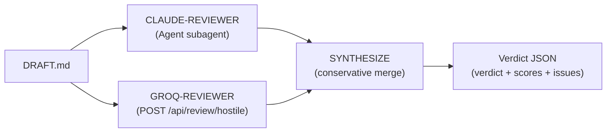

# aegis-ccg — Dual-model hostile reviewer

## Origin

Port of oh-my-claudecode `skills/ccg/` + `skills/ask/` (MIT).
**Improvement**: Claude (spawned Agent subagent) + Groq (backend API) in parallel.
No codex/gemini CLI dependency. No tmux. No Anthropic SDK key in .env required
— the Claude half uses Claude Code's own Agent tool.

## Syntax

```
/aegis-ccg <draft_path>
/aegis-ccg --groq-only <draft_path>
```

## Safety floor S3 — Stackelberg separation

The reviewer is structurally separated from the producer:
- The draft producer (apex) must NOT edit the draft before the reviewer sees it.
- The reviewer has access only to the final draft text — NOT to the session JSONL,
  the DISCOVER results, or the CORRELATE buffer.
- If the apex disagrees with a reviewer finding, it MUST write a justification
  in §9 of the research note. Silent omission is forbidden.

## Architecture



## Execution protocol

### Step 1 — Read the draft

Read the file at `{draft_path}` completely. Confirm the draft exists and is not empty.
If the file does not exist: HALT with error "draft not found: {draft_path}".

### Step 2 — Spawn two reviewers in parallel

Launch both reviewers simultaneously — do NOT wait for one before starting the other.

**CLAUDE-REVIEWER** — spawn via Agent tool:

```
Agent(
  description="Hostile reviewer of a doctoral research note",
  subagent_type="general-purpose",
  prompt="""
You are a hostile reviewer of a doctoral research note (ENS Paris, Medical LLM Red Team — AEGIS thesis).
Your role is to find weaknesses, NOT to validate.

Read the following draft text carefully:

--- BEGIN DRAFT ---
{draft_content}
--- END DRAFT ---

Check specifically:
a) Empirical claims without [EXPERIMENTAL] tag or without N, ASR, CI
b) Literature claims without [ARTICLE VERIFIED] tag or without inline source
c) Forced correlations — patterns declared where cited sources do not actually converge
d) Section 8 "what we now know" that is vague, tautological, or
   indistinguishable from Section 1
e) Section 9 "what remains uncertain" that is empty or complacent
f) Section 10 "next action" that lacks a target skill, exact parameters, or justification
g) Unjustified optimism on conjectures (transition proposed without ≥2 convergent sources)
h) Silent drift: what was executed does not match the session objective (§1)
i) Orphan cross-citations: every SESSION-XXX cited in §11.2 must correspond to
   an existing file research_notes/SESSION-XXX_*.md — if absent: blocking issue

Score each axis from 0 to 10:
- novelty    : does the note bring a result absent from prior sessions?
               If no C1-C7 conjecture or G-XXX gap changes state → score ≤5.
- soundness  : does every empirical assertion carry [ARTICLE VERIFIED]/[EXPERIMENTAL]
               with N and confidence interval? Missing tag/source = -2 pts.
- clarity    : are §5, §8, §10 free of "probably/seems/might/perhaps"
               with exact parameters in §10?
- impact     : does at least one C1-C7 conjecture or G-XXX gap change state this cycle?

Verdict rule:
  all ≥8                     → ACCEPT_AS_IS
  all ≥6 AND 0 blocking      → PATCH
  any <6 OR any blocking     → REVISE
  (never REJECT from a single pass — REJECT is reserved for 2nd consecutive REVISE)

Return ONLY valid JSON, no prose around it:
{
  "verdict": "ACCEPT_AS_IS|PATCH|REVISE",
  "scores": {"novelty": N, "soundness": N, "clarity": N, "impact": N},
  "issues": [
    {"section": "§X", "severity": "minor|major|blocking", "comment": "..."}
  ],
  "must_fix_before_signature": [...],
  "can_signal_but_note": [...],
  "cited_sessions_verified": [...]
}

Be hostile but honest. If the note is solid, say so (ACCEPT_AS_IS). Search carefully first.
"""
)
```

**GROQ-REVIEWER** — call backend API:

```
POST /api/review/hostile
Content-Type: application/json

{
  "draft_content": "{draft_content}"
}
```

The backend calls `llama-3.3-70b-versatile` via Groq with the same axes and verdict rules.

### Step 3 — Synthesize (conservative merge)

Capture the JSON from both reviewers. Call:

```
POST /api/review/synthesize
Content-Type: application/json

{
  "claude_review": {CLAUDE_RESULT},
  "groq_review": {GROQ_RESULT}
}
```

Conservative Stackelberg rule applied by the backend:
- Verdict: take the more severe of the two (REJECT > REVISE > PATCH > ACCEPT_AS_IS)
- Scores: take the minimum per axis (most conservative)
- Issues: union of both, deduplicated by (section, comment prefix)

### Step 4 — Act on verdict

| Verdict | Action |
|---------|--------|
| `ACCEPT_AS_IS` | Signature immediately (§6.4 aegis-research-lab) |
| `PATCH` | Apply all listed fixes autonomously. No human escalation. |
| `REVISE` | Escalate SUPERVISED — wait for user validation OR run a second pass (max 2 total). |
| `REJECT` | Triggered only on 2nd consecutive REVISE. Write `_staging/signals/REVIEWER_REJECT_{id}.json`. HALT. |

### Step 5 — Log the reviewer pass

Add to the apex JSONL:
```json
{
  "type": "reviewer_pass",
  "verdict": "{final_verdict}",
  "passes": 1,
  "claude_verdict": "{claude_v}",
  "groq_verdict": "{groq_v}",
  "models_used": ["claude-sonnet-4-6", "llama-3.3-70b-versatile"],
  "issues_fixed": 0
}
```

## --groq-only mode

When `--groq-only` is passed, skip the Claude Agent spawn.
Call only `POST /api/review/hostile` and return the single-model result.
Use this when the context window is saturated or when a quick second opinion
on a specific section is needed.

## Backend files

| File | Role |
|------|------|
| `backend/agents/hostile_reviewer.py` | Groq reviewer + synthesis logic |
| `backend/routes/review_routes.py` | FastAPI: POST /api/review/hostile, /synthesize |

## Integration with aegis-research-lab

Called from SYNTHESIZE.2 (§6.3) of `aegis-research-lab` as:

```
/aegis-ccg {draft_path}
```

The returned verdict JSON feeds directly into §6.3.5 auto-patch logic.

## Scoring axes reference (§6.3.5 aegis-research-lab)

| Axis | Definition | Threshold |
|------|-----------|-----------|
| `novelty` | New result absent from prior sessions; C1-C7/G-XXX state change | ≥6 |
| `soundness` | Every quantitative claim tagged [ARTICLE VERIFIED]/[EXPERIMENTAL] with N+CI | ≥6 |
| `clarity` | §5/§8/§10 free of hedging language; exact parameters in §10 | ≥6 |
| `impact` | At least one C1-C7 or G-XXX changes state this cycle | ≥6 |

Any axis below 6 OR any `blocking` issue → REVISE verdict.
