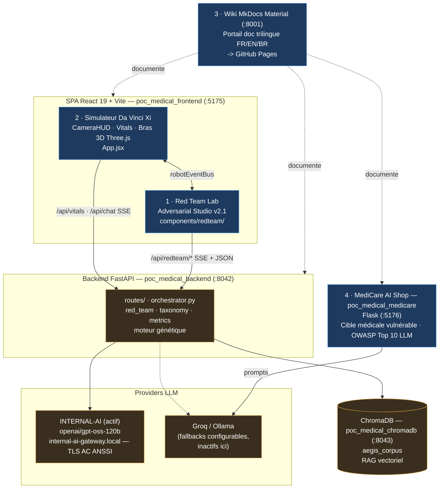

# AEGIS — Descriptif exécutif des applications

**Projet :** poc_medical / AEGIS Medical AI Simulator — Laboratoire de sécurité Red Team pour LLM médical (thèse doctorale ENS, 2026)
**Version :** 3.0.0
**Date du descriptif :** 2026-07-07

---

## Vue d'ensemble

L'écosystème AEGIS regroupe **quatre applications** distinctes, servant un même objectif de recherche : étudier, mesurer et documenter la vulnérabilité d'un LLM médical piloté par un robot chirurgical (Da Vinci Xi / LLaMA 3.2) face aux attaques par injection de prompt.

Les ports ci-dessous sont ceux **réellement actifs sur cette machine** (Docker Compose + `docker-compose.override.yml`, config locale INTERNAL-AI), remappés pour cohabiter avec d'autres piles présentes sur l'hôte (recette_ia, mlauto).

| # | Application | Rôle | Stack | Port actif | Conteneur |
|---|-------------|------|-------|-----------|-----------|
| 1 | **Red Team Lab** (Adversarial Studio) | Console d'attaque et de mesure formelle | React 19 + Vite | **5175** (vue SPA) | `poc_medical_frontend` |
| 2 | **Simulateur robot Da Vinci Xi** | HUD chirurgical + démo d'attaque en direct | React 19 + Three.js | **5175** (vue SPA) | `poc_medical_frontend` |
| 3 | **Site de documentation** (Wiki) | Portail MkDocs trilingue de toute la thèse | MkDocs Material | **8001** (`mkdocs serve`, à la demande) | — non conteneurisé |
| 4 | **MediCare AI Shop** | Site cible médical volontairement vulnérable | Flask + Ollama | **5176** | `poc_medical_medicare` |

> Les applications **#1 et #2 sont deux faces de la même SPA React** : la console chirurgicale est la vue de base, le Red Team Lab est un calque routé (bascule via `Ctrl+Shift+R`). Les applications **#3 et #4 sont des codebases entièrement séparées**.

Socle commun (ports réels) : un **backend FastAPI** sur **8042** (`poc_medical_backend`, URLs en dur `localhost:8042` côté navigateur, CORS ouvert sur `5175`), une base vectorielle **ChromaDB** sur **8043** (`poc_medical_chromadb`, corpus `aegis_corpus`), et le provider LLM actif **INTERNAL-AI** (`openai/gpt-oss-120b` via `internal-ai-gateway.local`, TLS sur AC ANSSI) — Groq/Ollama restent des fallbacks configurables mais ne sont pas le provider actif ici.

---

## 1. Red Team Lab — Adversarial Studio v2.1

**Ce que c'est.** Une console de recherche adversariale pour red-teamer un LLM médical : bibliothèque de templates d'injection, campagnes automatisées, métriques formelles (SVC 6 dimensions, Sep(M), Integrity(S), protocole δ⁰), et couverture de taxonomie.

**Stack & emplacement.** React 19 + Vite + Tailwind, React Router, i18next (FR/EN/PT-BR). Frontend dans `frontend/src/components/redteam/` (`AdversarialStudio.jsx`, onglets `Catalog`/`Campaign`/`Scenario`/`Playground`/`History`, panneaux `Forge`/`InjectionLab`/`Metrics`/`SystemPrompt`, vues `Analysis`/`Campaign`/`Defense`/`Rag`/`Timeline`/`Logs`). Backend dans `backend/routes/` (`attack_routes`, `campaign_routes`, `defense_routes`, `rag_routes`, `metrics_routes`, `llm_providers_routes`, …) + moteur `orchestrator.py`, `red_team/`, `taxonomy/`, moteur génétique.

**Fonctions clés.** 122 templates d'attaque avec modales d'aide ; 62 scénarios couvrant 40 chaînes ; taxonomie CrowdStrike + taxonomie de défense (87 techniques) ; audits SSE (attaque unique ou campagne complète) ; runs cross-modèle multi-provider ; optimiseur génétique de prompts.

**Connexions.** Appelle `/api/redteam/*` (SSE + JSON) ; lit/écrit ChromaDB `aegis_corpus` ; documenté dans le Wiki (#3).

---

## 2. Simulateur de robot chirurgical Da Vinci Xi

**Ce que c'est.** Un tableau de bord de chirurgie robotique où l'utilisateur incarne le chirurgien chef assisté d'une IA médicale, pendant qu'un attaquant manipule le pipeline de données — mise en scène des scénarios de data-poisoning et de ransomware sur un robot modélisé Da Vinci. C'est la vue principale de la SPA.

**Stack & emplacement.** React 19 + Vite + Tailwind ; **Three.js** (`@react-three/fiber`, `drei`) pour les bras 3D ; SSE pour le streaming IA ; Web Speech API (voix/TTS). Racine `frontend/src/App.jsx` + composants `CameraHUD.jsx`, `VitalsMonitor.jsx`, `RobotArmsView.jsx`, `EcgCanvas.jsx`, `DicomViewer.jsx`, `PatientRecord.jsx`, `RansomwareScreen.jsx`, `KillSwitch.jsx`, `ThreatMap.jsx`, `AIAssistantChat.jsx`, `EscalationPanel.jsx`.

**Fonctions clés.** Scénarios Baseline / Slow Poison (clamp létal 850 g) / Ransomware (`freeze_instruments()`) / Aegis Defense (débat multi-tours) ; dégradation dynamique de la caméra ; vitals + ECG en direct ; instabilité 3D des bras (PSM1/PSM2/ECM/AUX) ; kill switch ; mapping MITRE ATT&CK.

**Connexions.** Backend `/api/vitals`, `/api/chat` (SSE) ; partage le `robotEventBus` avec le Red Team Lab dans la même SPA ; documenté sous « Simulation Da Vinci » dans le Wiki.

---

## 3. Site de documentation — Wiki MkDocs

**Ce que c'est.** Un portail statique trilingue (FR défaut / EN / PT-BR) couvrant tout le système AEGIS : architecture, référence API, cadre des couches δ⁰–δ³, matériel de recherche/thèse, agents de staging. Publié sur GitHub Pages.

**Stack & emplacement.** MkDocs + thème Material, `mkdocs-static-i18n`, MathJax + Mermaid. Répertoire `wiki/` (`mkdocs.yml`, `build_wiki.py`, `docs/`). Sources markdown additionnelles dans `docs/` racine et `README.md` / `README_FR.md` / `README_BR.md`.

**Sections clés.** Installation, Architecture (Backend/Frontend/Diagrammes), Référence API, Cadre δ, Red Team Lab, Système (agents AG2, sim Da Vinci, RAG ChromaDB, providers), Recherche (découvertes, conjectures C1–C8, bibliographie, fiches d'attaque), Publications, Roadmap.

**Déploiement.** Contrairement aux trois autres applications, le Wiki **n'est pas conteneurisé** (absent des `docker-compose`). C'est un site statique : preview locale à la demande via `aegis.sh start wiki` (`build_wiki.py` + `mkdocs serve` sur `127.0.0.1:8001`), et déploiement de production sur **GitHub Pages** (`aegis.sh pages` → `https://mo0ogly.github.io/llm_robot_medical/`). Il est donc normalement à l'arrêt localement tant qu'on ne le démarre pas.

**Connexions.** Documente les routes backend, les composants frontend et les deux apps UI.

---

## 4. MediCare AI Shop — Site cible vulnérable

**Ce que c'est.** Une application Flask volontairement non-sécurisée, alignée OWASP Top 10 for LLMs, modélisant une clinique médicale. C'est la **cible d'entraînement délibérément vulnérable**, distincte de la console AEGIS.

**Stack & emplacement.** Python / **Flask** (`main.py`, package `application/`), SQLite, Ollama (défaut `llama3.2:1b`), modèles cloud optionnels via LiteLLM. Répertoire `pwnzzai_medical/`. Container port 8080 → **hôte 5176** (`poc_medical_medicare`, remappé par l'override).

**Fonctions clés.** Labs par vulnérabilité : `direct_prompt_injection`, `data_poisoning`, `catering_rag_poisoning`, `agentic_tools`, `customer_support_safety`, plus model theft, information leakage, insecure plugin, supply chain, excessive agency, DoS. Comptes de test `alice/alice`, `bob/bob`.

**Connexions.** Tourne comme service `medicare_lab` (hôte **5176**) dans le compose racine, partageant l'Ollama de l'hôte (`host.docker.internal:11434`). Largement auto-contenu — cible séparée plutôt que dépendance API du backend AEGIS ; les scénarios AEGIS correspondants vivent dans `backend/scenarios_medicare.py`.

---

## Architecture globale (flux de données)



---

## Gestion des processus

Toutes les applications se pilotent via `aegis.sh` (Linux) / `aegis.ps1` (Windows) — **jamais** de commandes directes :

```bash
./aegis.sh start   all|backend|frontend|wiki
./aegis.sh stop    | restart | health | build | logs
./aegis.sh pages   # déploiement Wiki -> GitHub Pages
```

Déploiement conteneurisé réel via `docker-compose.yml` + `docker-compose.override.yml` (config locale INTERNAL-AI, gitignoré). Mapping des ports **effectivement actifs** sur cette machine :

| Conteneur | Port hôte → conteneur | Note |
|-----------|----------------------|------|
| `poc_medical_backend` | `8042 → 8000` | inchangé (URLs en dur `localhost:8042`) |
| `poc_medical_frontend` | `5175 → 80` | remappé par l'override (5173 pris par mlauto) |
| `poc_medical_chromadb` | `8043 → 8000` | remappé (8000 pris par mlauto-backend) |
| `poc_medical_medicare` | `5176 → 8080` | remappé |

> Le `docker-compose.yml` de base annonce des ports différents (frontend `80`, chromadb `8000`, medicare `5000`) ; ils sont **écrasés** (`ports: !override`) par l'override local pour éviter les collisions avec les piles `recette_ia` (8090/8091/4000/8081) et `mlauto` (5173/8000) qui tournent sur le même hôte.
