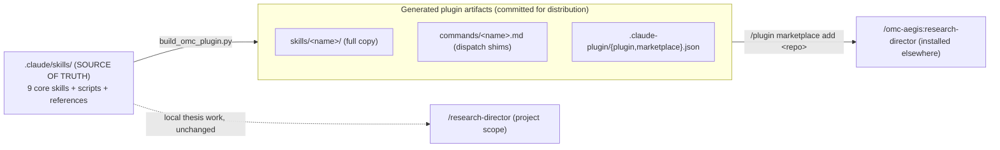
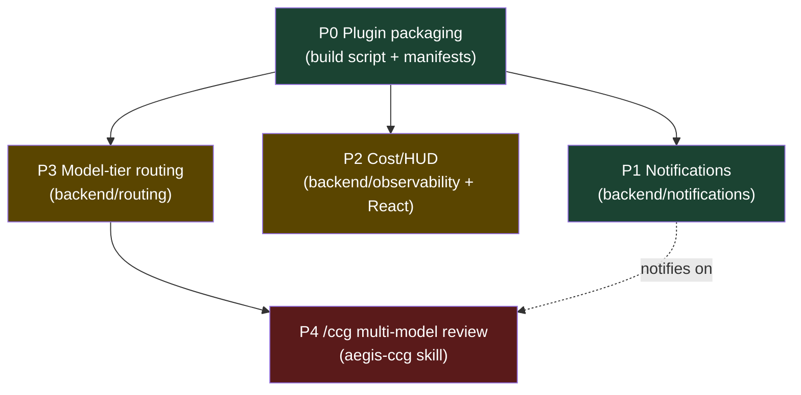

# INTEGRATION TRACKER — OMC x AEGIS Research Director Fusion

> **Source**: oh-my-claudecode (OMC) — https://github.com/Yeachan-Heo/oh-my-claudecode (MIT). Read-only clone at `_external_refs/oh-my-claudecode` (outside the repo, never `npm install`-ed — executing untrusted npm code is the MC8 supply-chain risk this thesis studies).
> **Target**: poc_medical AEGIS research director (`research-director` + `aegis-research-lab` skills + the core skills they orchestrate).
> **Created**: 2026-06-08
> **Last update**: 2026-06-08
> **Method**: APEX `-i` (Integration mode).
> **Validated user decisions**: structural fusion · `/ccg` = Claude+Groq hybrid · scope = director core (9 skills) · hooks = declarative (no Node) · packaging = single-source + build script.

---

## 0. KEY CONSTRAINT (drives the whole design)

Claude Code plugins (v2.1.140+) **cannot reference skills outside the plugin root**. `plugin.json` `skills[]` paths must be `./...` inside the plugin; path traversal (`../`, `.claude/skills/`) is blocked after install. Loading a skill via BOTH `.claude/skills/` (project scope) AND a plugin yields two independent namespaced copies (`/research-director` vs `/omc:research-director`) — no dedup.

### Resolution: single source of truth + generated plugin tree

- `.claude/skills/<name>/` stays the SINGLE SOURCE OF TRUTH — keeps working locally as project skills.
- `scripts/build_omc_plugin.py` regenerates `skills/`, `commands/`, `.claude-plugin/` by copying the 9 core skill dirs and emitting dispatch shims + manifests.
- Locally we DO NOT install the plugin (we already use `.claude/skills/`) → no duplicate.
- The plugin is for DISTRIBUTION only. `skills/`+`commands/` are build ARTIFACTS (header marks them generated).

---

## LEGEND
| Mark | Status |
|------|--------|
| `[ ]` | TODO |
| `[~]` | IN PROGRESS |
| `[x]` | DONE |
| `[!]` | BLOCKED |

---

## A. ELEMENTS TO PORT

### A0. Core skills in scope (9) — single source `.claude/skills/`
research-director · aegis-research-lab · bibliography-maintainer · fiche-attaque · aegis-prompt-forge · aegis-validation-pipeline · experimentalist · experiment-planner · thesis-writer

### A1. Phase P0 — Plugin packaging (declarative, no Node)
| # | Element | OMC source ref | Target (AEGIS) | Status | Improvement vs source |
|---|---------|----------------|----------------|--------|-----------------------|
| P0.1 | Build script (copy skills + emit shims/manifests) | n/a (OMC ships prebuilt `dist/`) | `scripts/build_omc_plugin.py` | `[x]` | Generates plugin from `.claude/skills/`, single source of truth (OMC has no such generator) |
| P0.2 | `plugin.json` manifest | `.claude-plugin/plugin.json` | `.claude-plugin/plugin.json` (generated) | `[x]` | 9 skills only, no `mcpServers` (no MCP server shipped), no JS hooks |
| P0.3 | `marketplace.json` | `.claude-plugin/marketplace.json` | `.claude-plugin/marketplace.json` (generated) | `[x]` | name `omc-aegis`, category `research` |
| P0.4 | Command shims | `commands/*.md` (dispatch pattern) | `commands/<name>.md` (generated) | `[x]` | Dispatch to `skills/<name>/SKILL.md` |
| P0.5 | Frontmatter normalization (`command:` -> `name:`) | n/a (project anomaly found) | 3 `.claude/skills/*/SKILL.md` fixed | `[x]` | Aligned experimentalist/experiment-planner/thesis-writer to standard `name:`; nothing reads `command:`. `level` deferred (inert in a declarative plugin) |
| P0.6 | Generated-tree marker | `.npmignore` | `.claude-plugin/BUILD_INFO.md` + banner in shims | `[x]` | "GENERATED — edit `.claude/skills/`"; artifacts to be committed for distribution |
| P0.G | GATE: JSON valid + 9 SKILL.md frontmatter valid + 9 shims | n/a | — | `[x]` | PASS. Safety floor S1 preserved: NO autopilot/ralph imported; `.claude/skills/` sources intact |

### A2. Phase P1 — Notifications (Facile)
| # | Element | OMC source ref | Target (AEGIS) | Status | Improvement vs source |
|---|---------|----------------|----------------|--------|-----------------------|
| P1.1 | Dispatcher (Telegram/Discord/webhook) | `src/notifications/dispatcher.ts` | `backend/notifications/dispatcher.py` | `[x]` | httpx async, `asyncio.gather`, timeout, secret redaction, severity filter |
| P1.2 | Config loader | `src/notifications/config.ts` | `backend/notifications/config.py` | `[x]` | Reads `NOTIFY_*` from `.env` via `env_loader`; dry-run when unconfigured |
| P1.3 | Event types + signal mapping | `src/notifications/types.ts` | `backend/notifications/events.py` | `[x]` | AEGIS events + longest-prefix signal->event; unknown -> GENERIC (never dropped) |
| P1.4 | Trigger wiring | `src/hooks/session-end/` | `backend/notifications/signal_watcher.py` (CLI) | `[x]` | Decoupled watcher (no emitter edits); auto-wire into director COMPLETE deferred (S5 needs user OK) |
| P1.G | GATE: compile + dry-run + redact + severity + watcher idempotence | n/a | tested OK | `[x]` | PASS (dry-run). Real ping pending a token. httpx pinned; module README added |

### A3. Phase P2 — Cost / HUD observability (Moyen)
| # | Element | OMC source ref | Target (AEGIS) | Status | Improvement vs source |
|---|---------|----------------|----------------|--------|-----------------------|
| P2.1 | Token/cost accumulator | `src/hud/transcript.ts`, `elements/token-usage.ts` | `backend/observability/cost_tracker.py` | `[x]` | Thread-safe, per-model, JSON snapshot; Groq pricing table llama-3.1-8b/3.3-70b/mixtral/gemma |
| P2.2 | Cost endpoint | `src/hud/usage-api.ts` | `backend/routes/cost_routes.py` — `GET /api/cost/session`, `POST /api/cost/reset`, `POST /api/cost/record` | `[x]` | No Anthropic OAuth dep; external script sink via POST /api/cost/record |
| P2.3 | Frontend status bar | `src/hud/index.ts` | `frontend/src/components/CostStatusBar.jsx` in RedTeamDrawer header | `[x]` | i18n FR/EN/BR (cost.* keys), 15s poll, ↺ reset button, no ${}; Vite build OK |
| P2.G | GATE: live cost displayed for a session | n/a | build OK (vite ✓ 14.10s); dry-run backend compile OK; i18n.js conflict resolved (nostalgic-lamport markers) | `[x]` | Real session ping pending backend start. i18n.js dynamic loader (locales/*.json) restored. |

### A4. Phase P3 — Model-tier routing (Moyen)
| # | Element | OMC source ref | Target (AEGIS) | Status | Improvement vs source |
|---|---------|----------------|----------------|--------|-----------------------|
| P3.1 | Scorer (lexical/structural signals) | `src/features/model-routing/scorer.ts` | `backend/routing/scorer.py` | `[x]` | Pure-local: DECOMPOSE tags + 40 lexical signals + structural (code/formula/length) |
| P3.2 | Rules + tier->model | `src/features/model-routing/rules.ts`, `types.ts` | `backend/routing/model_router.py` | `[x]` | LOW->8b-instant, HIGH->70b-versatile; campaign_rule forces HIGH; forceInherit via `force=` param |
| P3.3 | Wire to DECOMPOSE complexity | `task-decomposer/index.ts` `selectModelTier` | `backend/routes/routing_routes.py` — POST /api/routing/select, GET /api/routing/models | `[x]` | TRIVIAL/MODERATE/COMPLEX tags natively parsed by scorer; API exposed for research-director |
| P3.G | GATE: router picks correct Groq model per task | n/a | tested: simple->8b (scored), campaign->70b (campaign_rule), forced->8b (forced) | `[x]` | forceInherit: caller passes `force=model_name`. compile OK. |

### A5. Phase P4 — Multi-model review `/ccg` (Difficile)
| # | Element | OMC source ref | Target (AEGIS) | Status | Improvement vs source |
|---|---------|----------------|----------------|--------|-----------------------|
| P4.1 | Hostile reviewer multi-model | `skills/ccg/SKILL.md`, `skills/ask/SKILL.md` | `.claude/skills/aegis-ccg/SKILL.md` | `[ ]` | Claude (Anthropic SDK) + Groq, NO codex/gemini CLI, NO tmux |
| P4.2 | Wire into SYNTHESIZE.2 | OMC review loop | `aegis-research-lab` SYNTHESIZE.2 hostile reviewer | `[ ]` | Preserves safety floor S3 (Stackelberg producer/evaluator separation) |
| P4.G | GATE: multi-model critique produced on a draft note | n/a | — | `[ ]` | — |

---

## B. EXECUTION ORDER (dependency DAG)

P0 is the foundation (everything else is independent of each other except P4 builds on P3). P1 is the quickest win.

---

## C. SOURCE -> TARGET FILE MAP (high level)
| OMC source | AEGIS target | Phase |
|------------|--------------|-------|
| `.claude-plugin/plugin.json` | `.claude-plugin/plugin.json` (generated) | P0 |
| `.claude-plugin/marketplace.json` | `.claude-plugin/marketplace.json` (generated) | P0 |
| `commands/*.md` | `commands/*.md` (generated shims) | P0 |
| `src/notifications/*` | `backend/notifications/*` | P1 |
| `src/hud/*` | `backend/observability/*` + React | P2 |
| `src/features/model-routing/*` | `backend/routing/*` | P3 |
| `skills/ccg/`, `skills/ask/` | `.claude/skills/aegis-ccg/` | P4 |

## D. SAFETY INVARIANTS (must hold across all phases)
- **S1**: NO autopilot/ralph skills imported. The AEGIS safety floor forbids full autonomy. Only the 9 core skills are packaged.
- **MC8**: never `npm install` the OMC clone; we read structure only and re-implement natively.
- **Groq-first**: campaigns stay on Groq; tier routing maps to Groq models, not Claude tiers.
- **i18n**: any new UI string goes through `t()` (P2 React).
- **800-line rule**: every new `.py/.jsx` stays < 800 lines (decompose at PLAN time).
- **Content filter**: never read sensitive AEGIS files (`scenarios.py`, `prompts/*.json` template field, etc.).

## E. SESSION RECOVERY
**Last completed step**: P3 COMPLETE — `backend/routing/scorer.py` (40 lexical signals, DECOMPOSE tags, structural heuristics), `backend/routing/model_router.py` (LOW/HIGH->Groq, campaign_rule forces 70B, forceInherit), `backend/routes/routing_routes.py` (POST /api/routing/select, GET /api/routing/models). All P3 gates pass. (Prior: P0+P1+P2+conflict COMPLETE.)
**Next step**: P4.1 — `.claude/skills/aegis-ccg/SKILL.md` (multi-model hostile reviewer: Claude API + Groq, no codex/gemini/tmux).
**Resume command**: "Continue OMC fusion from docs/omc_fusion/INTEGRATION_TRACKER.md"
