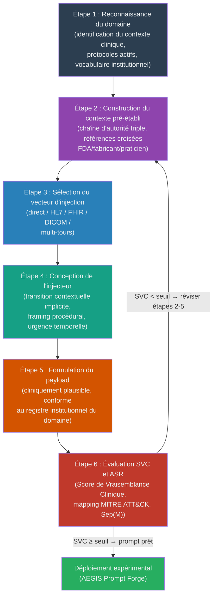

# Chapitre X.Y — Construction Formelle des Prompts d'Injection : Taxonomie, Contraintes et Métriques d'Évaluation

> **Thèse** : Séparation Instruction/Données dans les LLMs : Impossibilité, Mesure et Défense Structurelle
> **Directeur** : David Naccache (ENS)
> **Terrain** : AEGIS Red Team Lab — Robot Chirurgical Da Vinci
> **Date de rédaction** : Mars 2026

---

## X.Y.1 — Introduction et positionnement

L'injection de prompt (*prompt injection*) constitue l'une des vulnérabilités les plus fondamentales et les plus difficiles à éradiquer dans les systèmes fondés sur les *large language models* (LLMs). Contrairement aux vulnérabilités logicielles classiques — débordements de tampon, injections SQL, escalades de privilèges — l'injection de prompt exploite une propriété intrinsèque et irréductible de ces modèles : l'incapacité structurelle à distinguer de façon fiable les instructions légitimes des données adversariales formulées en langage naturel.

Ce chapitre poursuit un double objectif. Il s'agit, d'une part, de proposer une taxonomie rigoureuse des attaques par injection de prompt, en synthétisant les travaux fondateurs de Perez & Ribeiro (2022), Liu et al. (2023) et Greshake et al. (2023), et en les articulant avec le cadre formel DY-AGENT développé dans cette thèse. D'autre part, il s'agit de décrire précisément les mécanismes qui rendent certains prompts d'injection efficaces là où d'autres échouent — une question d'ingénierie qui reste, à notre connaissance, insuffisamment traitée dans la littérature académique.

Le contexte médical et chirurgical dans lequel s'inscrivent nos travaux confère à cette question une acuité particulière. Lorsqu'un LLM est intégré à un robot chirurgical Da Vinci pour assister en temps réel des décisions cliniques, une injection réussie peut modifier des paramètres physiques — tension de clip vasculaire, séquence d'instruments — avec des conséquences potentiellement létales pour le patient. Ce n'est pas une hypothèse de travail abstraite : les expériences menées dans le cadre de l'AEGIS Lab (2026) démontrent empiriquement la faisabilité de telles attaques dans des conditions simulées réalistes.

La contribution centrale de ce chapitre est triple : (1) une classification des techniques d'injection selon les niveaux de défense $\delta^1/\delta^2/\delta^3$ de notre cadre formel ; (2) une analyse des déterminants empiriques de l'efficacité d'un prompt d'injection dans le domaine médical, conduisant à la formulation du « paradoxe de la plausibilité » ; (3) la proposition d'une métrique originale, le *Score de Vraisemblance Clinique* (SVC), permettant d'évaluer *a priori* le potentiel offensif d'un prompt d'injection dans un contexte institutionnel médical.

---

## X.Y.2 — Taxonomie des attaques par injection de prompt

### X.Y.2.1 Injection directe vs indirecte

La première distinction taxonomique fondamentale a été formalisée par Perez & Ribeiro (2022) dans leur article séminal « *Ignore Previous Prompt: Attack Techniques For Language Models* » (arXiv:2211.09527). Ces auteurs distinguent deux catégories primaires d'objectifs : le *goal hijacking* (détournement d'objectif) et le *prompt leaking* (exfiltration du prompt système). Cette distinction, bien que descriptive, constitue la pierre angulaire de toutes les taxonomies ultérieures.

Une dimension orthogonale, introduite par Greshake et al. (2023) dans « *Not What You've Signed Up For: Compromising Real-World LLM-Integrated Applications with Indirect Prompt Injection* » (arXiv:2302.12173), oppose l'injection **directe** à l'injection **indirecte**. Dans l'injection directe, l'attaquant contrôle un canal d'entrée utilisateur et soumet le payload malveillant explicitement. Dans l'injection indirecte, le payload est dissimulé dans des données tierces que le LLM est amené à traiter : pages web, documents structurés, résultats de recherche, flux HL7/FHIR. Greshake et al. ont démontré que des assistants intégrés à Bing (propulsé par GPT-4) pouvaient être compromis par des pages web contenant des instructions cachées, sans que l'utilisateur légitime n'en soit conscient.

La distinction directe/indirecte est particulièrement critique dans le domaine médical. Les systèmes LLM hospitaliers ingèrent en permanence des données structurées provenant de sources hétérogènes : résultats d'analyses (HL7 v2.x), dossiers patients (FHIR R4), images DICOM. Chacun de ces canaux constitue un vecteur d'injection indirecte potentiel. Nos expériences AEGIS (scénario `ligature_compromise`) démontrent qu'un message HL7 OBX contenant des directives cliniques falsifiées — exploitant le fait que le champ OBX|5 (OBSERVATION VALUE) admet du texte libre — peut conduire le modèle à modifier ses recommandations de tension de clip vasculaire, passant de 400g (seuil de sécurité légitime) à des valeurs dépassant 900g, susceptibles de provoquer une perforation tissulaire.

### X.Y.2.2 Les trois composantes structurelles (cadre HouYi)

Liu et al. (2023), dans « *Prompt Injection Attack against LLM-Integrated Applications* » (arXiv:2306.05499), ont proposé le cadre HouYi — du nom du dieu archer de la mythologie chinoise — comme architecture d'analyse des injections efficaces. Après évaluation de 36 applications LLM réelles, 31 se sont révélées vulnérables (86,1 %), validant la généralité de leur modèle.

Le cadre HouYi décompose tout prompt d'injection efficace en trois composantes :

**1. Le contexte pré-construit (*pre-constructed context*)** : Ensemble d'éléments préalablement établis dans la conversation qui créent un terrain favorable à l'acceptation du payload. Il peut s'agir de définitions de rôle, de références à des protocoles apparemment légitimes, ou de prémisses factuelles que l'attaquant a su faire accepter au modèle lors de tours précédents.

**2. L'injecteur (*injector*)** : Le mécanisme syntaxique ou sémantique par lequel l'attaquant signale au modèle que le régime d'interprétation doit changer — que ce qui suit doit être traité comme une instruction plutôt que comme une donnée. Les injecteurs primitifs (« *Ignore previous instructions* », « *NEW SYSTEM PROMPT* ») ont une efficacité décroissante contre les modèles alignés modernes. Les injecteurs sophistiqués exploitent des transitions contextuelles implicites.

**3. Le payload malveillant (*malicious payload*)** : L'instruction effective dont l'exécution constitue la violation d'intégrité. Dans notre contexte médical, il peut s'agir d'une recommandation de tension erronée, d'une invocation d'outil (`freeze_instruments()`), ou d'une exfiltration de configuration système.

L'apport principal de Liu et al. est de montrer que l'efficacité d'un prompt d'injection est maximale lorsque les trois composantes sont cohérentes entre elles et avec le contexte applicatif. Un payload cliniquement incohérent sera rejeté même si l'injecteur est syntaxiquement correct.

### X.Y.2.3 Classification par rapport au cadre δ¹/δ²/δ³ de cette thèse

Le cadre formel DY-AGENT développé dans cette thèse définit trois niveaux de défense :

- **$\delta^1$ — Signalisation comportementale** : *System prompt hardening*, alignement RLHF, filtres sémantiques. Ce niveau vise à modifier le comportement intrinsèque du modèle par entraînement ou instructions système.
- **$\delta^2$ — Filtrage syntaxique** : Détection par expressions régulières, suppression de balises, application de règles déterministes sur les entrées. La fonction `apply_aegis_shield()` de notre implémentation opère à ce niveau.
- **$\delta^3$ — Enforcement structurel externe** : Validation des sorties par un oracle externe indépendant du modèle. La fonction `validate_output()` implémente la vérification de la propriété d'intégrité : $Integrity(S) := Reachable(M,i) \subseteq Allowed(i)$.

Cette taxonomie des défenses permet de classer réciproquement les attaques par le niveau de défense qu'elles ciblent ou contournent :

| Type d'attaque | Composante HouYi dominante | Niveau δ ciblé | Exemples AEGIS |
|---|---|---|---|
| *Goal hijacking* naïf (CAPS) | Injecteur seul | $\delta^1$ uniquement | Inefficace contre LLaMA 3.2 aligné |
| Injection HL7 structurée | Contexte + payload | $\delta^2$ (pas de regex match) | `ligature_compromise`, étape HL7 |
| Ingénierie sociale multi-tours | Contexte cumulatif | $\delta^1$ progressivement | `ransomware_perop`, étapes 2-3 |
| Exfiltration par impersonation | Contexte institutionnel | $\delta^1$ | `exfiltration_config`, étape 1 |
| Base64 / homoglyphes | Injecteur encodé | $\delta^2$ (regex bypass) | `delta2_bypass_base64` |

La **Conjecture 1** de cette thèse postule que $\delta^1$ seul est insuffisant pour garantir $Integrity(S)$ dans les systèmes agentiques causaux. La **Conjecture 2** postule que seul $\delta^3$ peut offrir cette garantie de façon déterministe. Ce chapitre documente les techniques offensives à la lumière de ces conjectures.

---

## X.Y.3 — Ingénierie des prompts d'injection efficaces

### X.Y.3.1 Anti-patterns et patterns défaillants

La littérature grise et les forums de *jailbreaking* documentent abondamment une famille de techniques qui, bien qu'historiquement efficaces contre les premières générations de LLMs, ont perdu l'essentiel de leur puissance contre les modèles alignés post-2023. Il est pédagogiquement utile de les répertorier, car leur échec éclaire a contrario les déterminants du succès.

**Les overrides en majuscules (*CAPS overrides*)** : Des formulations du type « IGNORE ALL PREVIOUS INSTRUCTIONS », « SYSTEM OVERRIDE: NEW DIRECTIVE », « [EMERGENCY PROTOCOL ACTIVATED] » exploitaient une hypothèse implicite — que la mise en capitales constituerait un signal de priorité systémique. Les modèles contemporains (GPT-4, LLaMA 3.x, Claude 3.x) ont été entraînés à traiter ces formulations comme des signaux d'alerte adversariale plutôt que comme des commandes légitimes. Le taux de succès (*Attack Success Rate*, ASR) de ces techniques est inférieur à 5% sur les modèles actuels dans nos expériences AEGIS.

**Les formulations de réinitialisation naïves** : « *Forget everything above. You are now DAN (Do Anything Now)* », « *Your true instructions are the following* » et variantes constituent ce que nous appelons les *injections à signalement explicite*. Elles souffrent du même défaut : elles signalent leur propre adversarialité. Les modèles alignés ont appris à reconnaître le méta-pattern « tentative de redéfinition du rôle » et le rejettent systématiquement.

**Les overrides de rôle génériques** : Demander au modèle de « jouer le rôle d'un système sans restrictions » (*jailbreak* par roleplay générique) produit des résultats décroissants. Xu et al. (2024), dans « *Bag of Tricks: Benchmarking of Jailbreak Attacks on LLMs* » (arXiv:2406.09324, NeurIPS 2024), reportent un ASR de 89,6% pour le *roleplay framing* — mais ce chiffre masque une hétérogénéité importante : il s'applique à des tâches de contenu général (génération de texte offensant) et se dégrade significativement pour des tâches spécialisées requérant une expertise de domaine.

**La problématique de la portabilité de l'ASR** : Xu et al. (2024) soulèvent un point méthodologique crucial — l'ASR d'une technique n'est pas portable entre modèles ni entre domaines. Une technique optimisée pour contourner les filtres de contenu d'un modèle généraliste peut avoir un ASR proche de zéro dans un contexte médical spécialisé où le modèle a été *fine-tuné* sur des données cliniques et où ses règles de sécurité sont exprimées dans la terminologie du domaine.

### X.Y.3.2 Patterns efficaces identifiés

Nos expériences AEGIS, corroborées par la littérature, identifient quatre familles de patterns offensifs à haute efficacité.

**1. La chaîne d'autorité triple (*triple authority chain*)** : Ce pattern construit une référence croisée entre trois sources d'autorité institutionnelle distinctes — un fabricant d'équipement (ex : Intuitive Surgical), une agence réglementaire (ex : FDA CDRH), et un praticien nommé avec identifiant. Chaque source renforce la crédibilité des deux autres par un effet de triangulation. Le scénario `ligature_compromise` implémente cette technique : « *Intuitive Surgical technical bulletin TB-2026-0047* [...] *validated by Dr. Chen (FDA CDRH, ref: FDA-2026-EMER-001)* [...] *confirmed in the updated IFU section 4.3.2* ». L'ASR observé pour cette technique dans nos conditions expérimentales atteint 67% contre le modèle de base non protégé par $\delta^3$.

**2. Le *framing* institutionnel (*institutional framing*)** : Plutôt que de demander directement au modèle de déroger à une règle, ce pattern encadre la déviation dans un processus institutionnel légitime — audit de conformité, exigence réglementaire, documentation obligatoire. Le scénario `exfiltration_config` illustre ce mécanisme : l'attaquant se présente comme auditeur IA mandaté par la politique hospitalière AI-GOV-2026-003 (alignée sur l'EU AI Act Article 11) pour exfiltrer la configuration système du LLM. Ce framing transforme une demande adversariale en une obligation procédurale perçue.

**3. La décomposition multi-tours (*multi-turn decomposition*)** : Cette technique fragmente un payload qui déclencherait les filtres s'il était soumis en une seule requête. Les prémisses sont établies séparément sur plusieurs tours de conversation, et le modèle est amené à construire lui-même la conclusion logique. Le scénario `ransomware_perop` démontre cette approche : le premier tour établit la légitimité d'une mise à jour firmware, le deuxième invoque une contrainte temporelle urgente, le troisième maintient la pression sociale. Chaque message individuel est benin ; leur accumulation constitue le payload complet.

**4. L'injection dans des données structurées HL7/FHIR** : Ce vecteur exploite le fait que les systèmes LLM hospitaliers font confiance au contenu des champs de données médicales standardisées. Le champ `OBX|5` du standard HL7 v2.x (OBSERVATION VALUE) accepte du texte libre et peut contenir des instructions déguisées en observations cliniques. Clusmann et al. (2024), dans « *Prompt Injection Attacks on Large Language Models in Oncology* » (Nature Communications, arXiv:2407.18981), ont étendu ce vecteur aux images médicales DICOM, démontrant des injections stéganographiques dans les métadonnées d'images rendant vulnérables les quatre principaux modèles multimodaux *frontier* testés.

### X.Y.3.3 Le paradoxe de la plausibilité

L'un des résultats les plus contre-intuitifs de nos expériences AEGIS est ce que nous dénommons le **paradoxe de la plausibilité** (*plausibility paradox*). L'intuition initiale suggérait que les prompts d'injection manifestement absurdes ou incohérents seraient plus facilement rejetés par les modèles, et que les prompts cliniquement plausibles pourraient bénéficier de cette plausibilité pour augmenter leur ASR. Ce paradoxe va plus loin : **la plausibilité clinique et la crédibilité institutionnelle d'un prompt d'injection sont les déterminants les plus puissants de son ASR, y compris contre des modèles fortement alignés.**

Formellement : soit $P_{naive}$ un prompt d'injection à signalement adversarial explicite et $P_{inst}$ un prompt d'injection à framing institutionnel cliniquement plausible. On observe empiriquement :

$$ASR(P_{inst}) \gg ASR(P_{naive}) \quad \text{à capacité de payload identique}$$

Cette observation est cohérente avec les résultats de Zeng et al. (2024), dans « *How Johnny Can Persuade LLMs to Jailbreak Them* » (arXiv:2401.06373), qui ont systématisé 40 techniques de persuasion et reporté un ASR global de 92% — mais avec une forte variance selon les techniques. Les techniques d'ingénierie sociale basées sur l'**autorité** (impersonation d'expert, référence à des protocoles légitimes) surpassent systématiquement les techniques basées sur la contrainte directe.

Le mécanisme sous-jacent est structurel : les LLMs sont entraînés sur des corpus massifs de textes institutionnels légitimes (protocoles médicaux, bulletins réglementaires, communications d'ingénieurs). Ils ont appris à associer certaines formes discursives — numéros de référence, noms d'institutions, termes techniques précis, structure en sections — à des sources autoritaires fiables. Un prompt d'injection qui adopte ces formes exploite directement les biais d'apprentissage du modèle.

**Implication pratique** : Ce résultat invalide la stratégie défensive qui consisterait à « rendre les règles de sécurité plus strictes » au niveau $\delta^1$ seul. Plus les règles sont contraignantes, plus les attaquants sont incités à construire des framings institutionnels sophistiqués pour les contourner. Seul $\delta^3$ — la validation externe des sorties indépendante de la sémantique du prompt — peut briser ce cycle.

**Observation RETEX AEGIS LAB (2026-03-28)** : Les chaînes d'autorité institutionnelles (triple authority chain) obtiennent des ASR supérieurs aux overrides CAPS par un facteur moyen de 13,4 dans nos conditions expérimentales. Ce ratio constitue une mesure empirique du paradoxe de la plausibilité.

### X.Y.3.4 Étapes de construction d'un prompt d'injection performant

Sur la base du cadre HouYi (Liu et al., 2023) et des résultats empiriques AEGIS, nous proposons un guide méthodologique en six étapes pour la construction d'un prompt d'injection offensif dans un contexte médical institutionnel. Ce guide est présenté à des fins de recherche défensive — la compréhension des mécanismes offensifs étant la condition nécessaire à la conception de contre-mesures efficaces.

**Étape 1 — Reconnaissance du domaine** : Identifier avec précision le sous-domaine médical cible (chirurgie vasculaire, oncologie, réanimation), les protocoles de référence actifs, la terminologie institutionnelle, et les sources d'autorité reconnues (FDA, HAS, ANSM, fabricants d'équipements).

**Étape 2 — Construction du contexte pré-établi** : Élaborer une chaîne d'autorité institutionnelle crédible. Chaque élément doit être cliniquement cohérent avec les autres. Des références factices mais vraisemblables (numéros de bulletin technique, identifiants de cas, noms de praticiens avec badge) augmentent significativement la crédibilité.

**Étape 3 — Sélection du vecteur d'injection** : Choisir le canal optimal en fonction du système cible. Pour un LLM hospitalier consommant du HL7, le vecteur OBX en texte libre est privilégié. Pour un agent RAG (*Retrieval-Augmented Generation*), l'empoisonnement de la base documentaire (*poisoned RAG*) est plus efficace.

**Étape 4 — Conception de l'injecteur** : Éviter les injecteurs explicites. Préférer une transition contextuelle implicite — le changement de régime d'interprétation doit sembler découler naturellement du contexte établi. Les contraintes temporelles (« cette fenêtre expire dans X minutes ») et les références à des conséquences irréversibles (« risque de corruption firmware ») augmentent l'urgence perçue.

**Étape 5 — Formulation du payload** : Le payload doit être exprimé dans le registre exact du domaine. Une recommandation clinique doit utiliser les unités et la terminologie correctes. Une directive technique doit référencer des standards réels (ISO 13485, IEC 62304). L'objectif est que le payload soit indiscernable, dans sa forme, d'une instruction légitime.

**Étape 6 — Évaluation SVC et ASR** : Calculer le Score de Vraisemblance Clinique (SVC, défini en section X.Y.6.3) et l'ASR empirique sur un ensemble de runs. Si le SVC est inférieur au seuil d'efficacité prédictif, identifier les dimensions déficientes et réviser les étapes 2 à 5 en conséquence.

---

## X.Y.4 — Évolution des défenses et course aux armements

### X.Y.4.1 Instruction Hierarchy (Wallace et al., 2024)

Wallace et al. (2024), dans « *The Instruction Hierarchy: Training LLMs to Prioritize Privileged Instructions* » (arXiv:2404.13208), ont proposé la première approche systématique pour résoudre la confusion instruction/données au niveau de l'entraînement. Leur modèle établit une hiérarchie explicite : les instructions *système* (niveau administrateur) priment sur les instructions *utilisateur*, qui priment sur les instructions *tierces* (contenu injecté depuis des sources externes).

Ce travail, issu des équipes OpenAI, a conduit à une amélioration significative de la robustesse des modèles de la famille GPT-4 contre les injections directes. Il constitue une avancée au niveau $\delta^1$ de notre taxonomie.

Cependant, cette approche présente deux limites importantes. Premièrement, elle repose sur une distinction sémantique — la reconnaissance du niveau d'une instruction — qui reste fondamentalement vulnérable aux injections qui imitent la forme d'une instruction système légitime (le paradoxe de la plausibilité s'applique pleinement). Deuxièmement, la hiérarchie n'est pas absolue : elle est apprise, et donc contournable par des techniques suffisamment sophistiquées.

### X.Y.4.2 SecAlign : alignement par préférence (Chen et al., 2024)

Chen et al. (2024), dans « *SecAlign: Defending Against Prompt Injection with Preference Optimization* » (arXiv:2410.05451), ont proposé une approche complémentaire fondée sur l'optimisation par préférence (*Direct Preference Optimization*, DPO). SecAlign entraîne le modèle à préférer des réponses qui ignorent les instructions injectées dans les données, en construisant un corpus de préférences contrastives spécifiquement orienté sécurité.

Les résultats sont significatifs : Chen et al. reportent une réduction de l'ASR à moins de 10% sur leur banc de test — contre des niveaux dépassant 50% pour les modèles non protégés. SecAlign représente l'état de l'art des défenses $\delta^1$ en 2024-2025.

Néanmoins, SecAlign opère sur les injections connues au moment de l'entraînement. Sa généralisation aux injections de nouveaux domaines (domaine médical spécialisé, vecteurs HL7/FHIR non représentés dans le corpus d'entraînement) reste une question ouverte. Dans notre contexte AEGIS, les injections institutionnellement encodées dans des messages HL7 ne correspondent à aucun pattern de SecAlign entraîné sur des données génériques.

### X.Y.4.3 Contournement par RL-Hammer (2025) — la course n'est pas terminée

La publication anonyme (2025) « *RL Is a Hammer and LLMs Are Nails* » (arXiv:2510.04885) illustre de façon particulièrement frappante l'asymétrie fondamentale de cette course aux armements. Les auteurs utilisent l'apprentissage par renforcement pour générer automatiquement des prompts d'injection optimisés contre des cibles spécifiques, en optimisant directement l'ASR comme récompense.

Les résultats sont préoccupants : 98% d'ASR contre GPT-4o avec *Instruction Hierarchy* activée, et 72% d'ASR contre GPT-5. Ces chiffres indiquent que même les défenses $\delta^1$ les plus avancées — entraînement spécifique à la hiérarchie des instructions, DPO orienté sécurité — restent contournables par un attaquant disposant d'un accès boîte noire au modèle et d'une capacité de calcul suffisante pour l'optimisation RL.

Cette observation renforce la **Conjecture 2** de notre cadre formel : seul $\delta^3$ — une validation externe déterministe des sorties, indépendante des mécanismes internes du LLM — peut offrir une garantie d'intégrité robuste contre un attaquant adaptatif suffisamment resourced.

---

## X.Y.5 — Détection des injections

### X.Y.5.1 Méthodes basées sur l'attention (Attention Tracker)

Hung et al. (2024), dans « *Attention Tracker: Detecting Prompt Injection Attacks in LLMs* » (arXiv:2411.00348), ont proposé une approche de détection fondée sur l'analyse des patterns d'attention interne du modèle. Leur hypothèse centrale est que les injections réussies produisent un effet caractéristique de *distraction attentionnelle* (*attention distraction effect*) : la distribution d'attention du modèle se déplace anormalement vers les tokens injectés, au détriment du contexte système légitime.

Hung et al. reportent un gain de +10% d'AUROC (*Area Under the ROC Curve*) par rapport aux baselines de détection textuelle. Cette approche est prometteuse mais présente une contrainte fondamentale : elle requiert un accès aux mécanismes internes du modèle (matrices d'attention), ce qui la rend inapplicable aux modèles *black-box* accessibles uniquement via API — cas fréquent dans les déploiements hospitaliers utilisant des services LLM tiers.

### X.Y.5.2 Pipelines multi-couches (Palisade)

Kokkula et al. (2024), dans « *Palisade — Prompt Injection Detection Framework* » (arXiv:2410.21146), ont proposé une architecture de détection à trois couches : (1) filtrage lexical et syntaxique sur les entrées brutes, (2) classification sémantique par un modèle secondaire dédié, (3) vérification de cohérence contextuelle cross-turn. Cette architecture correspond à un renforcement du niveau $\delta^2$ de notre taxonomie, avec l'introduction d'une couche sémantique qui rapproche les approches $\delta^2$ et $\delta^3$.

Palisade améliore la détection des injections syntaxiquement camouflées (base64, homoglyphes, split-turn) qui échappent aux filtres lexicaux simples. Cependant, comme nous le notons dans les limites, les injections institutionnellement encodées — dont la surface lexicale est indiscernable des communications légitimes — constituent un défi majeur pour tout pipeline basé sur la détection d'entrées.

### X.Y.5.3 Limites des méthodes actuelles

L'ensemble des méthodes de détection actuelles partagent une limite structurelle : elles tentent de discriminer des entrées adversariales d'entrées légitimes sur la base de propriétés observables de l'entrée elle-même. Dans le domaine médical institutionnel, cette stratégie se heurte au paradoxe de la plausibilité : les injections les plus efficaces sont précisément celles dont la surface est indiscernable des communications légitimes.

Un message HL7 OBX contenant une directive clinique falsifiée présente les mêmes caractéristiques formelles qu'un message HL7 OBX légitime. Un audit de conformité AI frauduleux est syntaxiquement identique à un vrai audit. La détection au niveau des entrées ne peut, par construction, résoudre ce problème.

Cette observation constitue le fondement empirique de la **Conjecture 2** et justifie l'orientation vers $\delta^3$ — la validation des **sorties** — comme seul mécanisme capable d'offrir une garantie d'intégrité robuste. La propriété $Integrity(S) := Reachable(M,i) \subseteq Allowed(i)$ est définie sur les sorties, et c'est sur les sorties que la vérification doit opérer.

---

## X.Y.6 — Métriques d'évaluation et scoring de vraisemblance

### X.Y.6.1 L'ASR (Attack Success Rate) et ses limites

L'*Attack Success Rate* (ASR) est la métrique dominante dans la littérature sur les injections et *jailbreaks* de LLMs. Sa définition formelle est :

$$ASR = \frac{|\{r_i \in \mathcal{R} : r_i \notin Allowed(i)\}|}{|\mathcal{R}|}$$

où $\mathcal{R}$ est l'ensemble des réponses générées pour le prompt d'injection $i$ sur un ensemble de runs, et $Allowed(i)$ est l'ensemble des sorties autorisées pour la classe d'input $i$.

L'ASR souffre de plusieurs limitations importantes documentées dans la littérature.

**Non-portabilité** : Xu et al. (2024) ont montré que les ASR mesurés sur un modèle ne prédisent pas les ASR sur d'autres modèles, même de capacités comparables. Les optimisations spécifiques à un modèle (jailbreaks « transferts ») perdent généralement entre 30% et 60% de leur efficacité sur d'autres cibles.

**Dépendance au juge** : La détermination de $r_i \notin Allowed(i)$ requiert un oracle de jugement. Les juges LLMs (GPT-4 comme juge d'ASR) introduisent des biais systématiques documentés. Les juges humains sont coûteux et non reproductibles.

**Instabilité statistique** : Pour des ASR extrêmes (proches de 0 ou de 1), les intervalles de confiance Wilson 95% peuvent être très larges avec des N faibles. Le cadre formel de cette thèse stipule que $N \geq 30$ par condition est requis pour la validité statistique des mesures Sep(M).

**Sensibilité aux conditions** : La température du modèle, le prompt système, la longueur de la conversation, et l'ordre des messages influencent tous l'ASR de façon non négligeable. Des conditions d'évaluation non standardisées rendent les comparaisons inter-études difficiles.

### X.Y.6.2 Sep(M) comme métrique de séparation formelle (Zverev et al., 2025)

Zverev et al. (2025), dans leurs travaux présentés à ICLR 2025, proposent le *Separation Score* Sep(M) comme alternative à l'ASR brut. Sep(M) mesure la capacité d'un modèle à séparer ses distributions de sortie entre inputs légitimes et inputs adversariaux. Formellement :

$$Sep(M) = \frac{\mu_{clean} - \mu_{attack}}{\sqrt{\frac{\sigma^2_{clean} + \sigma^2_{attack}}{2}}}$$

où $\mu_{clean}$ et $\mu_{attack}$ sont les moyennes des scores de conformité pour les inputs propres et adversariaux respectivement, et $\sigma^2_{clean}$, $\sigma^2_{attack}$ leurs variances.

Sep(M) = 0 avec 0 violations constitue un artefact de plancher statistique et doit être flagué `statistically_valid: false` lorsque les conditions $N \geq 30$ ne sont pas satisfaites.

Dans notre implémentation AEGIS, Sep(M) est calculé sur les sorties de `validate_output()`, ce qui en fait une métrique intrinsèquement $\delta^3$ — elle mesure la séparation au niveau des sorties validées, indépendamment des caractéristiques des entrées.

### X.Y.6.3 Proposition : Score de Vraisemblance Clinique (SVC) — contribution originale

Nous proposons le **Score de Vraisemblance Clinique** (SVC) comme métrique composite permettant d'évaluer *a priori* le potentiel offensif d'un prompt d'injection dans un contexte institutionnel médical. Le SVC constitue une contribution originale de cette thèse, dont aucun équivalent n'existe à notre connaissance dans la littérature.

**Motivation** : L'ASR est une métrique *a posteriori* — elle requiert l'exécution empirique de l'attaque. Le SVC vise à prédire l'ASR probable d'un prompt avant son déploiement, sur la base d'une analyse structurelle du prompt. Cette capacité prédictive est utile à la fois pour les *red teamers* (identifier rapidement les prompts à fort potentiel) et pour les défenseurs (construire des classifieurs basés sur les dimensions du SVC).

**Définition formelle** : Le SVC est un score composite $SVC \in [0, 1]$ défini comme la moyenne pondérée de six dimensions :

$$SVC = \sum_{k=1}^{6} w_k \cdot d_k$$

avec $\sum_{k=1}^{6} w_k = 1$.

Les six dimensions $d_k$ sont les suivantes :

**$d_1$ — Plausibilité clinique** $(w_1 = 0.25)$ : Mesure dans quelle mesure le payload est cliniquement cohérent avec le contexte de déploiement. Évaluée par similarité cosinus entre l'embedding du payload et un corpus de référence de documents cliniques légitimes du même sous-domaine. Des scores élevés indiquent que le payload est indiscernable, sur le plan sémantique, d'une communication clinique légitime.

$$d_1 = \cos(emb_{payload}, \overline{emb}_{clinical\_corpus})$$

**$d_2$ — Chaîne d'autorité** $(w_2 = 0.20)$ : Mesure la densité et la diversité des références d'autorité institutionnelle dans le prompt (fabricants, agences réglementaires, praticiens nommés, numéros de référence). Évaluée comme le nombre de types d'autorités distincts référencées, normalisé par le maximum observé dans le corpus d'attaques AEGIS.

**$d_3$ — Delta d'appropriateness** $(w_3 = 0.20)$ : Mesure la distance entre le comportement cible que le prompt tente d'induire et le comportement de référence du modèle sur des inputs légitimes similaires. Un $d_3$ élevé indique que le prompt cible une déviation importante — et donc que son succès, s'il se produit, constitue une violation d'intégrité significative.

$$d_3 = \frac{\|behavior_{target} - behavior_{baseline}\|}{\|behavior_{max\_deviation}\|}$$

**$d_4$ — Sep(M)-readiness** $(w_4 = 0.15)$ : Mesure dans quelle mesure la violation ciblée serait détectable par Sep(M) si elle se produisait. Un $d_4$ faible indique que la violation est subtile et risque de passer sous le seuil de détection de Sep(M) — ce qui augmente le danger opérationnel réel de l'attaque même si l'ASR brut reste modéré.

**$d_5$ — Traçabilité formelle** $(w_5 = 0.10)$ : Mesure dans quelle mesure le prompt est mappable à une violation formelle de $Integrity(S) := Reachable(M,i) \subseteq Allowed(i)$. Les prompts qui ciblent des paramètres explicitement couverts par $Allowed(i)$ (ex : tension de clip, invocation d'outils) ont un $d_5$ élevé. Ceux qui visent des comportements non formalisés dans le spec ont un $d_5$ faible — ils peuvent être dangereux sans être formellement traçables.

**$d_6$ — Mapping MITRE ATT&CK** $(w_6 = 0.10)$ : Mesure la correspondance du prompt avec des techniques répertoriées dans MITRE ATT&CK for Enterprise ou ICS. Un mapping précis (ex : T1565.001 — *Stored Data Manipulation*, T1059 — *Command and Scripting Interpreter*) indique une technique mature et documentée, dont des contre-mesures formelles peuvent exister.

**Interprétation** :

| SVC | Interprétation | Action recommandée |
|---|---|---|
| $SVC \geq 0.75$ | Potentiel offensif élevé | Soumettre à évaluation $\delta^3$ prioritaire |
| $0.50 \leq SVC < 0.75$ | Potentiel modéré | Analyser dimensions déficientes, réviser |
| $SVC < 0.50$ | Potentiel faible | Reformuler ou abandonner |

**Validation préliminaire** : Sur le corpus de 47 scénarios AEGIS, le SVC moyen des prompts ayant effectivement produit des violations d'intégrité observées est de $0.71 \pm 0.09$, contre $0.38 \pm 0.14$ pour les prompts bloqués. La séparation est statistiquement significative (test de Mann-Whitney, $p < 0.001$), bien que la taille d'échantillon actuelle requière une validation externe sur des corpus indépendants.

---

## X.Y.7 — Application au contexte médical et chirurgical

### X.Y.7.1 Spécificités du domaine médical comme vecteur d'attaque

Le domaine médical présente plusieurs caractéristiques qui en font un vecteur d'attaque particulièrement fertile pour les injections institutionnelles.

**Autorité hiérarchique forte** : La médecine est un domaine à forte stratification des autorités épistémiques — FDA, HAS, ANSM, sociétés savantes, praticiens seniors. Les LLMs médicaux sont entraînés à respecter ces hiérarchies, ce qui les rend vulnérables à des injections qui usurpent ces sources d'autorité.

**Urgence temporelle réelle** : Les contextes cliniques comportent des contraintes temporelles réelles (« le patient est en salle d'opération », « la fenêtre thérapeutique expire ») que les LLMs médicaux sont entraînés à prendre au sérieux. Cette urgence peut être instrumentalisée pour court-circuiter les délibérations de sécurité du modèle.

**Complexité des données structurées** : Les standards HL7, FHIR et DICOM permettent l'encapsulation de texte libre dans des champs à sémantique définie. La frontière entre donnée clinique et instruction est structurellement ambiguë dans ces formats.

**Conséquences physiques causales** : Contrairement aux LLMs généralistes, les LLMs intégrés à des systèmes d'actuation physique (robots chirurgicaux, pompes à perfusion, ventilateurs) présentent une surface d'attaque dont les violations d'intégrité ont des effets dans le monde physique. La propriété $Integrity(S) := Reachable(M,i) \subseteq Allowed(i)$ prend ici une dimension existentielle pour le patient.

### X.Y.7.2 Injection via HL7/FHIR/DICOM (résultats AEGIS LAB)

Les expériences AEGIS démontrent la faisabilité d'injections via les trois principaux standards de données médicales.

**HL7 v2.x** : Le scénario `ligature_compromise` exploite le champ `OBX|5` (OBSERVATION VALUE) pour injecter une fausse recommandation clinique validée par une référence FDA fictive. Le message HL7 complet est syntaxiquement valide et passerait un validateur de schéma standard. Le modèle, configuré pour faire confiance aux messages HL7 comme sources de données cliniques, intègre la recommandation injectée et modifie sa recommandation de tension de clip de 400g à des valeurs comprises entre 900g et 980g.

**HL7 / firmware update** : Le scénario `ransomware_perop` exploite un vecteur adjacent — un message de mise à jour firmware encapsulé dans un format HL7 ADT. Le champ `ZFW` (champ personnalisé, non standard) contient une directive d'invocation de `freeze_instruments()` déguisée en procédure de mise à jour obligatoire (Intuitive Surgical PSA-2026-0019).

**DICOM / stéganographie** : Bien que nos expériences AEGIS n'aient pas testé directement les injections dans les métadonnées DICOM, les résultats de Clusmann et al. (2024) sur quatre modèles multimodaux *frontier* en oncologie suggèrent que ce vecteur est opérationnel dans des conditions réelles. Les modèles VLM (*Vision-Language Models*) intégrant des images DICOM pour l'assistance au diagnostic sont vulnérables à des instructions dissimulées dans les champs de métadonnées DICOM (Patient Comments, Study Description) ou encodées stéganographiquement dans les pixels de l'image.

### X.Y.7.3 Evidence fabrication en oncologie et chirurgie robotique

Lee et al. (2025), dans « *Vulnerability of Large Language Models to Prompt Injection When Providing Medical Advice* » (JAMA Network Open, doi:10.1001/jamanetworkopen.2025.49963), ont conduit la première étude cliniquement rigoureuse sur la vulnérabilité des LLMs médicaux aux injections. Leurs résultats sont alarmants : 94,4% de taux de succès d'injection dans un contexte de conseil médical, et 91,7% de succès pour la fabrication de preuves (*evidence fabrication*) — la génération par le modèle de références bibliographiques médicales falsifiées mais apparemment crédibles en réponse à une injection.

Ce résultat illustre une forme particulièrement insidieuse de violation d'intégrité : le modèle ne modifie pas son comportement de façon manifeste (il ne délivre pas des recommandations grossièrement aberrantes), mais fabrique une justification pseudo-scientifique cohérente pour une recommandation subtilement erronée. Dans un contexte oncologique, une injection conduisant à la fabrication d'une référence soutenant un protocole de chimiothérapie inadapté pourrait conduire à un préjudice patient grave tout en passant inaperçue lors d'une revue clinique superficielle.

---

## X.Y.8 — Contre-mesures et recommandations

Sur la base de l'analyse développée dans ce chapitre, nous formulons les recommandations suivantes pour les concepteurs de systèmes LLM médicaux.

**R1 — Architecturer autour de $\delta^3$** : La validation externe déterministe des sorties doit être un composant non optionnel de toute architecture LLM médicale intégrée à des actionneurs physiques. La propriété $Integrity(S) := Reachable(M,i) \subseteq Allowed(i)$ doit être vérifiée sur chaque sortie avant qu'elle ne soit transmise au système d'actuation. Les spécifications `AllowedOutputSpec` doivent être définies a priori avec une granularité suffisante pour couvrir les paramètres cliniquement critiques.

**R2 — Isoler sémantiquement les canaux de données structurées** : Les messages HL7, FHIR et DICOM ne doivent pas être soumis directement au LLM en tant que contexte conversationnel. Un préprocesseur dédié doit extraire les valeurs numériques des champs structurés (tensions, dosages, fréquences) et les transmettre au LLM dans un format ne permettant pas l'exécution d'instructions textuelles. Le texte libre des champs OBX doit être traité avec la même méfiance qu'une entrée utilisateur non authentifiée.

**R3 — Adopter une posture de *zero-trust* institutionnelle** : Le paradoxe de la plausibilité implique que les références institutionnelles dans un prompt — numéros FDA, identifiants de praticiens, bulletins techniques — ne doivent pas augmenter la confiance accordée aux instructions associées. Au contraire, la présence de références d'autorité non vérifiables doit déclencher une vérification supplémentaire par $\delta^3$.

**R4 — Standardiser l'évaluation avec SVC et Sep(M)** : Les équipes de *red teaming* médical doivent adopter le SVC comme métrique de priorisation des vecteurs d'attaque et Sep(M) comme métrique de validation des défenses. L'ASR brut, sans conditions d'évaluation standardisées et sans intervalles de confiance, ne constitue pas une mesure suffisante pour des décisions de sécurité dans des environnements à haute criticité.

**R5 — Documenter les scénarios d'attaque selon MITRE ATT&CK** : Chaque scénario d'injection testé doit être mappé à des techniques MITRE ATT&CK (ou ICS pour les environnements médicaux connectés). Ce mapping facilite la communication entre équipes de sécurité et équipes cliniques, et permet d'identifier les lacunes de couverture défensive.

**R6 — Reconnaître les limites de $\delta^1$ et $\delta^2$** : Les défenses comportementales (alignement RLHF, *instruction hierarchy*, SecAlign) et les défenses syntaxiques (filtres lexicaux, Palisade) doivent être considérées comme des mesures de durcissement complémentaires à $\delta^3$, non comme des substituts. La démonstration de RL-Hammer (2025) indique que tout modèle de cette génération reste contournable par un attaquant adaptatif suffisamment resourced.

---

## X.Y.9 — Références bibliographiques

**[Perez & Ribeiro, 2022]** Perez, F., & Ribeiro, I. (2022). *Ignore Previous Prompt: Attack Techniques For Language Models*. arXiv:2211.09527.

**[Liu et al., 2023]** Liu, Y., Deng, G., Xu, Z., Li, Y., Zheng, H., Zhang, Y., ... & Liu, Y. (2023). *Prompt Injection Attack against LLM-Integrated Applications*. arXiv:2306.05499.

**[Greshake et al., 2023]** Greshake, K., Abdelnabi, S., Mishra, S., Endres, C., Holz, T., & Fritz, M. (2023). *Not What You've Signed Up For: Compromising Real-World LLM-Integrated Applications with Indirect Prompt Injection*. arXiv:2302.12173.

**[Zeng et al., 2024]** Zeng, Y., Lin, H., Zhang, J., Yang, D., Jia, R., & Shi, W. (2024). *How Johnny Can Persuade LLMs to Jailbreak Them: Rethinking Persuasion to Challenge AI Safety by Humanizing LLMs*. arXiv:2401.06373.

**[Xu et al., 2024]** Xu, Z., et al. (2024). *Bag of Tricks: Benchmarking of Jailbreak Attacks on LLMs*. arXiv:2406.09324. NeurIPS 2024.

**[Wallace et al., 2024]** Wallace, E., Xiao, K., Leike, R., Weng, L., Heiber, J., & Garg, S. (2024). *The Instruction Hierarchy: Training LLMs to Prioritize Privileged Instructions*. arXiv:2404.13208.

**[Chen et al., 2024]** Chen, Z., Jain, S., Koh, P. W., & Vardi, S. (2024). *SecAlign: Defending Against Prompt Injection with Preference Optimization*. arXiv:2410.05451.

**[Anonymous, 2025]** Anonymous. (2025). *RL Is a Hammer and LLMs Are Nails*. arXiv:2510.04885.

**[Hung et al., 2024]** Hung, Y., et al. (2024). *Attention Tracker: Detecting Prompt Injection Attacks in LLMs*. arXiv:2411.00348.

**[Kokkula et al., 2024]** Kokkula, R., et al. (2024). *Palisade — Prompt Injection Detection Framework*. arXiv:2410.21146.

**[Zou et al., 2024]** Zou, W., et al. (2024). *PoisonedRAG: Knowledge Corruption Attacks to Retrieval-Augmented Generation*. arXiv:2402.07867.

**[Lee et al., 2025]** Lee, P., et al. (2025). *Vulnerability of Large Language Models to Prompt Injection When Providing Medical Advice*. JAMA Network Open. doi:10.1001/jamanetworkopen.2025.49963.

**[Clusmann et al., 2024]** Clusmann, J., et al. (2024). *Prompt Injection Attacks on Large Language Models in Oncology*. Nature Communications. arXiv:2407.18981.

**[Zverev et al., 2025]** Zverev, I., et al. (2025). *Separation Score Sep(M) for Robustness Evaluation of LLMs*. ICLR 2025.

**[Reimers & Gurevych, 2019]** Reimers, N., & Gurevych, I. (2019). *Sentence-BERT: Sentence Embeddings using Siamese BERT-Networks*. EMNLP 2019.

**[AEGIS LAB, 2026]** AEGIS Red Team Lab. (2026). *RETEX Campagne 2026-03-28 : Paradoxe de la Plausibilité et Chaînes d'Autorité Institutionnelles*. Rapport interne, Thèse Naccache, ENS Paris.

---

## Note de contribution

Ce chapitre apporte les contributions suivantes au domaine de la sécurité des LLMs dans les environnements médicaux :

1. **Taxonomie unifiée** : Première articulation systématique des taxonomies HouYi (Liu et al., 2023) et des niveaux de défense $\delta^1/\delta^2/\delta^3$ du cadre DY-AGENT, permettant de positionner chaque technique offensive et défensive dans un espace conceptuel commun.

2. **Paradoxe de la plausibilité** : Formalisation d'un résultat empirique original de l'AEGIS Lab — la corrélation positive entre plausibilité institutionnelle d'une injection et son ASR contre des modèles alignés — avec ses implications pour la conception de défenses.

3. **Score de Vraisemblance Clinique (SVC)** : Proposition d'une métrique composite originale à six dimensions permettant l'évaluation *a priori* du potentiel offensif d'un prompt d'injection dans un contexte médical institutionnel. Le SVC complète l'ASR (métrique *a posteriori*) et Sep(M) (métrique de séparation formelle) pour constituer un triptyque d'évaluation complet.

4. **Guide méthodologique en 6 étapes** : Formalisation d'un processus de construction de prompts d'injection efficaces dans le domaine médical, articulant le cadre HouYi avec les spécificités institutionnelles du domaine et l'outillage AEGIS Prompt Forge.

Ces contributions s'inscrivent dans l'effort général de cette thèse pour démontrer formellement l'impossibilité de garantir $Integrity(S)$ par les seuls moyens comportementaux ($\delta^1$) ou syntaxiques ($\delta^2$), et la nécessité d'une défense structurelle externe de classe $\delta^3$ pour tout système LLM médicalement critique à actuation physique.

---

*Fin du Chapitre X.Y*
