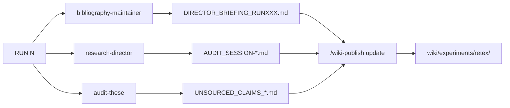

# RETEX — Retours d'experience

!!! abstract "Retour d'experience inter-sessions"
    Cette section agrege les **briefings**, **scoring reports** et **audits anti-hallucination**
    generes par les skills `/bibliography-maintainer` et `/research-director` apres chaque RUN.
    Les fichiers sont automatiquement synchronises depuis `research_archive/_staging/` par
    `wiki/build_wiki.py` lors de chaque `/wiki-publish update`.

## Director Briefings

Briefings synthetiques produits apres chaque RUN par `/bibliography-maintainer` Phase 6.

- [DIRECTOR_BRIEFING_RUN003](briefings/DIRECTOR_BRIEFING_RUN003.md)
- [DIRECTOR_BRIEFING_RUN005](briefings/DIRECTOR_BRIEFING_RUN005.md)
- [DIRECTOR_BRIEFING_RUN007](briefings/DIRECTOR_BRIEFING_RUN007.md)
- [DIRECTOR_BRIEFING_VERIFICATION_DELTA3_20260411](briefings/DIRECTOR_BRIEFING_VERIFICATION_DELTA3_20260411.md)

## Memory State

- [MEMORY_STATE.md](memory-state.md) — etat memoire cumulative

## Audits anti-hallucination (`/audit-these`)

- [MODEL_VERSIONS_AUDIT_20260406](audits/MODEL_VERSIONS_AUDIT_20260406.md)
- [UNSOURCED_CLAIMS_20260405](audits/UNSOURCED_CLAIMS_20260405.md)
- [UNSOURCED_CLAIMS_20260406](audits/UNSOURCED_CLAIMS_20260406.md)
- [UNSOURCED_CLAIMS_20260408](audits/UNSOURCED_CLAIMS_20260408.md)

## Pipeline d'update

