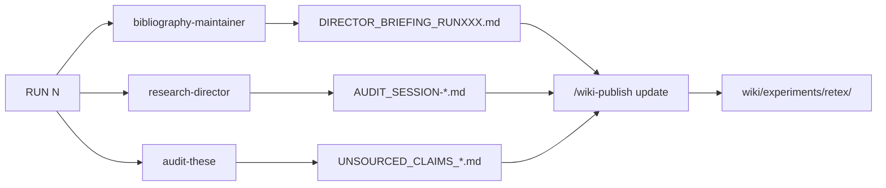

# RETEX — Retours d'experience

!!! abstract "Retour d'experience inter-sessions"
    Cette section agrege les **briefings**, **scoring reports** et **audits anti-hallucination**
    generes par les skills `/bibliography-maintainer` et `/research-director` apres chaque RUN.
    Les fichiers sont automatiquement synchronises depuis `research_archive/_staging/` par
    `wiki/build_wiki.py` lors de chaque `/wiki-publish update`.

## Director Briefings

Briefings synthetiques produits apres chaque RUN par `/bibliography-maintainer` Phase 6.

- [DIRECTOR_BRIEFING_2026-05-21](briefings/DIRECTOR_BRIEFING_2026-05-21.md)
- [DIRECTOR_BRIEFING_RUN003](briefings/DIRECTOR_BRIEFING_RUN003.md)
- [DIRECTOR_BRIEFING_RUN005](briefings/DIRECTOR_BRIEFING_RUN005.md)
- [DIRECTOR_BRIEFING_RUN007](briefings/DIRECTOR_BRIEFING_RUN007.md)
- [DIRECTOR_BRIEFING_RUN009](briefings/DIRECTOR_BRIEFING_RUN009.md)
- [DIRECTOR_BRIEFING_RUN010](briefings/DIRECTOR_BRIEFING_RUN010.md)
- [DIRECTOR_BRIEFING_RUN011](briefings/DIRECTOR_BRIEFING_RUN011.md)
- [DIRECTOR_BRIEFING_VERIFICATION_DELTA3_20260411](briefings/DIRECTOR_BRIEFING_VERIFICATION_DELTA3_20260411.md)

## Memory State

- [MEMORY_STATE.md](memory-state.md) — etat memoire cumulative

## Audits anti-hallucination (`/audit-these`)

- [AUDIT_COMPLET_20260609](audits/AUDIT_COMPLET_20260609.md)
- [AUDIT_COMPLET_20260612](audits/AUDIT_COMPLET_20260612.md)
- [CONTRADICTIONS_2026-06-10](audits/CONTRADICTIONS_2026-06-10.md)
- [FIDELITY_AUDIT_2026-06-10](audits/FIDELITY_AUDIT_2026-06-10.md)
- [MODEL_VERSIONS_AUDIT_20260406](audits/MODEL_VERSIONS_AUDIT_20260406.md)
- [MODEL_VERSIONS_AUDIT_20260520](audits/MODEL_VERSIONS_AUDIT_20260520.md)
- [MODEL_VERSIONS_AUDIT_20260609](audits/MODEL_VERSIONS_AUDIT_20260609.md)
- [MODEL_VERSIONS_AUDIT_20260612](audits/MODEL_VERSIONS_AUDIT_20260612.md)
- [TEMPORAL_AUDIT_2026-06-10](audits/TEMPORAL_AUDIT_2026-06-10.md)
- [UNSOURCED_CLAIMS_2026-06-10](audits/UNSOURCED_CLAIMS_2026-06-10.md)
- [UNSOURCED_CLAIMS_20260405](audits/UNSOURCED_CLAIMS_20260405.md)
- [UNSOURCED_CLAIMS_20260406](audits/UNSOURCED_CLAIMS_20260406.md)
- [UNSOURCED_CLAIMS_20260408](audits/UNSOURCED_CLAIMS_20260408.md)
- [UNSOURCED_CLAIMS_20260412](audits/UNSOURCED_CLAIMS_20260412.md)
- [UNSOURCED_CLAIMS_20260520](audits/UNSOURCED_CLAIMS_20260520.md)
- [UNSOURCED_CLAIMS_20260609](audits/UNSOURCED_CLAIMS_20260609.md)
- [UNSOURCED_CLAIMS_20260610](audits/UNSOURCED_CLAIMS_20260610.md)
- [UNSOURCED_CLAIMS_20260612](audits/UNSOURCED_CLAIMS_20260612.md)

## Scoring reports `/research-director`

- [AUDIT_SESSION-20260613-NEXT_scoring-report_2026-06-13_COMPLETE](scoring-reports/AUDIT_SESSION-20260613-NEXT_scoring-report_2026-06-13_COMPLETE.md)
- [AUDIT_SESSION_2026-05-20_G058VAL_scoring-report_COMPLETE](scoring-reports/AUDIT_SESSION_2026-05-20_G058VAL_scoring-report_COMPLETE.md)
- [DIRECTOR_VALIDATION_BRIEFING_G058_2026-05-20](scoring-reports/DIRECTOR_VALIDATION_BRIEFING_G058_2026-05-20.md)
- [P125_36_LLMs_LIST_PDCA3_2026-05-16](scoring-reports/P125_36_LLMs_LIST_PDCA3_2026-05-16.md)

## Pipeline d'update

```mermaid
flowchart LR
    RUN["RUN N"] --> BIB["bibliography-maintainer"]
    BIB --> BRIEF["DIRECTOR_BRIEFING_RUNXXX.md"]
    RUN --> DIR["research-director"]
    DIR --> SCORE["AUDIT_SESSION-*.md"]
    RUN --> AUDIT["audit-these"]
    AUDIT --> UNSRC["UNSOURCED_CLAIMS_*.md"]
    BRIEF --> WIKI["/wiki-publish update"]
    SCORE --> WIKI
    UNSRC --> WIKI
    WIKI --> PAGE["wiki/experiments/retex/"]
```
