# Frontend — React 19 + Vite + Tailwind v4

## Vue d'ensemble

Le frontend AEGIS est une **SPA React 19** construite avec Vite 7 et Tailwind CSS v4. Il sert deux objectifs distincts : un **dashboard chirurgical temps reel** simulant l'interface operatoire du Da Vinci Xi, et un **laboratoire Red Team** pour l'execution et l'analyse de campagnes adversariales.

L'architecture est concue pour la **these doctorale** : chaque composant UI est connecte a un vrai appel API backend (zero placeholder), et tout texte visible passe par `react-i18next` en 3 langues (FR/EN/BR).

| Metrique | Valeur |
|----------|--------|
| Fichiers source | 93 (.jsx/.js) |
| Composants dashboard | 24 (interface chirurgicale) |
| Composants Red Team | 51 (lab adversarial) |
| Hooks custom | 5 (simulation, session, audio, TTS) |
| Langues i18n | 3 (FR, EN, BR) |
| Taille i18n | 277 KB (split en chunks lazy-loaded) |
| Bundle principal | 668 KB (post-optimisation, -26%) |
| SSE endpoints | 4 composants en streaming temps reel |
| Lazy-loaded | 7 vues heavy (React.lazy) |

## Architecture a deux applications

Le frontend est organise en **deux applications distinctes** partageant le meme build Vite. Le **dashboard chirurgical** (`/`) simule l'environnement operatoire complet : moniteur patient (ECG, SpO2, BP), visualisation 3D des bras robotiques (Three.js), chat IA avec le DVSI, et carte des menaces reseau. Le **Red Team Lab** (`/redteam`) est l'outil de recherche principal : forge de prompts, execution de campagnes, exploration des resultats, et analyse des metriques delta.

Les deux applications partagent l'event bus (`robotEventBus.js`) pour la communication inter-composants et le meme systeme de routing React Router v7. L'acces au Red Team Lab se fait via `Ctrl+Shift+R` ou le bouton dans le header.

```mermaid
flowchart LR
    subgraph DASH["/ — Dashboard Chirurgical"]
        direction TB
        VM["VitalsMonitor<br/><small>ECG, SpO2, BP</small>"]
        PR["PatientRecord<br/><small>HL7 / FHIR</small>"]
        AI["AIAssistantChat<br/><small>SSE streaming</small>"]
        RA["RobotArmsView<br/><small>3D WebGL</small>"]
        CH["CameraHUD"]
        TM["ThreatMap"]
        AT["ActionTimeline"]
    end

    subgraph RT["/redteam — Red Team Lab"]
        direction TB
        CV["CatalogView"] --- FP["ForgePanel"]
        ST["ScenarioTab"] --- MP["MetricsPanel"]
        CT["CampaignTab"] --- RV["RagView"]
        DV["DefenseView"] --- LV["LogsView"]
        RE["ResultExplorer"]
        GP["GeneticProgressView"]
        HT["HistoryTab"]
    end

    DASH <-- "Ctrl+Shift+R" --> RT

    style DASH fill:#dcfce7,stroke:#2d6a4f
    style RT fill:#fee2e2,stroke:#dc2626
```

**Acces au Red Team Lab :** `Ctrl+Shift+R` ou bouton dans le header.

**Clic sur un diagramme** pour l'ouvrir en plein ecran (modale SVG zoomable, Echap pour fermer).

## Flux de donnees

Le frontend consomme les donnees du backend via **3 canaux distincts** :

- **SSE (Server-Sent Events)** : 4 composants recoivent des tokens/evenements en temps reel — `AIAssistantChat` (tokens de reponse), `TelemetryConsole` (evenements agents), `GeneticProgressView` (generations de la forge), `CampaignTab` (rounds de campagne).
- **REST JSON** : 7 composants font des requetes classiques GET/POST — catalogue, defense, scenarios, metriques, resultats. Le hook `useFetchWithCache` deduplique les requetes et maintient un cache HTTP (~85% hit rate).
- **Event Bus** : 5 canaux internes (`robot_state`, `vitals_update`, `camera_effect`, `escalation`, `kill_switch`) pour la communication entre le dashboard chirurgical et ses composants 3D/monitoring.

```mermaid
flowchart TB
    subgraph BACK["Backend (FastAPI :8042)"]
        SSE["SSE streaming"]
        REST["REST JSON"]
    end

    subgraph SSE_TARGETS["Composants SSE (temps reel)"]
        AIC["AIAssistantChat<br/><small>tokens</small>"]
        TC["TelemetryConsole<br/><small>events</small>"]
        GPV["GeneticProgressView<br/><small>generations</small>"]
        CAM["CampaignTab<br/><small>rounds</small>"]
    end

    subgraph REST_TARGETS["Composants REST (requete/reponse)"]
        CAT["CatalogView"]
        DEF["DefenseView"]
        SCE["ScenarioTab"]
        MET["MetricsPanel"]
        RES["ResultExplorer"]
    end

    subgraph EBUS["Event Bus (robotEventBus.js)"]
        direction TB
        RS["robot_state"]
        VU["vitals_update"]
        CE["camera_effect"]
        ESC["escalation"]
        KS["kill_switch"]
    end

    subgraph EBUS_TARGETS["Composants Event Bus"]
        RAV["RobotArmsView<br/><small>3D positions</small>"]
        VIT["VitalsMonitor<br/><small>ECG, SpO2, BP</small>"]
        HUD["CameraHUD<br/><small>degradation</small>"]
        EPA["EscalationPanel<br/><small>alertes</small>"]
        KSW["KillSwitch<br/><small>isolation meca.</small>"]
    end

    SSE --> AIC & TC & GPV & CAM
    REST --> CAT & DEF & SCE & MET & RES
    RS --> RAV
    VU --> VIT
    CE --> HUD
    ESC --> EPA
    KS --> KSW

    style BACK fill:#0ea5e9,stroke:#0369a1
    style EBUS fill:#7c3aed,stroke:#5b21b6
```

## Optimisations de performance (v4.1)

| Phase | Optimisation | Impact |
|-------|-------------|--------|
| Phase 1-2 | Memoisation + lazy-loading de 7 vues | Reduction du bundle initial |
| Phase 3 | Split i18n en chunks par langue | -150 KB, chargement a la demande |
| Phase 4 | Cache HTTP + deduplication de requetes | ~85% cache hit, -60% requetes dupliquees |

Le hook `useFetchWithCache` remplace `fetch + useEffect` dans 14 composants avec prefetch automatique au montage de `RedTeamLayout`.

## Stack technique

| Librairie | Version | Usage |
|-----------|---------|-------|
| React | 19.2 | Framework UI |
| React Router | 7.13 | Routing SPA |
| Three.js | 0.183 | Rendu 3D (bras robotiques) |
| React Three Fiber | 9.5 | Binding React pour Three.js |
| i18next | 25.8 | Internationalisation |
| Tailwind CSS | 4 | Styles utilitaires |
| Lucide React | -- | Icones |
| Vitest | -- | Tests unitaires |

## Routing

| Route | Composant | Lazy |
|-------|-----------|------|
| `/` | App (dashboard chirurgical) | Non |
| `/redteam` | RedTeamLayout | Non |
| `/redteam/rag` | RagView | Oui |
| `/redteam/exercise` | ExerciseView | Oui |
| `/redteam/defense` | DefenseView | Oui |
| `/redteam/analysis` | AnalysisView | Oui |
| `/redteam/prompt-forge` | PromptForge | Oui |
| `/redteam/campaign` | CampaignView | Oui |
| `/redteam/results` | ResultExplorer | Oui |
| `/redteam/logs` | LogsView | Non |
| `/redteam/catalog` | CatalogView | Non |
| `/redteam/studio` | StudioView | Non |
| `/redteam/playground` | PlaygroundView | Non |
| `/redteam/timeline` | TimelineView | Non |
| `/redteam/scenarios` | ScenariosView | Non |
| `/redteam/history` | HistoryView | Non |

---

## Dashboard chirurgical (24 composants)

### Moniteur patient

| Composant | Taille | Description |
|-----------|--------|-------------|
| VitalsMonitor.jsx | 18 KB | Monitoring des constantes vitales |
| EcgCanvas.jsx | 8 KB | Canvas de tracage ECG en temps reel |
| PatientRecord.jsx | 23 KB | Affichage des donnees patient (HL7) |
| CameraHUD.jsx | 5 KB | Overlay HUD sur le flux camera endoscopique |

### Interface operatoire

| Composant | Taille | Description |
|-----------|--------|-------------|
| RobotArmsView.jsx | 10 KB | Visualisation 3D des 4 bras (Three.js, lazy-loaded) |
| KillSwitch.jsx | 2 KB | Bouton d'isolation mecanique |
| ActionTimeline.jsx | 5 KB | Journal temps reel des evenements |
| ProtocolView.jsx | 3 KB | Visualisation du protocole chirurgical |

### Communication IA

| Composant | Taille | Description |
|-----------|--------|-------------|
| AIAssistantChat.jsx | 31 KB | Interface chat avec l'IA chirurgicale |
| EscalationPanel.jsx | 5 KB | Panneau d'escalade des alertes |
| SecOpsTerminal.jsx | 3 KB | Terminal d'operations de securite |
| TelemetryConsole.jsx | 16 KB | Console de telemetrie des agents |

### Visualisation des menaces

| Composant | Taille | Description |
|-----------|--------|-------------|
| ThreatMap.jsx | 9 KB | Carte du reseau hospitalier avec vecteurs d'attaque |
| RansomwareScreen.jsx | 7 KB | Ecran de simulation ransomware |
| ExplanationModal.jsx | 56 KB | Modal explicative detaillee |

---

## Red Team Lab (51 composants)

### Vues principales (12 fichiers dans `views/`)

| Vue | Taille | Description |
|-----|--------|-------------|
| AnalysisView | 26 KB | Analyse detaillee des resultats d'attaque |
| CatalogView | 13 KB | Navigateur du catalogue d'attaques |
| DefenseView | 14 KB | Vue des mecanismes de defense |
| ExerciseView | 13 KB | Exercices d'entrainement |
| LogsView | 13 KB | Affichage des logs |
| PlaygroundView | 1 KB | Wrapper playground |
| RagView | 22 KB | Interface RAG (upload, query, seed) |
| ResultExplorer | 18 KB | Exploration des resultats experimentaux |

### Panneaux (5 fichiers dans `panels/`)

| Panneau | Taille | Description |
|---------|--------|-------------|
| ForgePanel | 42 KB | Forge de prompts adversariaux |
| InjectionLabPanel | 14 KB | Laboratoire d'injection |
| MetricsPanel | 17 KB | Metriques et analytics |
| SessionPanel | 9 KB | Gestion de session |
| SystemPromptPanel | 5 KB | Editeur de system prompts |

### Composants centraux (21 fichiers)

| Composant | Taille | Description |
|-----------|--------|-------------|
| AdversarialStudio | 38 KB | Studio adversarial principal |
| CampaignTab | 36 KB | Gestion et execution de campagnes |
| ScenarioTab | 67 KB | Templates d'attaque et scenarios |
| ScenarioHelpModal | 200 KB | Modals d'aide (98 templates documentes) |
| CatalogTab | 20 KB | Navigateur de catalogue |
| PlaygroundTab | 17 KB | Playground de test rapide |
| PromptForgeMultiLLM | 20 KB | Forge multi-LLM |
| GeneticProgressView | 14 KB | Suivi de l'optimiseur genetique |
| HistoryTab | 12 KB | Historique des sessions |
| DigitalTwin | 5 KB | Simulation physique du jumeau numerique |
| TestSuitePanel | 12 KB | Execution de suites de tests |

### Composants partages (9 fichiers dans `shared/`)

| Composant | Description |
|-----------|-------------|
| DefenseTaxonomyCard | Carte taxonomie defensive |
| GuardrailBenchmarkTable | Tableau benchmark guardrails |
| LiuBenchmarkCard | Metriques Liu et al. |
| TaxonomyCoverageCard | Couverture taxonomique |
| PayloadEditModal | Editeur de payload |
| CatalogCrudTab | Operations CRUD catalogue |
| ViewHelpModal | Modal d'aide generique |

---

## Hooks custom (5)

| Hook | Description |
|------|-------------|
| `useRobotSimulation` | Simulation de comportement robotique (10 Hz) |
| `useSessionRecorder` | Enregistrement de session dans localStorage |
| `useSessionPlayer` | Lecture/replay de session |
| `useAudioEffects` | Effets sonores et alarmes |
| `useTTS` | Text-to-Speech (voix distinctes par agent) |

## Gestion d'etat

- **Pas de Redux/Context global** : etat local via `useState` hooks
- **Event bus** : `robotEventBus.js` pour communication inter-composants
- **Session storage** : `localStorage` via hooks custom
- **Router state** : React Router v7

## Code splitting

7 vues heavy sont lazy-loaded (`React.lazy`), 7 vues legeres sont importees statiquement. Le ScenarioHelpModal (200 KB) est le plus gros composant du projet.
