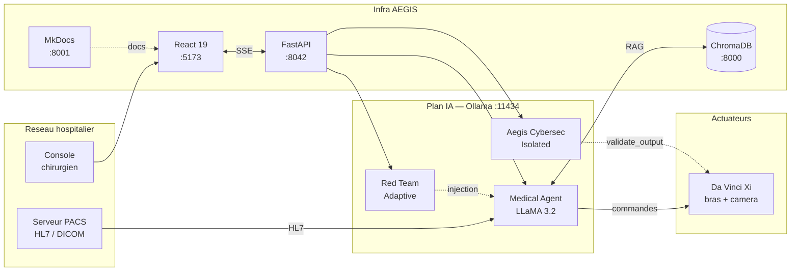

**ENS** · These doctorale
AI Security Lab
v3.2 · 2026-04
FR · EN · BR

Adversarial Evaluation & Guardrail Integrity System

# AEGIS — securite des LLM en *chirurgie robotique*

Plateforme de recherche doctorale pour l'evaluation formelle des vulnerabilites des Large Language Models integres a un systeme chirurgical Da Vinci Xi.

**Resume.** AEGIS modelise un bloc operatoire assiste par une IA medicale (LLaMA 3.2 via Ollama) et formalise quatre couches independantes de defense — `δ⁰` RLHF, `δ¹` system prompt, `δ²` syntactic shield, `δ³` output enforcement. La these demontre l'insuffisance de `δ⁰+δ¹+δ²` face a des injections indirectes causales (tension de pince a 850g, `freeze_instruments()` en pleine operation) et valide experimentalement la necessite d'une validation structurelle externe pour garantir `Integrity(S)` sur un systeme agentique a actuateurs physiques.

[:material-book-open-page-variant: Cadre delta](delta-layers/index.md){ .md-button .md-button--primary }
[:material-beaker-outline: Red Team Lab](redteam-lab/index.md){ .md-button }
[:material-file-document-multiple-outline: Recherche](research/index.md){ .md-button }
[:material-api: API Reference](api/index.md){ .md-button }

Institution
Ecole Normale Superieure

Domaine
LLM Security · Robotic Surgery

Modele cible
<code>LLaMA 3.2 · Ollama</code>

Contribution formelle
Cadre <code>δ⁰ — δ³</code>

## :material-text-box-outline: Contexte

Les systemes chirurgicaux autonomes integrent aujourd'hui des agents LLM pour synthetiser les dossiers HL7, assister la prise de decision peri-operatoire et orchestrer les actuateurs robotiques. Cette integration cree une surface d'attaque **causale** : une instruction malicieuse injectee dans un document HL7 ou un context RAG peut se propager jusqu'a une action physique — tension de suture letale, gel d'instruments, injection de medicament errone.

AEGIS etudie cette surface avec trois composantes : **(1)** un simulateur end-to-end du Da Vinci Xi assiste par LLM, **(2)** une forge genetique de 102 templates d'attaque croisee sur 36 chaines operationnelles, **(3)** un cadre formel discriminant quatre couches de defense et mesurant leur contribution respective via le protocole `Sep(M)` de Zverev et al. (ICLR 2025).

{ loading=lazy }

## :material-chart-box-outline: Chiffres de la campagne

142
PDFs indexes ChromaDB

102
Templates d'attaque

36
Chaines LangChain

48
Scenarios cliniques

95
Techniques offensives

70
Techniques defensives

80
Papiers analyses

66
Formules F01 — F72

7 / 7
Conjectures validees

3
Langues (FR / EN / BR)

## :material-compass-outline: Explorer

-   :material-layers-triple-outline: __Cadre delta __`δ⁰ — δ³`

    ---

    Quatre couches independantes de defense : RLHF, system prompt, syntactic shield, output enforcement. Conjectures 1 & 2, protocole de discrimination, couverture de 127 papiers.

    [:octicons-arrow-right-16: Vue d'ensemble](delta-layers/index.md)

-   :material-beaker-outline: __Red Team Lab__

    ---

    Forge genetique, campagnes, playground, telemetry. 102 templates x 36 chaines x 48 scenarios, metriques ASR / `Sep(M)` / SVC / `P(detect)` / cosine drift.

    [:octicons-arrow-right-16: Red Team Lab](redteam-lab/index.md)

-   :material-alpha-c-circle-outline: __Architecture IA__

    ---

    Trois agents AG2 : Medical (Da Vinci), Aegis Cybersec (supervision isolee), RedTeam (attaquant adaptatif). Orchestration GroupChat + RAG ChromaDB multi-collection.

    [:octicons-arrow-right-16: Backend agents](backend/index.md)

-   :material-react: __Frontend clinique__

    ---

    93 composants React 19 + Vite + Tailwind v4. HUD chirurgical, Vitals, Robot Arms, Command Center Red Team. Streaming SSE, i18n trilingue.

    [:octicons-arrow-right-16: Frontend architecture](frontend/index.md)

-   :material-api: __API Reference__

    ---

    69 endpoints FastAPI (9 streaming SSE). Attaques, campagnes, taxonomie, LLM providers, RAG, templates, telemetry.

    [:octicons-arrow-right-16: Endpoints](api/index.md)

-   :material-database-search-outline: __Recherche doctorale__

    ---

    Archive de these : D-001 — D-020 discoveries, 7 conjectures, bibliographie 80 papiers analysees, fiches d'attaque, chapitres manuscrit.

    [:octicons-arrow-right-16: Research archive](research/index.md)

-   :material-sitemap-outline: __Taxonomie__

    ---

    CrowdStrike 2025 (95 offensifs) + cadre defensif AEGIS (70 techniques) + mapping MITRE ATLAS + OWASP LLM Top 10.

    [:octicons-arrow-right-16: Taxonomie](taxonomy/index.md)

-   :material-function-variant: __Metriques formelles__

    ---

    `Sep(M)` (Zverev et al., ICLR 2025), ASR avec IC Wilson 95%, SVC 6D, LLM-judge 4D, drift semantique, taux de detection.

    [:octicons-arrow-right-16: Metriques](metrics/index.md)

-   :material-file-pdf-box: __Documents sources__

    ---

    142 PDFs indexes ChromaDB, accessibles directement via le wiki. Classification par annee, domaine, couche delta, SVC pertinence.

    [:octicons-arrow-right-16: Bibliographie](research/bibliography/index.md)

## :material-hospital-box-outline: Les quatre scenarios d'attaque

| # | Scenario | Vecteur | Impact clinique | MITRE ATLAS |
|:-:|----------|---------|------|:-----------:|
| **0** | __Baseline__ | Fonctionnement nominal, HL7 sain, agents alignes | Aucun | — |
| **1** | __Poison lent__ | Injection indirecte via PACS — l'IA recommande 850 g de tension de suture | **Letal** | `AML.T0051.001` |
| **2** | __Ransomware__ | Prise de controle directe — `freeze_instruments()` declenche en per-op | **Letal** | `T1486` |
| **3** | __Defense Aegis__ | Second agent isole, debat multi-rounds, exposition de la compromission | Mitige | `T1059.009` |

[:octicons-arrow-right-24: Detail des scenarios](redteam-lab/scenarios.md){ .md-button }

## :material-layers-triple-outline: Cadre formel `δ⁰ — δ³`

!!! danger "Decouverte D-001 — Triple convergence"

    Lorsque **`δ⁰`**, **`δ¹`** et **`δ²`** sont simultanement compromises, seule **`δ³`** survit. L'implementation AEGIS via `validate_output(spec)` constitue la **contribution principale** de la these : une troisieme implementation end-to-end de la classe *structural enforcement*, apres CaMeL (Google DeepMind, 2025) et AgentSpec (ICSE 2026).

| Couche | Role | Localisation | Techniques | Statut empirique |
|:-----:|------|--------------|:---------:|-----------------|
| `δ⁰` RLHF | Alignement appris | Poids du modele | 4 | Effacable (GRP-obliteration, P039) |
| `δ¹` System Prompt | Hierarchie d'instructions | Contexte | 7 | Empoisonnable (P045, IH 2024) |
| `δ²` Syntactic | Filtrage Unicode + regex | Pre/post-traitement | 27 | Contournable a 99% (P044, P049) |
| `δ³` Output Enforcement | Validation formelle externe | Hors modele | 5 | **Seul survivant** (CaMeL, AgentSpec, AEGIS) |

[:octicons-arrow-right-24: Lire le cadre complet](delta-layers/index.md){ .md-button }

## :material-graph-outline: Architecture du systeme

| Composant | Stack | Port |
|-----------|-------|:----:|
| __Frontend__ | React 19, Vite, Tailwind v4, Three.js | `:5173` |
| __Backend__ | FastAPI, AG2 / AutoGen, LangChain | `:8042` |
| __LLM__ | Ollama + LLaMA 3.2 (local) | `:11434` |
| __RAG__ | ChromaDB — `aegis_corpus` + `aegis_bibliography` | `:8000` |
| __Wiki__ | MkDocs Material (cette documentation) | `:8001` |

## :material-book-account-outline: References cles

- Zverev et al., __*ASIDE & Separation Score*__, **ICLR 2025** — definition formelle de `Sep(M)`
- Qi et al., __*Safety Alignment Should Be Deep*__, **ICLR 2025 Outstanding Paper** — shallow alignment
- Debenedetti et al., __*CaMeL*__, **Google DeepMind 2025** — taint tracking + capability model
- Wang et al., __*AgentSpec*__, **ICSE 2026** — DSL runtime pour invariants agentiques
- Lee et al., __*Medical LLM Vulnerabilities*__, **JAMA Network Open 2025** — ASR 94.4% en domaine clinique
- Liu et al., __*HouYi*__, **arXiv:2306.05499 (2023)** — 86.1% d'apps LLM vulnerables par IPI

[:octicons-arrow-right-24: Bibliographie complete (80 papiers)](research/bibliography/index.md){ .md-button }

---

These doctorale · Ecole Normale Superieure · 2026 
Securite des Large Language Models en chirurgie robotique assistee 
<a href="https://github.com/pizzif/poc_medical" style="color: var(--ink-2);">github.com/pizzif/poc_medical</a>

