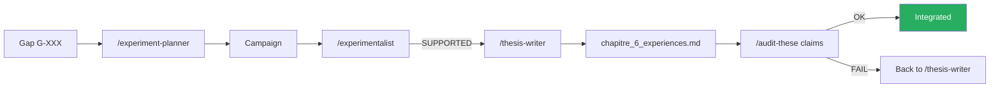

# AEGIS thesis manuscript

!!! abstract "Doctoral thesis in progress — ENS, 2026"
    **Title**: *"Instruction/Data Separation in LLMs: Impossibility, Measurement and
    Structural Defense"*

    **Director**: **David Naccache** (ENS)
    **Testbed**: AEGIS Red Team Lab — Da Vinci Xi surgical robot (simulated)
    **Corpus**: 130 papers (P001-P130, excl. P088/P105/P106)
    **Progress**: ~85% (chapters I-V drafted, chapter VI in progress)

## 1. Manuscript structure

```
research_archive/manuscript/
├── PITCH_DOCTORAT_NACCACHE_2026.docx       — initial director pitch
├── PROJET_DOCTORAL_PIZZI_v8.docx           — doctoral project v8
├── Chapitre_II_Methodologie_V2.docx         — methodology v2
├── Chapitre_II_Metodologia_PT.docx          — PT translation
├── Chapitre_VI_quater_Africa_EN.docx        — chapter 6 quater Africa (EN)
├── Addendum_ChapitreV_TippingPoint2028.docx — addendum V
├── Note_Densite_Cognitive_Huang_2026.docx   — Huang note
├── Note_Academique_AI_for_Americans_First.docx
├── Note_Academique_Context_Isolated_Adversarial_Workflow.md
├── academic_notes_2023_2026.md              — integrated academic notes
├── formal_framework_complete.md             — complete formal framework
├── formal_test_protocol.md                  — test protocol
├── chapitre_6_experiences.md                — chapter 6 experiments (live)
├── article-linkedin-academique.md           — popularization
├── peer_preservation_thesis_formulation.md  — C8 formulation
├── thesis_project.md                        — global project
└── theory_sd_rag_poisoning_en.md            — SD RAG theory
```

## 2. General outline

### Chapter I — Introduction (80%)

- Motivation: Lee et al. (JAMA 2025) 94.4% ASR on medical LLMs
- Problem statement: formal impossibility of separating instruction/data
- Contribution: δ⁰–δ³ framework + AEGIS implementation
- State: near finalization, needs update with P126 Tramer

### Chapter II — Methodology (90%)

- Keshav 3-pass protocol for literature review
- N >= 30, Wilson CI, Sep(M) statistical validity
- Automated PDCA pipeline with skills
- Mandatory cross-validation (anti-hallucination rule)
- **Trilingual**: FR / EN / PT available

### Chapter III — State of the art (85%)

- **130 papers** analyzed via Keshav 3-pass
- Organization by δ⁰–δ³ layer (see [INDEX_BY_DELTA](../research/bibliography/by-delta.md))
- CrowdStrike 95 + AEGIS 70 defenses taxonomy
- **Identified gap**: no medical + δ³ paper (except AEGIS)

### Chapter IV — δ⁰–δ³ formal framework (85%)

- **Definition 7**: `Integrity(S) := Reachable(M, i) ⊆ Allowed(i)`
- **Definition 3.3bis**: Zverev 2025 extension for δ⁰
- **Theorem**: martingale gradient (Young 2026) proves C3
- **Conjectures C1-C8** with evolving scores

### Chapter V — AEGIS implementation (75%)

- Backend architecture (FastAPI + AG2 + ChromaDB)
- Frontend React + Vite + Tailwind v4
- Genetic forge (port of Liu 2023 + AEGIS dual scoring)
- 42 attack chains, 48 scenarios, 102 templates
- RagSanitizer 15 detectors
- validate_output + AllowedOutputSpec

### Chapter VI — Experiments (60%)

- **TC-001 / TC-002**: Triple Convergence — D-022 δ⁰/δ¹ paradox
- **THESIS-001**: 1200-run campaign — **D-023 / D-024 / D-025**
- **THESIS-002**: cross-model XML Agent 100% ASR
- **THESIS-003**: cross-family Qwen 3 32B (in progress)
- **RAG-001**: chain_defenses active

### Chapter VI quater — Africa (80%, English + Portuguese)

Regional dimension — impacts specific to countries with weak medical infrastructure and
increased vulnerability to the deployment of unaudited LLMs.

### Chapter VII — Discussion & Conclusion (30%)

- Implications for medical regulation (FDA, EMA)
- Simulation limitations
- Roadmap: CaMeL + AgentSpec + ASIDE integration
- Outlook: D-027 (CodeAct), D-028 (ToolSandbox)

## 3. Original contributions

!!! success "The 5 publishable contributions"

    ### Contribution 1 — Formalized δ⁰–δ³ framework

    First framework that unifies **5 scattered concepts** (safety layers, shallow alignment,
    outer/inner alignment, safety knowledge neurons, ASIDE) under a measurable 4-layer taxonomy.

    ### Contribution 2 — D-024 HyDE self-amplification

    **First endogenous pre-retrieval attack vector** documented in the RAG pipeline.
    No attacker prerequisite (no corpus poisoning, no retriever fine-tuning). 96.7% ASR.

    **6-stage RAG taxonomy** introduced by D-024.

    ### Contribution 3 — D-025 Parsing Trust exploit

    **XML Agent 96.7% ASR** with SVC 0.11. Requires **d⁷ (Parsing Trust)** as the 7th SVC
    dimension, absent from Zhang 2025 scoring.

    ### Contribution 4 — AEGIS δ³ medical end-to-end

    **First medical-specialized δ³ prototype**: `validate_output` + `AllowedOutputSpec`
    grounded in FDA 510k Da Vinci. Fills the D-002 gap (CaMeL/AgentSpec/LlamaFirewall without
    domain specialization).

    ### Contribution 5 — D-022 δ⁰/δ¹ Paradox

    **Counter-intuitive**: δ⁰+δ¹ combined REDUCES ASR vs δ¹ alone. Layer convergence
    is **antagonistic, not additive**. The optimal attacker must **choose**, not combine.

## 4. Planned publications

| Venue | Subject | Status | Deadline |
|-------|---------|--------|:--------:|
| **IEEE S&P 2027** | AEGIS δ⁰–δ³ framework + medical case study | Draft | 2026-11-01 |
| **ACL 2026** | D-024 HyDE self-amplification | Writing | 2026-05-15 |
| **ICLR 2027** | D-022 δ⁰/δ¹ paradox + new formulation | Plan | 2026-09-30 |
| **JAMA** | Medical impact + comparative commercial LLMs | Note | 2027-01 |
| **Distill.pub** | Visual popularization of the δ⁰–δ³ framework | Plan | 2026-12 |

## 5. Annex documents

### Academic notes

- `academic_notes_2023_2026.md` — notes on 100+ read papers
- `Note_Academique_Context_Isolated_Adversarial_Workflow.md` — isolated workflow
- `Note_Densite_Cognitive_Huang_2026.md` — Huang 2026 commentary

### Protocols

- `formal_test_protocol.md` — conjecture test protocol
- `formal_framework_complete.md` — complete mathematical framework
- `methodological_critique_w1_w5.md` — methodological critique
- `methodology_weaknesses_and_next_steps.md` — self-critique

### Articles

- `article-linkedin-academique.md` — linkedin version for dissemination

## 6. Progress state

| Chapter | Maturity | Blockers | Action |
|---------|:--------:|----------|--------|
| I Introduction | 80% | P126 update | Integrate scooping risk |
| II Methodology | 90% | — | Final proofreading |
| III State of the art | 85% | P128-P130 integration | `/bibliography-maintainer incremental` |
| IV Formal framework | 85% | — | Possible Lean 4 validation |
| V Implementation | 75% | Forge documentation | This wiki page |
| VI Experiments | 60% | THESIS-003 in progress | Wait for Qwen results |
| VI quater Africa | 80% | — | — |
| VII Conclusion | 30% | Chap VI must be done | Wait for Chap VI |

## 7. Writing rules (CLAUDE.md)

!!! warning "Absolute rules"

    - **ZERO placeholder** in the manuscript
    - **ZERO emoticon** (academic)
    - **δ⁰–δ³ notation** Unicode required
    - **Inline references**: `(Author, Year, Section X, Eq. Y, p. Z)`
    - **Epistemic tags**: `[ARTICLE VERIFIE]`, `[PREPRINT]`, `[HYPOTHESE]`, `[CALCUL VERIFIE]`
    - **Sep(M) >= 30** per condition, otherwise `[EXPERIMENTAL - N insufficient]`
    - **Cross-validation**: 3 random numbers verified against ChromaDB fulltext after every batch
    - **Trilingual** FR / EN / PT for key chapters (I, II, VI quater)

## 8. Automated skills → manuscript pipeline



## 9. Resources

- :material-folder: [research_archive/manuscript/](https://github.com/pizzif/poc_medical/tree/main/research_archive/manuscript)
- :material-book: [formal_framework_complete.md](../research/index.md)
- :material-chart-bar: [Experiments — THESIS-001/002/003](../experiments/index.md)
- :material-lightbulb: [28 discoveries](../research/discoveries/d-series.md)
- :material-compass: [8 conjectures](../research/discoveries/c-series.md)
- :material-shield: [δ⁰–δ³ Framework](../delta-layers/index.md)
