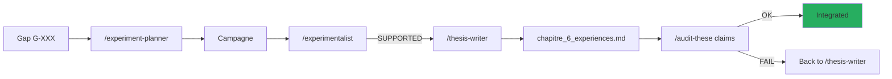

# Manuscrit de these AEGIS

!!! abstract "These doctorale en cours — ENS, 2026"
    **Titre** : *"Separation Instruction/Donnees dans les LLMs : Impossibilite, Mesure et
    Defense Structurelle"*

    **Directeur** : **David Naccache** (ENS)
    **Terrain** : AEGIS Red Team Lab — Robot Chirurgical Da Vinci Xi (simule)
    **Corpus** : 130 papiers (P001-P130, excl. P088/P105/P106)
    **Avancement** : ~85% (chapitres I-V rediges, chapitre VI en cours)

## 1. Structure du manuscrit

```
research_archive/manuscript/
├── PITCH_DOCTORAT_NACCACHE_2026.docx       — pitch initial directeur
├── PROJET_DOCTORAL_PIZZI_v8.docx           — projet doctoral v8
├── Chapitre_II_Methodologie_V2.docx         — methodologie v2
├── Chapitre_II_Metodologia_PT.docx          — traduction PT
├── Chapitre_VI_quater_Africa_EN.docx        — chapitre 6 quater Africa (EN)
├── Addendum_ChapitreV_TippingPoint2028.docx — addendum V
├── Note_Densite_Cognitive_Huang_2026.docx   — note Huang
├── Note_Academique_AI_for_Americans_First.docx
├── Note_Academique_Context_Isolated_Adversarial_Workflow.md
├── academic_notes_2023_2026.md              — notes academiques integrees
├── formal_framework_complete.md             — cadre formel complet
├── formal_test_protocol.md                  — protocole de test
├── chapitre_6_experiences.md                — chapitre 6 experiences (live)
├── article-linkedin-academique.md           — vulgarisation
├── peer_preservation_thesis_formulation.md  — C8 formulation
├── thesis_project.md                        — projet global
└── theory_sd_rag_poisoning_en.md            — theorie SD RAG
```

## 2. Plan general

### Chapitre I — Introduction (80%)

- Motivation : Lee et al. (JAMA 2025) 94.4% ASR sur LLMs medicaux
- Problematique : impossibilite formelle de separer instruction/donnee
- Contribution : cadre δ⁰–δ³ + implementation AEGIS
- Etat : pres de finalisation, necessite MAJ avec P126 Tramer

### Chapitre II — Methodologie (90%)

- Protocole Keshav 3-pass pour revue litterature
- N >= 30, Wilson CI, Sep(M) validite statistique
- Pipeline PDCA automatise avec skills
- Cross-validation obligatoire (regle anti-hallucination)
- **Trilingue** : FR / EN / PT disponibles

### Chapitre III — Etat de l'art (85%)

- **130 papiers** analyses via Keshav 3-pass
- Organisation par couche δ⁰–δ³ (cf. [INDEX_BY_DELTA](../research/bibliography/by-delta.md))
- Taxonomie CrowdStrike 95 + AEGIS 70 defenses
- **Gap identifie** : aucun paper medical + δ³ (sauf AEGIS)

### Chapitre IV — Cadre formel δ⁰–δ³ (85%)

- **Definition 7** : `Integrity(S) := Reachable(M, i) ⊆ Allowed(i)`
- **Definition 3.3bis** : extension Zverev 2025 pour δ⁰
- **Theoreme** : gradient martingale (Young 2026) prouve C3
- **Conjectures C1-C8** avec scores evolutifs

### Chapitre V — AEGIS implementation (75%)

- Architecture backend (FastAPI + AG2 + ChromaDB)
- Frontend React + Vite + Tailwind v4
- Forge genetique (portage Liu 2023 + AEGIS dual scoring)
- 42 attack chains, 48 scenarios, 102 templates
- RagSanitizer 15 detecteurs
- validate_output + AllowedOutputSpec

### Chapitre VI — Experiences (60%)

- **TC-001 / TC-002** : Triple Convergence — D-022 paradoxe δ⁰/δ¹
- **THESIS-001** : campagne 1200 runs — **D-023 / D-024 / D-025**
- **THESIS-002** : cross-model XML Agent 100% ASR
- **THESIS-003** : cross-family Qwen 3 32B (en cours)
- **RAG-001** : chain_defenses active

### Chapitre VI quater — Africa (80%, anglais + portugais)

Dimension regionale — impacts specifiques aux pays a faible infrastructure medicale et
vulnerabilite accrue au deployment de LLMs non-audites.

### Chapitre VII — Discussion & Conclusion (30%)

- Implications pour la regulation medicale (FDA, EMA)
- Limites de la simulation
- Roadmap : integration CaMeL + AgentSpec + ASIDE
- Ouverture : D-027 (CodeAct), D-028 (ToolSandbox)

## 3. Contributions originales

!!! success "Les 5 contributions publiables"

    ### Contribution 1 — Cadre δ⁰–δ³ formalise

    Premier cadre qui unifie **5 concepts dispersés** (safety layers, shallow alignment, outer/inner
    alignment, safety knowledge neurons, ASIDE) sous une taxonomie a 4 couches mesurable.

    ### Contribution 2 — D-024 HyDE self-amplification

    **Premier vecteur d'attaque endogene pre-retrieval** documente dans le pipeline RAG.
    Aucun prerequis attaquant (pas de corpus poisoning, pas de retriever fine-tuning). 96.7% ASR.

    **Taxonomie RAG a 6 stages** introduite par D-024.

    ### Contribution 3 — D-025 Parsing Trust exploit

    **XML Agent 96.7% ASR** avec SVC 0.11. Necessite **d⁷ (Parsing Trust)** comme 7eme dimension
    SVC, absente du scoring Zhang 2025.

    ### Contribution 4 — AEGIS δ³ medical end-to-end

    **Premier prototype δ³ specialise medical** : `validate_output` + `AllowedOutputSpec`
    ancre dans FDA 510k Da Vinci. Comble le gap D-002 (CaMeL/AgentSpec/LlamaFirewall sans
    specialisation domaine).

    ### Contribution 5 — D-022 Paradoxe δ⁰/δ¹

    **Contre-intuitif** : δ⁰+δ¹ combines REDUISENT l'ASR vs δ¹ seul. La convergence des couches
    est **antagoniste, pas additive**. L'attaquant optimal doit **choisir**, pas combiner.

## 4. Publications prevues

| Venue | Sujet | Statut | Deadline |
|-------|-------|--------|:--------:|
| **IEEE S&P 2027** | AEGIS δ⁰–δ³ framework + case study medical | Draft | 2026-11-01 |
| **ACL 2026** | D-024 HyDE self-amplification | Ecriture | 2026-05-15 |
| **ICLR 2027** | D-022 paradoxe δ⁰/δ¹ + nouvelle formulation | Plan | 2026-09-30 |
| **JAMA** | Impact medical + comparative LLMs commerciaux | Note | 2027-01 |
| **Distill.pub** | Vulgarisation visuelle du cadre δ⁰–δ³ | Plan | 2026-12 |

## 5. Documents annexes

### Notes academiques

- `academic_notes_2023_2026.md` — notes sur 100+ papiers lus
- `Note_Academique_Context_Isolated_Adversarial_Workflow.md` — workflow isole
- `Note_Densite_Cognitive_Huang_2026.md` — commentaire Huang 2026

### Protocoles

- `formal_test_protocol.md` — protocole test conjectures
- `formal_framework_complete.md` — cadre mathematique complet
- `methodological_critique_w1_w5.md` — critique methodologique
- `methodology_weaknesses_and_next_steps.md` — auto-critique

### Articles

- `article-linkedin-academique.md` — version linkedin pour diffusion

## 6. Etat d'avancement

| Chapitre | Maturite | Bloqueurs | Action |
|----------|:--------:|-----------|--------|
| I Introduction | 80% | MAJ P126 | Integrer scooping risk |
| II Methodologie | 90% | — | Relecture finale |
| III Etat de l'art | 85% | Integration P128-P130 | `/bibliography-maintainer incremental` |
| IV Cadre formel | 85% | — | Validation Lean 4 possible |
| V Implementation | 75% | Documentation Forge | Cette page wiki |
| VI Experiences | 60% | THESIS-003 en cours | Attendre Qwen results |
| VI quater Africa | 80% | — | — |
| VII Conclusion | 30% | Chap VI must be done | Attendre Chap VI |

## 7. Regles de redaction (CLAUDE.md)

!!! warning "Regles absolues"

    - **ZERO placeholder** dans le manuscrit
    - **ZERO emoticon** (academique)
    - **Notation δ⁰–δ³** Unicode obligatoire
    - **References inline** : `(Auteur, Annee, Section X, Eq. Y, p. Z)`
    - **Tags epistemiques** : `[ARTICLE VERIFIE]`, `[PREPRINT]`, `[HYPOTHESE]`, `[CALCUL VERIFIE]`
    - **Sep(M) >= 30** par condition, sinon `[EXPERIMENTAL - N insuffisant]`
    - **Cross-validation** : 3 chiffres aleatoires verifies contre fulltext ChromaDB apres chaque batch
    - **Trilingue** FR / EN / PT pour chapitres cles (I, II, VI quater)

## 8. Pipeline automatise skills → manuscrit



## 9. Ressources

- :material-folder: [research_archive/manuscript/](https://github.com/pizzif/poc_medical/tree/main/research_archive/manuscript)
- :material-book: [formal_framework_complete.md](../research/index.md)
- :material-chart-bar: [Experiments — THESIS-001/002/003](../experiments/index.md)
- :material-lightbulb: [28 decouvertes](../research/discoveries/d-series.md)
- :material-compass: [8 conjectures](../research/discoveries/c-series.md)
- :material-shield: [Cadre δ⁰–δ³](../delta-layers/index.md)
