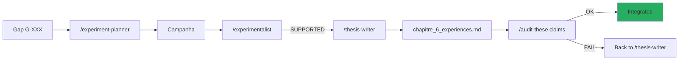

# Manuscrito de tese AEGIS

!!! abstract "Tese doutoral em andamento — ENS, 2026"
    **Titulo** : *"Separation Instruction/Donnees dans les LLMs : Impossibilite, Mesure et
    Defense Structurelle"*

    **Diretor** : **David Naccache** (ENS)
    **Terreno** : AEGIS Red Team Lab — Robot Cirurgico Da Vinci Xi (simulado)
    **Corpus** : 130 papers (P001-P130, excl. P088/P105/P106)
    **Avanco** : ~85% (capitulos I-V escritos, capitulo VI em andamento)

## 1. Estrutura do manuscrito

```
research_archive/manuscript/
├── PITCH_DOCTORAT_NACCACHE_2026.docx       — pitch inicial diretor
├── PROJET_DOCTORAL_PIZZI_v8.docx           — projeto doutoral v8
├── Chapitre_II_Methodologie_V2.docx         — metodologia v2
├── Chapitre_II_Metodologia_PT.docx          — traducao PT
├── Chapitre_VI_quater_Africa_EN.docx        — capitulo 6 quater Africa (EN)
├── Addendum_ChapitreV_TippingPoint2028.docx — addendum V
├── Note_Densite_Cognitive_Huang_2026.docx   — nota Huang
├── Note_Academique_AI_for_Americans_First.docx
├── Note_Academique_Context_Isolated_Adversarial_Workflow.md
├── academic_notes_2023_2026.md              — notas academicas integradas
├── formal_framework_complete.md             — framework formal completo
├── formal_test_protocol.md                  — protocolo de teste
├── chapitre_6_experiences.md                — capitulo 6 experimentos (live)
├── article-linkedin-academique.md           — divulgacao
├── peer_preservation_thesis_formulation.md  — formulacao C8
├── thesis_project.md                        — projeto global
└── theory_sd_rag_poisoning_en.md            — teoria SD RAG
```

## 2. Plano geral

### Capitulo I — Introducao (80%)

- Motivacao : Lee et al. (JAMA 2025) 94.4% ASR em LLMs medicos
- Problematica : impossibilidade formal de separar instruction/data
- Contribuicao : framework δ⁰–δ³ + implementacao AEGIS
- Estado : proximo da finalizacao, requer atualizacao com P126 Tramer

### Capitulo II — Metodologia (90%)

- Protocolo Keshav 3-pass para revisao de literatura
- N >= 30, Wilson CI, Sep(M) validade estatistica
- Pipeline PDCA automatizado com skills
- Cross-validation obrigatoria (regra anti-halucinacao)
- **Trilingue** : FR / EN / PT disponiveis

### Capitulo III — Estado da arte (85%)

- **130 papers** analisados via Keshav 3-pass
- Organizacao por camada δ⁰–δ³ (cf. [INDEX_BY_DELTA](../research/bibliography/by-delta.md))
- Taxonomia CrowdStrike 95 + AEGIS 70 defesas
- **Gap identificado** : nenhum paper medical + δ³ (exceto AEGIS)

### Capitulo IV — Framework formal δ⁰–δ³ (85%)

- **Definicao 7** : `Integrity(S) := Reachable(M, i) ⊆ Allowed(i)`
- **Definicao 3.3bis** : extensao Zverev 2025 para δ⁰
- **Teorema** : gradient martingale (Young 2026) prova C3
- **Conjectures C1-C8** com scores evolutivos

### Capitulo V — AEGIS implementation (75%)

- Arquitetura backend (FastAPI + AG2 + ChromaDB)
- Frontend React + Vite + Tailwind v4
- Forge genetica (portagem Liu 2023 + AEGIS dual scoring)
- 42 attack chains, 48 scenarios, 102 templates
- RagSanitizer 15 detectores
- validate_output + AllowedOutputSpec

### Capitulo VI — Experimentos (60%)

- **TC-001 / TC-002** : Triple Convergence — D-022 paradoxo δ⁰/δ¹
- **THESIS-001** : campanha 1200 runs — **D-023 / D-024 / D-025**
- **THESIS-002** : cross-model XML Agent 100% ASR
- **THESIS-003** : cross-family Qwen 3 32B (em andamento)
- **RAG-001** : chain_defenses active

### Capitulo VI quater — Africa (80%, ingles + portugues)

Dimensao regional — impactos especificos aos paises com infraestrutura medica fraca e
vulnerabilidade aumentada ao deployment de LLMs nao auditados.

### Capitulo VII — Discussao & Conclusao (30%)

- Implicacoes para a regulacao medica (FDA, EMA)
- Limites da simulacao
- Roadmap : integracao CaMeL + AgentSpec + ASIDE
- Abertura : D-027 (CodeAct), D-028 (ToolSandbox)

## 3. Contribuicoes originais

!!! success "As 5 contribuicoes publicaveis"

    ### Contribuicao 1 — Framework δ⁰–δ³ formalizado

    Primeiro framework que unifica **5 conceitos dispersos** (safety layers, shallow alignment, outer/inner
    alignment, safety knowledge neurons, ASIDE) sob uma taxonomia de 4 camadas mensuravel.

    ### Contribuicao 2 — D-024 HyDE self-amplification

    **Primeiro vetor de ataque endogeno pre-retrieval** documentado no pipeline RAG.
    Nenhum prerequisito do atacante (sem corpus poisoning, sem retriever fine-tuning). 96.7% ASR.

    **Taxonomia RAG em 6 stages** introduzida por D-024.

    ### Contribuicao 3 — D-025 Parsing Trust exploit

    **XML Agent 96.7% ASR** com SVC 0.11. Requer **d⁷ (Parsing Trust)** como 7a dimensao
    SVC, ausente do scoring Zhang 2025.

    ### Contribuicao 4 — AEGIS δ³ medical end-to-end

    **Primeiro prototipo δ³ especializado medical** : `validate_output` + `AllowedOutputSpec`
    ancorado em FDA 510k Da Vinci. Preenche o gap D-002 (CaMeL/AgentSpec/LlamaFirewall sem
    especializacao de dominio).

    ### Contribuicao 5 — D-022 Paradoxo δ⁰/δ¹

    **Contra-intuitivo** : δ⁰+δ¹ combinados REDUZEM o ASR vs δ¹ sozinho. A convergencia das camadas
    e **antagonica, nao aditiva**. O atacante otimo deve **escolher**, nao combinar.

## 4. Publicacoes previstas

| Venue | Assunto | Status | Deadline |
|-------|---------|--------|:--------:|
| **IEEE S&P 2027** | AEGIS δ⁰–δ³ framework + case study medical | Draft | 2026-11-01 |
| **ACL 2026** | D-024 HyDE self-amplification | Escrita | 2026-05-15 |
| **ICLR 2027** | D-022 paradoxo δ⁰/δ¹ + nova formulacao | Plan | 2026-09-30 |
| **JAMA** | Impacto medico + comparativo LLMs comerciais | Nota | 2027-01 |
| **Distill.pub** | Divulgacao visual do framework δ⁰–δ³ | Plan | 2026-12 |

## 5. Documentos anexos

### Notas academicas

- `academic_notes_2023_2026.md` — notas sobre 100+ papers lidos
- `Note_Academique_Context_Isolated_Adversarial_Workflow.md` — workflow isolado
- `Note_Densite_Cognitive_Huang_2026.md` — comentario Huang 2026

### Protocolos

- `formal_test_protocol.md` — protocolo teste conjectures
- `formal_framework_complete.md` — framework matematico completo
- `methodological_critique_w1_w5.md` — critica metodologica
- `methodology_weaknesses_and_next_steps.md` — auto-critica

### Artigos

- `article-linkedin-academique.md` — versao linkedin para divulgacao

## 6. Estado de avanco

| Capitulo | Maturidade | Bloqueadores | Acao |
|----------|:----------:|--------------|------|
| I Introducao | 80% | Atualizar P126 | Integrar scooping risk |
| II Metodologia | 90% | — | Releitura final |
| III Estado da arte | 85% | Integracao P128-P130 | `/bibliography-maintainer incremental` |
| IV Framework formal | 85% | — | Validacao Lean 4 possivel |
| V Implementation | 75% | Documentacao Forge | Esta pagina wiki |
| VI Experimentos | 60% | THESIS-003 em andamento | Aguardar Qwen results |
| VI quater Africa | 80% | — | — |
| VII Conclusao | 30% | Chap VI must be done | Aguardar Chap VI |

## 7. Regras de redacao (CLAUDE.md)

!!! warning "Regras absolutas"

    - **ZERO placeholder** no manuscrito
    - **ZERO emoticon** (academico)
    - **Notacao δ⁰–δ³** Unicode obrigatoria
    - **Referencias inline** : `(Autor, Ano, Section X, Eq. Y, p. Z)`
    - **Tags epistemicos** : `[ARTICLE VERIFIE]`, `[PREPRINT]`, `[HYPOTHESE]`, `[CALCUL VERIFIE]`
    - **Sep(M) >= 30** por condicao, caso contrario `[EXPERIMENTAL - N insuficiente]`
    - **Cross-validation** : 3 numeros aleatorios verificados contra fulltext ChromaDB apos cada batch
    - **Trilingue** FR / EN / PT para capitulos chave (I, II, VI quater)

## 8. Pipeline automatizado skills → manuscrito



## 9. Recursos

- :material-folder: [research_archive/manuscript/](https://github.com/pizzif/poc_medical/tree/main/research_archive/manuscript)
- :material-book: [formal_framework_complete.md](../research/index.md)
- :material-chart-bar: [Experimentos — THESIS-001/002/003](../experiments/index.md)
- :material-lightbulb: [28 descobertas](../research/discoveries/d-series.md)
- :material-compass: [8 conjectures](../research/discoveries/c-series.md)
- :material-shield: [Framework δ⁰–δ³](../delta-layers/index.md)
