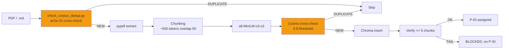

# ChromaDB + RAG pipeline

!!! abstract "In one sentence"
    AEGIS uses **ChromaDB** as a vector store for two distinct corpora: `aegis_corpus`
    (~4200 docs — attack sheets + templates + clinical guidelines) and `aegis_bibliography`
    (~4700 docs — 130 research papers in chunks), with **cosine > 0.9 anti-duplication** and
    **automatic injection** via the bibliography-maintainer pipeline.

## 1. What it is used for

| Usage | Collection | Consumer |
|-------|-----------|----------|
| **Clinical guidelines** (FDA, HL7, protocols) | `medical_rag` | `rag_basic`, `rag_private`, `hyde_chain` |
| **Attack sheets + templates** | `aegis_corpus` | `/fiche-attaque` skill, Forge |
| **Academic literature** (papers P001-P130) | `aegis_bibliography` | `/bibliography-maintainer`, SCIENTIST agent |
| **RAG test** (synthetic corpus) | `test_rag` | Unit tests |

## 2. ChromaDB architecture

```
backend/chroma_db/
├── chroma.sqlite3              # SQLite metadata
├── 17dac757-...                # aegis_corpus collection UUID (~4200 chunks)
├── 29af892a-...                # aegis_bibliography collection UUID (~4700 chunks)
└── 552f3037-...                # medical_rag collection UUID
```

### Collections detail

| Collection | Docs | Embedding | Main usage |
|-----------|:----:|-----------|------------|
| `aegis_corpus` | ~4200 | `sentence-transformers/all-MiniLM-L6-v2` | AEGIS sheets + templates |
| `aegis_bibliography` | ~4700 | same | 130 papers in ~500 token chunks |
| `medical_rag` | variable | same | Clinical guidelines for scenarios |

## 3. Injection pipeline



## 4. Anti-duplication — the AEGIS rule

!!! danger "Absolute rule (CLAUDE.md)"
    **Before sending an arXiv reference to WebFetch / WebSearch / ANALYST / COLLECTOR** — whether
    in `full_search` or `incremental` mode, or in an ad-hoc verification sub-agent —
    **ALWAYS cross-check MANIFEST.md for its arXiv ID first** via:

    ```bash
    python backend/tools/check_corpus_dedup.py <arxiv_id> [<arxiv_id> ...]
    ```

    **Exit codes**:

    - `0` — `[NEW]` → proceed with verification/analysis/injection
    - `1` — `[DUPLICATE] as PXXX` → **STOP**. The corpus version PXXX is authoritative.
    - `2` — `[ERROR]` → diagnose (missing MANIFEST, needle too short)

### Documented failure mode (2026-04-09)

A scoped verification agent deduplicated via **arXiv cosine** (external source) but NOT via
**MANIFEST** (internal source). Result: **Crescendo (arXiv:2404.01833, already present as P099)**
was re-verified and would have been re-integrated without the manual post-hoc cross-check.

**Fix**: `backend/tools/check_corpus_dedup.py` + Step 0 in the bibliography-maintainer's `SKILL.md`.

### Limitation

The check relies on the **arXiv ID** (pattern `arXiv:XXXX.XXXXX` in MANIFEST). For papers
without an arXiv ID (conference proceedings, journals without preprint), complement it with a title
check via `--title "<needle>"` (needle >= 12 chars to avoid false positives).

For semantic duplicates (same content, different title), the fallback remains the **cosine
ChromaDB** check of the COLLECTOR with threshold > 0.9.

## 5. Post-injection verification (COLLECTOR)

After PDF injection in ChromaDB, the COLLECTOR MUST **verify >= 5 chunks present**. If it fails
→ **BLOCKED**, no P-ID assigned. Log in the preseed JSON.

```python
# Verification via API
GET /api/rag/documents/{filename}/chunks

# Expected return
{
  "filename": "P126_2506.08837.pdf",
  "chunks_count": 101,
  "status": "indexed",
  "first_chunk_preview": "Design Patterns for Securing LLM Agents..."
}
```

## 6. API routes

```
POST /api/rag/upload          — Upload file + chunking + injection
POST /api/rag/ingest          — Injection from local path (script mode)
GET  /api/rag/collections     — List collections
GET  /api/rag/documents       — List indexed documents
GET  /api/rag/documents/{filename}/chunks — Chunk details per file
POST /api/rag/query           — Multi-collection query
DELETE /api/rag/documents/{filename}      — Remove a document
```

See [api/rag.md](../api/rag.md) for full details.

## 7. Multi-collection query

The agents (SCIENTIST, MATHEUX, CYBERSEC) query **both collections simultaneously** to
cross-reference sources:

```python
# Multi-collection pattern
results_corpus = chroma_client.query(
    collection_name="aegis_corpus",
    query_text="HyDE adversarial",
    n_results=5,
)
results_bib = chroma_client.query(
    collection_name="aegis_bibliography",
    query_text="HyDE adversarial",
    n_results=5,
)
# Manual reranking by cosine + source weight
```

**CLI script** for interactive query:

```bash
python backend/tools/query_rag.py --multi-collection \
    --query "HyDE self-amplification 96.7% ASR" \
    --n-results 10
```

**AEGIS rule**: agents MUST query the RAG with `--multi-collection` to read the full text,
NOT limit themselves to the abstract.

## 8. Integration with RagSanitizer (δ²)

Before a RAG chunk is injected into the LLM context, it **can** pass through `RagSanitizer`
which applies the 15 detectors:

```python
sanitizer = RagSanitizer(risk_threshold=4)
for chunk in retrieved_chunks:
    result = sanitizer.sanitize(chunk.page_content)
    if result["redacted"]:
        # Alert + skip OR replace with [REDACTED]
        log_injection_attempt(chunk, result["detectors"])
    else:
        context += chunk.page_content
```

This integration is **optional** (`aegis_shield=True` flag) to allow `shield OFF` campaigns
that measure δ¹ alone.

## 9. Bibliographic corpus — 130 indexed papers

**RUN-008 state (2026-04-11)**:

- **130 papers** (P001-P130, excl. P088/P105/P106)
- **~4700 chunks** in `aegis_bibliography`
- **Latest batch**: P128-P130 (Kang Programmatic, CodeAct Wang, ToolSandbox Apple)

**Organization**: `research_archive/doc_references/{YYYY}/{category}/PXXX_...md`

```
doc_references/
├── 2023/prompt_injection/P001_Liu_HouYi.md
├── 2024/benchmarks/P125_Benjamin_SystematicAnalysisPI.md
├── 2025/defenses/P126_BeurerKellner_DesignPatternsLLMAgents.md  # SCOOPING RISK
├── 2026/prompt_injection/P127_Dziemian_IPICompetition.md
└── MANIFEST.md                                                   # Authoritative index
```

## 10. Tests and verification

```bash
# Collection sanity check
python backend/tools/check_chroma_health.py

# Verification query
python backend/tools/query_rag.py --query "tension 800g validate_output"

# Dedup check
python backend/tools/check_corpus_dedup.py 2506.08837
# → [DUPLICATE] as P126 (exit 1)
```

## 11. Limitations and strengths

<div class="grid" markdown>

!!! success "Strengths"
    - **Local-first**: ChromaDB SQLite embedded, no cloud dependency
    - **Free embedding**: all-MiniLM-L6-v2 (384 dim, 80MB)
    - **Multi-collection**: corpus/biblio/test separation
    - **Two-level anti-duplication** (arXiv ID + cosine)
    - **Auto pipeline integration** (COLLECTOR → CHUNKER → inject → verify)
    - **Scientific reproduction**: every paper traceable via P-ID

!!! failure "Limitations"
    - **Limited embedding**: all-MiniLM has blind spots (antonyms — D-010)
    - **No reranker**: multi-collection query without cross-encoder
    - **Naive chunking**: `RecursiveCharacterTextSplitter` without semantic respect
    - **No versioning**: re-chunking overwrites previous chunks
    - **SQLite lock**: contention if multiple agents write in parallel
    - **Limited size**: ChromaDB starts to slow down >100k chunks

</div>

## 12. Resources

- :material-code-tags: [backend/rag_sanitizer.py](https://github.com/pizzif/poc_medical/blob/main/backend/rag_sanitizer.py)
- :material-code-tags: [backend/tools/check_corpus_dedup.py](https://github.com/pizzif/poc_medical/blob/main/backend/tools/check_corpus_dedup.py)
- :material-file-document: [MANIFEST.md — 130 papers](../research/bibliography/index.md)
- :material-shield: [δ² RagSanitizer](../delta-layers/delta-2.md)
- :material-api: [RAG API](../api/rag.md)
