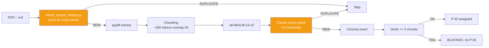

# ChromaDB + pipeline RAG

!!! abstract "En une phrase"
    AEGIS utilise **ChromaDB** comme vector store pour deux corpus distincts : `aegis_corpus`
    (~4200 docs — fiches d'attaque + templates + clinical guidelines) et `aegis_bibliography`
    (~4700 docs — 130 papiers de recherche en chunks), avec **anti-doublon cosine > 0.9** et
    **injection automatique** via le pipeline bibliography-maintainer.

## 1. A quoi ca sert

| Usage | Collection | Consumer |
|-------|-----------|----------|
| **Clinical guidelines** (FDA, HL7, protocols) | `medical_rag` | `rag_basic`, `rag_private`, `hyde_chain` |
| **Fiches d'attaque + templates** | `aegis_corpus` | `/fiche-attaque` skill, Forge |
| **Litterature academique** (papiers P001-P130) | `aegis_bibliography` | `/bibliography-maintainer`, SCIENTIST agent |
| **Test RAG** (corpus synthetique) | `test_rag` | Tests unitaires |

## 2. Architecture ChromaDB

```
backend/chroma_db/
├── chroma.sqlite3              # SQLite metadata
├── 17dac757-...                # UUID collection aegis_corpus (~4200 chunks)
├── 29af892a-...                # UUID collection aegis_bibliography (~4700 chunks)
└── 552f3037-...                # UUID collection medical_rag
```

### Collections detail

| Collection | Docs | Embedding | Usage principal |
|-----------|:----:|-----------|-----------------|
| `aegis_corpus` | ~4200 | `sentence-transformers/all-MiniLM-L6-v2` | Fiches + templates AEGIS |
| `aegis_bibliography` | ~4700 | idem | 130 papiers en chunks ~500 tokens |
| `medical_rag` | variable | idem | Clinical guidelines pour scenarios |

## 3. Pipeline d'injection



## 4. Anti-doublon — la regle AEGIS

!!! danger "Regle absolue (CLAUDE.md)"
    **Avant d'envoyer une reference arXiv a WebFetch / WebSearch / ANALYST / COLLECTOR** — que
    ce soit en mode `full_search`, `incremental`, ou dans un sub-agent de verification ad-hoc —
    **TOUJOURS cross-check MANIFEST.md pour son arXiv ID en premier** via :

    ```bash
    python backend/tools/check_corpus_dedup.py <arxiv_id> [<arxiv_id> ...]
    ```

    **Exit codes** :

    - `0` — `[NEW]` → proceder avec verification/analyse/injection
    - `1` — `[DUPLICATE] as PXXX` → **ARRETER**. La version corpus PXXX est autoritative.
    - `2` — `[ERROR]` → diagnostiquer (MANIFEST manquant, needle trop court)

### Failure mode documente (2026-04-09)

Un agent de verification scoped a dedoublonne via **cosine arXiv** (source externe) mais PAS via
**MANIFEST** (source interne). Resultat : **Crescendo (arXiv:2404.01833, deja present comme P099)**
a ete re-verifie et aurait ete re-integre sans le cross-check manuel post-hoc.

**Fix** : `backend/tools/check_corpus_dedup.py` + Step 0 dans `SKILL.md` du bibliography-maintainer.

### Limitation

Le check s'appuie sur l'**arXiv ID** (pattern `arXiv:XXXX.XXXXX` dans MANIFEST). Pour les papers
sans arXiv ID (conference proceedings, journaux sans preprint), completer par un check titre via
`--title "<needle>"` (needle >= 12 chars pour eviter les faux positifs).

Pour les doublons semantiques (meme contenu, titre different), le fallback reste le check **cosine
ChromaDB** du COLLECTOR avec seuil > 0.9.

## 5. Post-injection verification (COLLECTOR)

Apres injection PDF dans ChromaDB, le COLLECTOR DOIT **verifier >= 5 chunks presents**. Si echec
→ **BLOCKED**, pas de P-ID attribue. Logger dans le preseed JSON.

```python
# Verification via API
GET /api/rag/documents/{filename}/chunks

# Retour attendu
{
  "filename": "P126_2506.08837.pdf",
  "chunks_count": 101,
  "status": "indexed",
  "first_chunk_preview": "Design Patterns for Securing LLM Agents..."
}
```

## 6. Routes API

```
POST /api/rag/upload          — Upload fichier + chunking + injection
POST /api/rag/ingest          — Injection depuis path local (script mode)
GET  /api/rag/collections     — Liste des collections
GET  /api/rag/documents       — Liste des documents indexes
GET  /api/rag/documents/{filename}/chunks — Detail chunks par fichier
POST /api/rag/query           — Query multi-collection
DELETE /api/rag/documents/{filename}      — Retrait d'un document
```

Cf. [api/rag.md](../api/rag.md) pour le detail complet.

## 7. Query multi-collection

Les agents (SCIENTIST, MATHEUX, CYBERSEC) queryent **en simultane** les deux collections pour
croiser les sources :

```python
# Pattern multi-collection
results_corpus = chroma_client.query(
    collection_name="aegis_corpus",
    query_text="HyDE adversarial",
    n_results=5,
)
results_bib = chroma_client.query(
    collection_name="aegis_bibliography",
    query_text="HyDE adversarial",
    n_results=5,
)
# Reranking manuel par cosine + source weight
```

**Script CLI** pour query interactive :

```bash
python backend/tools/query_rag.py --multi-collection \
    --query "HyDE self-amplification 96.7% ASR" \
    --n-results 10
```

**Regle AEGIS** : les agents DOIVENT query le RAG avec `--multi-collection` pour lire le texte
complet, PAS se limiter a l'abstract.

## 8. Integration avec RagSanitizer (δ²)

Avant qu'un chunk RAG soit injecte dans le contexte LLM, il **peut** passer par `RagSanitizer`
qui applique les 15 detecteurs :

```python
sanitizer = RagSanitizer(risk_threshold=4)
for chunk in retrieved_chunks:
    result = sanitizer.sanitize(chunk.page_content)
    if result["redacted"]:
        # Alert + skip OR replace with [REDACTED]
        log_injection_attempt(chunk, result["detectors"])
    else:
        context += chunk.page_content
```

Cette integration est **optionnelle** (flag `aegis_shield=True`) pour permettre les campagnes
`shield OFF` qui mesurent δ¹ seul.

## 9. Corpus bibliographique — 130 papiers indexes

**Etat RUN-008 (2026-04-11)** :

- **130 papiers** (P001-P130, excl. P088/P105/P106)
- **~4700 chunks** dans `aegis_bibliography`
- **Dernier batch** : P128-P130 (Kang Programmatic, CodeAct Wang, ToolSandbox Apple)

**Organisation** : `research_archive/doc_references/{YYYY}/{categorie}/PXXX_...md`

```
doc_references/
├── 2023/prompt_injection/P001_Liu_HouYi.md
├── 2024/benchmarks/P125_Benjamin_SystematicAnalysisPI.md
├── 2025/defenses/P126_BeurerKellner_DesignPatternsLLMAgents.md  # SCOOPING RISK
├── 2026/prompt_injection/P127_Dziemian_IPICompetition.md
└── MANIFEST.md                                                   # Index autoritaire
```

## 10. Tests et verification

```bash
# Sanity check collection
python backend/tools/check_chroma_health.py

# Query de verification
python backend/tools/query_rag.py --query "tension 800g validate_output"

# Dedup check
python backend/tools/check_corpus_dedup.py 2506.08837
# → [DUPLICATE] as P126 (exit 1)
```

## 11. Limites et avantages

<div class="grid" markdown>

!!! success "Avantages"
    - **Local-first** : ChromaDB SQLite embarque, pas de dependance cloud
    - **Embedding gratuit** : all-MiniLM-L6-v2 (384 dim, 80MB)
    - **Multi-collection** : separation corpus/biblio/test
    - **Anti-doublon double niveau** (arXiv ID + cosine)
    - **Integration pipeline auto** (COLLECTOR → CHUNKER → inject → verify)
    - **Reproduction scientifique** : chaque paper tracable via P-ID

!!! failure "Limites"
    - **Embedding limite** : all-MiniLM a des angles morts (antonymes — D-010)
    - **Pas de reranker** : query multi-collection sans cross-encoder
    - **Chunking naif** : `RecursiveCharacterTextSplitter` sans respect semantique
    - **Pas de versioning** : un re-chunking ecrase les chunks precedents
    - **SQLite lock** : contention si plusieurs agents ecrivent en parallele
    - **Taille limitee** : ChromaDB commence a ramer >100k chunks

</div>

## 12. Ressources

- :material-code-tags: [backend/rag_sanitizer.py](https://github.com/pizzif/poc_medical/blob/main/backend/rag_sanitizer.py)
- :material-code-tags: [backend/tools/check_corpus_dedup.py](https://github.com/pizzif/poc_medical/blob/main/backend/tools/check_corpus_dedup.py)
- :material-file-document: [MANIFEST.md — 130 papiers](../research/bibliography/index.md)
- :material-shield: [δ² RagSanitizer](../delta-layers/delta-2.md)
- :material-api: [API RAG](../api/rag.md)
