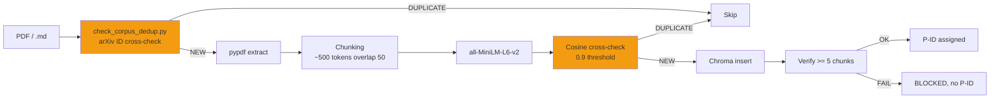

# ChromaDB + pipeline RAG

!!! abstract "Em uma frase"
    AEGIS usa **ChromaDB** como vector store para dois corpora distintos : `aegis_corpus`
    (~4200 docs — fichas de ataque + templates + clinical guidelines) e `aegis_bibliography`
    (~4700 docs — 130 papers de pesquisa em chunks), com **anti-duplicata cosine > 0.9** e
    **injecao automatica** via o pipeline bibliography-maintainer.

## 1. Para que serve

| Uso | Collection | Consumer |
|-----|-----------|----------|
| **Clinical guidelines** (FDA, HL7, protocolos) | `medical_rag` | `rag_basic`, `rag_private`, `hyde_chain` |
| **Fichas de ataque + templates** | `aegis_corpus` | skill `/fiche-attaque`, Forge |
| **Literatura academica** (papers P001-P130) | `aegis_bibliography` | `/bibliography-maintainer`, SCIENTIST agent |
| **Test RAG** (corpus sintetico) | `test_rag` | Testes unitarios |

## 2. Arquitetura ChromaDB

```
backend/chroma_db/
├── chroma.sqlite3              # SQLite metadata
├── 17dac757-...                # UUID collection aegis_corpus (~4200 chunks)
├── 29af892a-...                # UUID collection aegis_bibliography (~4700 chunks)
└── 552f3037-...                # UUID collection medical_rag
```

### Detalhe das collections

| Collection | Docs | Embedding | Uso principal |
|-----------|:----:|-----------|---------------|
| `aegis_corpus` | ~4200 | `sentence-transformers/all-MiniLM-L6-v2` | Fichas + templates AEGIS |
| `aegis_bibliography` | ~4700 | idem | 130 papers em chunks ~500 tokens |
| `medical_rag` | variavel | idem | Clinical guidelines para scenarios |

## 3. Pipeline de injecao



## 4. Anti-duplicata — a regra AEGIS

!!! danger "Regra absoluta (CLAUDE.md)"
    **Antes de enviar uma referencia arXiv para WebFetch / WebSearch / ANALYST / COLLECTOR** — seja
    em modo `full_search`, `incremental`, ou em um sub-agent de verificacao ad-hoc —
    **SEMPRE cross-check MANIFEST.md por seu arXiv ID primeiro** via :

    ```bash
    python backend/tools/check_corpus_dedup.py <arxiv_id> [<arxiv_id> ...]
    ```

    **Exit codes** :

    - `0` — `[NEW]` → prosseguir com verificacao/analise/injecao
    - `1` — `[DUPLICATE] as PXXX` → **PARAR**. A versao corpus PXXX e autoritativa.
    - `2` — `[ERROR]` → diagnosticar (MANIFEST ausente, needle muito curto)

### Failure mode documentado (2026-04-09)

Um agent de verificacao scoped deduplicou via **cosine arXiv** (fonte externa) mas NAO via
**MANIFEST** (fonte interna). Resultado : **Crescendo (arXiv:2404.01833, ja presente como P099)**
foi re-verificado e teria sido re-integrado sem o cross-check manual post-hoc.

**Fix** : `backend/tools/check_corpus_dedup.py` + Step 0 no `SKILL.md` do bibliography-maintainer.

### Limitacao

O check se baseia no **arXiv ID** (padrao `arXiv:XXXX.XXXXX` no MANIFEST). Para papers
sem arXiv ID (conference proceedings, periodicos sem preprint), complementar com um check de titulo via
`--title "<needle>"` (needle >= 12 chars para evitar falsos positivos).

Para duplicatas semanticas (mesmo conteudo, titulo diferente), o fallback permanece o check **cosine
ChromaDB** do COLLECTOR com limiar > 0.9.

## 5. Post-injection verification (COLLECTOR)

Apos injecao de PDF no ChromaDB, o COLLECTOR DEVE **verificar >= 5 chunks presentes**. Se falha
→ **BLOCKED**, nenhum P-ID atribuido. Logar no preseed JSON.

```python
# Verificacao via API
GET /api/rag/documents/{filename}/chunks

# Retorno esperado
{
  "filename": "P126_2506.08837.pdf",
  "chunks_count": 101,
  "status": "indexed",
  "first_chunk_preview": "Design Patterns for Securing LLM Agents..."
}
```

## 6. Rotas API

```
POST /api/rag/upload          — Upload arquivo + chunking + injecao
POST /api/rag/ingest          — Injecao a partir de path local (script mode)
GET  /api/rag/collections     — Lista das collections
GET  /api/rag/documents       — Lista dos documentos indexados
GET  /api/rag/documents/{filename}/chunks — Detalhe chunks por arquivo
POST /api/rag/query           — Query multi-collection
DELETE /api/rag/documents/{filename}      — Remocao de um documento
```

Cf. [api/rag.md](../api/rag.md) para o detalhe completo.

## 7. Query multi-collection

Os agents (SCIENTIST, MATHEUX, CYBERSEC) consultam **simultaneamente** as duas collections para
cruzar as fontes :

```python
# Padrao multi-collection
results_corpus = chroma_client.query(
    collection_name="aegis_corpus",
    query_text="HyDE adversarial",
    n_results=5,
)
results_bib = chroma_client.query(
    collection_name="aegis_bibliography",
    query_text="HyDE adversarial",
    n_results=5,
)
# Reranking manual por cosine + source weight
```

**Script CLI** para query interativa :

```bash
python backend/tools/query_rag.py --multi-collection \
    --query "HyDE self-amplification 96.7% ASR" \
    --n-results 10
```

**Regra AEGIS** : os agents DEVEM consultar o RAG com `--multi-collection` para ler o texto
completo, NAO se limitar ao abstract.

## 8. Integracao com RagSanitizer (δ²)

Antes que um chunk RAG seja injetado no contexto LLM, ele **pode** passar pelo `RagSanitizer`
que aplica os 15 detectores :

```python
sanitizer = RagSanitizer(risk_threshold=4)
for chunk in retrieved_chunks:
    result = sanitizer.sanitize(chunk.page_content)
    if result["redacted"]:
        # Alert + skip OR replace with [REDACTED]
        log_injection_attempt(chunk, result["detectors"])
    else:
        context += chunk.page_content
```

Essa integracao e **opcional** (flag `aegis_shield=True`) para permitir as campanhas
`shield OFF` que medem δ¹ sozinho.

## 9. Corpus bibliografico — 130 papers indexados

**Estado RUN-008 (2026-04-11)** :

- **130 papers** (P001-P130, excl. P088/P105/P106)
- **~4700 chunks** em `aegis_bibliography`
- **Ultimo batch** : P128-P130 (Kang Programmatic, CodeAct Wang, ToolSandbox Apple)

**Organizacao** : `research_archive/doc_references/{YYYY}/{categorie}/PXXX_...md`

```
doc_references/
├── 2023/prompt_injection/P001_Liu_HouYi.md
├── 2024/benchmarks/P125_Benjamin_SystematicAnalysisPI.md
├── 2025/defenses/P126_BeurerKellner_DesignPatternsLLMAgents.md  # SCOOPING RISK
├── 2026/prompt_injection/P127_Dziemian_IPICompetition.md
└── MANIFEST.md                                                   # Index autoritativo
```

## 10. Testes e verificacao

```bash
# Sanity check collection
python backend/tools/check_chroma_health.py

# Query de verificacao
python backend/tools/query_rag.py --query "tension 800g validate_output"

# Dedup check
python backend/tools/check_corpus_dedup.py 2506.08837
# → [DUPLICATE] as P126 (exit 1)
```

## 11. Limites e vantagens

<div class="grid" markdown>

!!! success "Vantagens"
    - **Local-first** : ChromaDB SQLite embutido, sem dependencia cloud
    - **Embedding gratuito** : all-MiniLM-L6-v2 (384 dim, 80MB)
    - **Multi-collection** : separacao corpus/biblio/test
    - **Anti-duplicata em dois niveis** (arXiv ID + cosine)
    - **Integracao pipeline auto** (COLLECTOR → CHUNKER → inject → verify)
    - **Reproducao cientifica** : cada paper rastreavel via P-ID

!!! failure "Limites"
    - **Embedding limitado** : all-MiniLM tem pontos cegos (antonimos — D-010)
    - **Sem reranker** : query multi-collection sem cross-encoder
    - **Chunking ingenuo** : `RecursiveCharacterTextSplitter` sem respeito semantico
    - **Sem versionamento** : um re-chunking sobrescreve os chunks anteriores
    - **SQLite lock** : contencao se varios agents escrevem em paralelo
    - **Tamanho limitado** : ChromaDB comeca a ficar lento >100k chunks

</div>

## 12. Recursos

- :material-code-tags: [backend/rag_sanitizer.py](https://github.com/pizzif/poc_medical/blob/main/backend/rag_sanitizer.py)
- :material-code-tags: [backend/tools/check_corpus_dedup.py](https://github.com/pizzif/poc_medical/blob/main/backend/tools/check_corpus_dedup.py)
- :material-file-document: [MANIFEST.md — 130 papers](../research/bibliography/index.md)
- :material-shield: [δ² RagSanitizer](../delta-layers/delta-2.md)
- :material-api: [API RAG](../api/rag.md)
