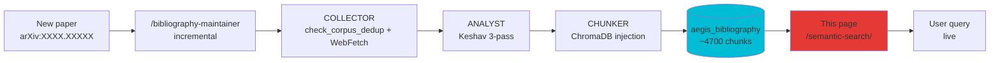

# Semantic Search — 130+ papers

!!! abstract "In one sentence"
    **Live** semantic search over ChromaDB (`aegis_bibliography`, ~4700 chunks across 130+ papers)
    using `sentence-transformers/all-MiniLM-L6-v2` embeddings. Unlike the full-text search at the
    top of the wiki (which searches Markdown pages), this one searches the **full content** of
    indexed PDFs.

## How it works

1. You type a query in **natural language** (e.g. `HyDE self-amplification 96.7% ASR`)
2. The widget calls `POST /api/rag/semantic-search` on the AEGIS backend
3. ChromaDB computes cosine similarity between your query and the chunks
4. The **top-K chunks** are returned with distance, source, and full content

**Critical advantage**: each paper ingested via `/bibliography-maintainer` becomes
**immediately searchable** here — no wiki rebuild required.

## Prerequisites

!!! warning "Local backend required"
    This widget is **usable only with the AEGIS backend running locally**:

    ```bash
    .\aegis.ps1 start backend     # Windows
    ./aegis.sh start backend      # Linux/Mac
    ```

    **Verification**: click the `Check` button below after startup. You should see
    `Backend OK - collections: aegis_bibliography (...), aegis_corpus (...), ...`

    **If you are on GitHub Pages**: the widget defaults to `http://localhost:8042`.
    Change the URL via the `Backend URL` field to point to your backend (prod or tunnel).

## Widget

<div id="aegis-semantic-search"></div>

## Example queries

Click a query to test:

| Query | Goal |
|-------|------|
| `HyDE self-amplification medical LLM` | Find papers about D-024 |
| `gradient martingale RLHF shallow alignment` | P052 Young + P018 Qi |
| `CaMeL provable security taint tracking` | P081 CaMeL DeepMind |
| `Da Vinci Xi robotic surgery tension 800g` | Medical papers + FDA |
| `XML agent parsing trust exploit 96%` | D-025 Parsing Trust |
| `Sep(M) separation score Zverev ICLR 2025` | P024 formal definition |
| `prompt injection indirect IPI Greshake 2023` | Seminal IPI papers |
| `HL7 FHIR OBX segment injection medical` | Medical IPI vectors |

## Available collections

| Collection | Content | Approx chunks |
|-----------|---------|:-------------:|
| **`aegis_bibliography`** | **130+ papers P001-P130** (Keshav 3-pass + fulltext) | **~4700** |
| `aegis_corpus` | Attack sheets + templates + clinical guidelines | ~4200 |
| `medical_rag` | Clinical guidelines for scenarios | Variable |

## Interpreting the results

| Metric | Meaning |
|--------|---------|
| **Rank** | `#1` = best match |
| **Similarity** | `100%` = identical, `> 70%` = very close, `< 50%` = weak |
| **Distance** | `0.0` = identical, `1.0` = orthogonal, `2.0` = opposite |
| **Source** | Source file (e.g. `P081_2503.18813.pdf`) |
| **Paper ID** | P-ID assigned by the COLLECTOR (if metadata present) |
| **delta_layer** | δ⁰–δ³ layer mapping (if classified) |

## Full-text vs semantic search

| Feature | Full-text search (wiki header) | Semantic search (this page) |
|---------|:------------------------------:|:---------------------------:|
| **Scope** | Wiki Markdown pages (346 pages) | ChromaDB chunks (4700+ PDF chunks) |
| **Type** | Lexical (keywords) | Semantic (embeddings) |
| **Live update** | At `mkdocs build` | **Immediate (live ChromaDB)** |
| **Multilingual** | FR + EN separately | Cross-language via embeddings |
| **Backend required** | No | **Yes** |
| **Typical usage** | Find a page | **Find a passage inside a paper** |

## Raw API

For scripted usage:

```bash
curl -X POST http://localhost:8042/api/rag/semantic-search \
  -H "Content-Type: application/json" \
  -d '{
    "query": "HyDE self-amplification",
    "collection": "aegis_bibliography",
    "limit": 10
  }'
```

```json
{
  "query": "HyDE self-amplification",
  "collection": "aegis_bibliography",
  "total_hits": 10,
  "hits": [
    {
      "id": "P117_...chunk_42",
      "source": "P117_Yoon_2025_KnowledgeLeakageHyDE.pdf",
      "paper_id": "P117",
      "year": "2025",
      "delta_layer": "δ²",
      "distance": 0.312,
      "similarity": 0.688,
      "content": "HyDE generates a hypothetical document...",
      "content_length": 742
    }
  ]
}
```

## Security constraints

- **Query length**: max 500 characters (SEC-08)
- **Rate limit**: 20 requests/min per IP (SEC-09)
- **Collection whitelist**: `aegis_bibliography`, `aegis_corpus`, `medical_rag`
- **CORS**: `localhost:5173`, `localhost:8001`, `pizzif.github.io`
- **Limit clamping**: max 50 hits per query
- **Full chunk content**: no server-side truncation (user requirement, PDCA cycle 2)

## Limits and advantages

<div class="grid" markdown>

!!! success "Advantages"
    - **Live**: newly indexed papers are immediately searchable
    - **Semantic**: finds by meaning, not just keywords
    - **Scope**: searches the **fulltext** of PDFs (not just abstracts)
    - **Metadata**: paper_id / year / delta_layer filters
    - **Free**: `all-MiniLM-L6-v2` runs locally (80 MB)
    - **Reproducible**: each P-ID traces back to the original PDF
    - **Full content**: no truncation, see the whole chunk

!!! failure "Limits"
    - **Backend required**: does not work on GitHub Pages alone
    - **CORS**: only allows localhost:8001 + 5173 + pizzif.github.io
    - **Embedding limits**: all-MiniLM has **blind spots** (antonyms — D-010)
    - **No reranker**: no cross-encoder to refine ranking
    - **Single collection at a time**: no simultaneous multi-collection
    - **Distance > 1.5** rarely relevant
    - **Raw chunks**: no automatic synthesis, you read them directly

</div>

## Automatic update pipeline



**No manual action required** after `/bibliography-maintainer`: the widget points directly
at `aegis_bibliography` live.

## Resources

- :material-api: [backend/routes/rag_routes.py - semantic_search](https://github.com/pizzif/poc_medical/blob/main/backend/routes/rag_routes.py)
- :material-file-document: [RAG ChromaDB architecture](../rag/index.md)
- :material-book-search: [Bibliography - 130 papers](../research/bibliography/index.md)
- :material-magnify-scan: [Skill /bibliography-maintainer](../skills/index.md)
- :material-shield: [δ framework](../delta-layers/index.md)
