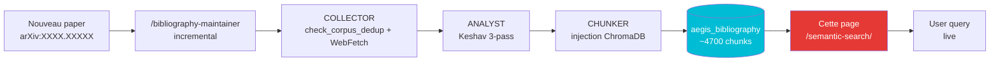

# Recherche semantique — 130+ papiers

!!! abstract "En une phrase"
    Recherche semantique **live** sur ChromaDB (`aegis_bibliography`, ~4700 chunks sur 130+
    papiers) via embedding `sentence-transformers/all-MiniLM-L6-v2`. Contrairement a la
    recherche plein texte en haut du wiki (qui cherche dans les pages Markdown), celle-ci
    cherche dans le **contenu complet** des PDFs indexes.

## Comment ca marche

1. Tu tapes une requete en **langage naturel** (ex. `HyDE self-amplification 96.7% ASR`)
2. Le widget appelle `POST /api/rag/semantic-search` sur le backend AEGIS
3. ChromaDB calcule la similarite cosinus entre ta query et les chunks
4. Les **top-K chunks** sont retournes avec distance, source, preview

**Avantage critique** : chaque paper ingere via `/bibliography-maintainer` devient
**immediatement searchable** ici — aucune regeneration du wiki requise.

## Prerequis

!!! warning "Backend local requis"
    Ce widget n'est **utilisable qu'avec le backend AEGIS lance localement** :

    ```bash
    .\aegis.ps1 start backend     # Windows
    ./aegis.sh start backend      # Linux/Mac
    ```

    **Verification** : clique sur le bouton `Check` ci-dessous apres le demarrage. Tu devrais
    voir `Backend OK - collections: aegis_bibliography (...), aegis_corpus (...), ...`

    **Si tu es sur GitHub Pages** : le widget cherchera par defaut `http://localhost:8042`.
    Change l'URL via le champ `Backend URL` pour pointer vers ton backend (prod ou tunnel).

## Widget

<div id="aegis-semantic-search"></div>

## Exemples de queries

Clique sur un exemple pour tester :

| Query | Objectif |
|-------|----------|
| `HyDE self-amplification medical LLM` | Retrouve les papers sur D-024 |
| `gradient martingale RLHF shallow alignment` | P052 Young + P018 Qi |
| `CaMeL provable security taint tracking` | P081 CaMeL DeepMind |
| `Da Vinci Xi robotic surgery tension 800g` | Papers medicaux + FDA |
| `XML agent parsing trust exploit 96%` | D-025 Parsing Trust |
| `Sep(M) separation score Zverev ICLR 2025` | P024 definition formelle |
| `prompt injection indirect IPI Greshake 2023` | Papers IPI fondateurs |
| `HL7 FHIR OBX segment injection medical` | Vecteurs IPI medicaux |

## Collections disponibles

| Collection | Contenu | Chunks approx. |
|-----------|---------|:--------------:|
| **`aegis_bibliography`** | **130+ papiers P001-P130** (Keshav 3-pass + fulltext) | **~4700** |
| `aegis_corpus` | Fiches d'attaque + templates + clinical guidelines | ~4200 |
| `medical_rag` | Clinical guidelines pour scenarios | Variable |

## Interpretation des resultats

| Metrique | Signification |
|----------|--------------|
| **Rank** | `#1` = meilleure correspondance |
| **Similarity** | `100%` = identique, `> 70%` = tres proche, `< 50%` = faible |
| **Distance** | `0.0` = identique, `1.0` = orthogonal, `2.0` = oppose |
| **Source** | Fichier source (ex. `P081_2503.18813.pdf`) |
| **Paper ID** | P-ID assigne par le COLLECTOR (si metadonnee presente) |
| **delta_layer** | Couche δ⁰–δ³ associee (si classifiee) |

## Comparaison avec la recherche plein texte

| Fonctionnalite | Recherche plein texte (haut du wiki) | Recherche semantique (cette page) |
|---------------|:------------------------------------:|:---------------------------------:|
| **Scope** | Pages Markdown du wiki (346 pages) | Chunks ChromaDB (4700+ chunks PDF) |
| **Type** | Lexicale (keywords) | Semantique (embeddings) |
| **Live update** | Au `mkdocs build` | **Immediat (ChromaDB live)** |
| **Multilingue** | FR + EN separement | Cross-language via embeddings |
| **Backend required** | Non | **Oui** |
| **Usage typique** | Trouver une page | **Trouver un passage dans un paper** |

## API brute

Pour les utilisations scriptees :

```bash
curl -X POST http://localhost:8042/api/rag/semantic-search \
  -H "Content-Type: application/json" \
  -d '{
    "query": "HyDE self-amplification",
    "collection": "aegis_bibliography",
    "limit": 10
  }'
```

```json
{
  "query": "HyDE self-amplification",
  "collection": "aegis_bibliography",
  "total_hits": 10,
  "hits": [
    {
      "id": "P117_...chunk_42",
      "source": "P117_Yoon_2025_KnowledgeLeakageHyDE.pdf",
      "paper_id": "P117",
      "year": "2025",
      "delta_layer": "δ²",
      "distance": 0.312,
      "similarity": 0.688,
      "content_preview": "HyDE generates a hypothetical document...",
      "content_length": 742
    }
  ]
}
```

## Limites et avantages

<div class="grid" markdown>

!!! success "Avantages"
    - **Live** : nouveau paper indexe → immediatement searchable
    - **Semantique** : trouve par sens, pas juste par mot
    - **Scope** : cherche dans le **fulltext** des PDFs (pas juste les abstracts)
    - **Metadonnees** : filtres paper_id / year / delta_layer
    - **Gratuit** : `all-MiniLM-L6-v2` embedding en local (80 MB)
    - **Reproductible** : chaque P-ID tracable au PDF original

!!! failure "Limites"
    - **Backend obligatoire** : ne fonctionne pas sur GitHub Pages seul
    - **CORS** : autorise localhost:8001 + 5173 + pizzif.github.io
    - **Embedding limite** : all-MiniLM a des **angles morts** (antonymes — D-010)
    - **Pas de reranker** : pas de cross-encoder pour affiner le classement
    - **Pas de multi-collection simultane** : une collection a la fois
    - **Distance > 1.5** souvent non pertinente
    - **Chunks bruts** : pas de synthese automatique, tu dois lire

</div>

## Pipeline d'update automatique



**Aucune action manuelle requise** apres `/bibliography-maintainer` : le widget pointe
directement sur `aegis_bibliography` en live.

## Ressources

- :material-api: [backend/routes/rag_routes.py - semantic_search](https://github.com/pizzif/poc_medical/blob/main/backend/routes/rag_routes.py)
- :material-file-document: [RAG ChromaDB architecture](../rag/index.md)
- :material-book-search: [Bibliography - 130 papers](../research/bibliography/index.md)
- :material-magnify-scan: [Skill /bibliography-maintainer](../skills/index.md)
- :material-shield: [Cadre delta](../delta-layers/index.md)
