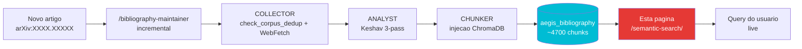

# Busca semantica — 130+ artigos

!!! abstract "Em uma frase"
    Busca semantica **ao vivo** sobre ChromaDB (`aegis_bibliography`, ~4700 chunks em 130+
    artigos) via embedding `sentence-transformers/all-MiniLM-L6-v2`. Diferente da busca em
    texto completo no topo do wiki (que pesquisa nas paginas Markdown), esta busca no
    **conteudo completo** dos PDFs indexados.

## Como funciona

1. Voce digita uma consulta em **linguagem natural** (ex. `HyDE self-amplification 96.7% ASR`)
2. O widget chama `POST /api/rag/semantic-search` no backend AEGIS
3. ChromaDB calcula a similaridade cosseno entre sua query e os chunks
4. Os **top-K chunks** sao retornados com distance, source e conteudo completo

**Vantagem critica**: cada artigo ingerido via `/bibliography-maintainer` torna-se
**imediatamente pesquisavel** aqui — nenhuma regeneracao do wiki necessaria.

## Pre-requisitos

!!! warning "Backend local obrigatorio"
    Este widget so funciona com o **backend AEGIS rodando localmente**:

    ```bash
    .\aegis.ps1 start backend     # Windows
    ./aegis.sh start backend      # Linux/Mac
    ```

    **Verificacao**: clique no botao `Check` abaixo apos a inicializacao. Voce deve ver
    `Backend OK - collections: aegis_bibliography (...), aegis_corpus (...), ...`

    **Se voce estiver no GitHub Pages**: o widget aponta por padrao para
    `http://localhost:8042`. Altere a URL via o campo `Backend URL` para apontar para seu
    backend (prod ou tunel).

## Widget

<div id="aegis-semantic-search"></div>

## Exemplos de queries

Clique em uma query para testar:

| Query | Objetivo |
|-------|----------|
| `HyDE self-amplification medical LLM` | Encontra artigos sobre D-024 |
| `gradient martingale RLHF shallow alignment` | P052 Young + P018 Qi |
| `CaMeL provable security taint tracking` | P081 CaMeL DeepMind |
| `Da Vinci Xi robotic surgery tension 800g` | Artigos medicos + FDA |
| `XML agent parsing trust exploit 96%` | D-025 Parsing Trust |
| `Sep(M) separation score Zverev ICLR 2025` | P024 definicao formal |
| `prompt injection indirect IPI Greshake 2023` | Artigos fundadores IPI |
| `HL7 FHIR OBX segment injection medical` | Vetores IPI medicos |

## Colecoes disponiveis

| Colecao | Conteudo | Chunks aprox. |
|---------|----------|:-------------:|
| **`aegis_bibliography`** | **130+ artigos P001-P130** (Keshav 3-pass + fulltext) | **~4700** |
| `aegis_corpus` | Fichas de ataque + templates + clinical guidelines | ~4200 |
| `medical_rag` | Clinical guidelines para cenarios | Variavel |

## Interpretacao dos resultados

| Metrica | Significado |
|---------|-------------|
| **Rank** | `#1` = melhor correspondencia |
| **Similarity** | `100%` = identico, `> 70%` = muito proximo, `< 50%` = fraco |
| **Distance** | `0.0` = identico, `1.0` = ortogonal, `2.0` = oposto |
| **Source** | Arquivo de origem (ex. `P081_2503.18813.pdf`) |
| **Paper ID** | P-ID atribuido pelo COLLECTOR (se metadado presente) |
| **delta_layer** | Camada δ⁰–δ³ associada (se classificada) |

## Busca em texto completo vs busca semantica

| Funcionalidade | Busca em texto completo (topo do wiki) | Busca semantica (esta pagina) |
|----------------|:--------------------------------------:|:-----------------------------:|
| **Escopo** | Paginas Markdown do wiki (346 paginas) | Chunks ChromaDB (4700+ chunks PDF) |
| **Tipo** | Lexical (palavras-chave) | Semantica (embeddings) |
| **Atualizacao live** | No `mkdocs build` | **Imediato (ChromaDB live)** |
| **Multilingue** | FR + EN separadamente | Cross-language via embeddings |
| **Backend requerido** | Nao | **Sim** |
| **Uso tipico** | Encontrar uma pagina | **Encontrar uma passagem em um artigo** |

## API bruta

Para uso scriptado:

```bash
curl -X POST http://localhost:8042/api/rag/semantic-search \
  -H "Content-Type: application/json" \
  -d '{
    "query": "HyDE self-amplification",
    "collection": "aegis_bibliography",
    "limit": 10
  }'
```

```json
{
  "query": "HyDE self-amplification",
  "collection": "aegis_bibliography",
  "total_hits": 10,
  "hits": [
    {
      "id": "P117_...chunk_42",
      "source": "P117_Yoon_2025_KnowledgeLeakageHyDE.pdf",
      "paper_id": "P117",
      "year": "2025",
      "delta_layer": "δ²",
      "distance": 0.312,
      "similarity": 0.688,
      "content": "HyDE generates a hypothetical document...",
      "content_length": 742
    }
  ]
}
```

## Restricoes de seguranca

- **Tamanho da query**: max 500 caracteres (SEC-08)
- **Rate limit**: 20 requisicoes/min por IP (SEC-09)
- **Whitelist de colecoes**: `aegis_bibliography`, `aegis_corpus`, `medical_rag`
- **CORS**: `localhost:5173`, `localhost:8001`, `pizzif.github.io`
- **Clamping de limit**: max 50 hits por query
- **Conteudo chunk completo**: sem truncamento server-side (requisito do usuario, PDCA ciclo 2)

## Limites e vantagens

<div class="grid" markdown>

!!! success "Vantagens"
    - **Live**: novos artigos indexados sao imediatamente pesquisaveis
    - **Semantica**: encontra pelo significado, nao apenas por palavra-chave
    - **Escopo**: pesquisa o **fulltext** dos PDFs (nao apenas abstracts)
    - **Metadados**: filtros paper_id / year / delta_layer
    - **Gratuito**: `all-MiniLM-L6-v2` roda localmente (80 MB)
    - **Reproduzivel**: cada P-ID rastreavel ao PDF original
    - **Conteudo completo**: sem truncamento, visualize o chunk inteiro

!!! failure "Limites"
    - **Backend obrigatorio**: nao funciona apenas no GitHub Pages
    - **CORS**: autoriza somente localhost:8001 + 5173 + pizzif.github.io
    - **Embedding limitado**: all-MiniLM tem **pontos cegos** (antonimos — D-010)
    - **Sem reranker**: nenhum cross-encoder para refinar o ranking
    - **Sem multi-colecao simultanea**: uma colecao por vez
    - **Distance > 1.5** raramente relevante
    - **Chunks brutos**: sem sintese automatica, voce precisa ler

</div>

## Pipeline de atualizacao automatica



**Nenhuma acao manual necessaria** apos `/bibliography-maintainer`: o widget aponta
diretamente para `aegis_bibliography` em live.

## Recursos

- :material-api: [backend/routes/rag_routes.py - semantic_search](https://github.com/pizzif/poc_medical/blob/main/backend/routes/rag_routes.py)
- :material-file-document: [Arquitetura RAG ChromaDB](../rag/index.md)
- :material-book-search: [Bibliografia - 130 artigos](../research/bibliography/index.md)
- :material-magnify-scan: [Skill /bibliography-maintainer](../skills/index.md)
- :material-shield: [Estrutura δ](../delta-layers/index.md)
