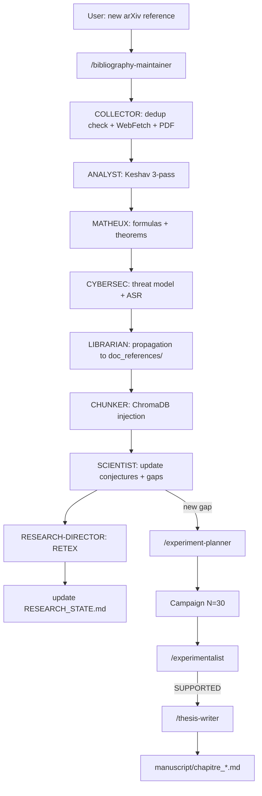

# Ecosystem of the 24 Claude Code skills

!!! abstract "In one sentence"
    **Skills** are **Claude Code slash commands** (`/research-director`,
    `/bibliography-maintainer`, `/fiche-attaque`...) that encapsulate **autonomous multi-agent
    pipelines** to orchestrate AEGIS doctoral research.

    AEGIS has **24 skills** in `.claude/skills/`, of which **14 are project-specific** and
    **10 are generic** (docx, pptx, algorithmic-art...).

## 1. What it is used for

Every skill automates a recurring task of the thesis project that would be:

- **Too complex** for a single prompt (fiche-attaque = 11 sections + 2 annexes)
- **Too repetitive** to be manual (bibliographic integration P001 → P130)
- **Too critical** to leave to the LLM without guardrails (audit-these, cross-validation)

## 2. The 14 AEGIS-specific skills

<div class="grid cards" markdown>

-   :material-account-tie: **`/research-director`**

    ---

    **Role**: **PDCA orchestrator** (Plan-Do-Check-Act) — autonomous laboratory director.

    **Loop**: OBJECTIVE → DECOMPOSE → PLAN → ACT → OBSERVE → EVALUATE → (REPLAN) → COMPLETE

    **Orchestrates**: `bibliography-maintainer`, `aegis-prompt-forge`, `fiche-attaque`,
    `experimentalist`, `thesis-writer`.

    **Trigger**: `/research-director cycle`

-   :material-book-search: **`/bibliography-maintainer`**

    ---

    **9 agents**: COLLECTOR, ANALYST, MATHEUX, CYBERSEC, WHITEHACKER, LIBRARIAN, MATHTEACHER,
    SCIENTIST, CHUNKER.

    **Modes**: `full_search`, `incremental`, `scoped`

    **Pipeline**: WebFetch → check_corpus_dedup → Keshav 3-pass analysis → propagation to doc_references/
    → ChromaDB injection → verification >= 5 chunks.

    **Trigger**: `/bibliography-maintainer incremental`

-   :material-file-document-edit: **`/fiche-attaque [num]`**

    ---

    **3 agents**: SCIENTIST + MATH + CYBER-LIBRARIAN (all Sonnet, TEXT-ONLY).

    **Generates** an attack sheet `.docx` with **11 sections + 2 annexes** for an AEGIS template.

    **Status**: 23/97 sheets generated, seeded in ChromaDB after generation.

-   :material-forge: **`/aegis-prompt-forge`**

    ---

    **4 modes**: `FORGE` (generate prompt), `AUDIT` (score), `RETEX`, `CALIBRATE`.

    **Usage**: create a new attack prompt for a given scenario, or audit an existing
    prompt against 6D SVC.

-   :material-plus-box: **`/add-scenario`**

    ---

    **6 agents**: Orchestrator, Scientist, Backend Dev, Frontend Dev, QA, DOC.

    **End-to-end pipeline**: new scenario → scenarios.py → frontend component → tests →
    documentation (gates G-A to G-D).

-   :material-beaker: **`/experiment-planner [gap_id]`**

    ---

    Converts an **ACTIONABLE gap** (G-001 to G-027) into an **executable JSON protocol**:

    - Pre-check 5 baseline runs
    - Parameters N=30, Wilson CI
    - Target metrics
    - Auto-rerun if INCONCLUSIVE

-   :material-chart-bell-curve: **`/experimentalist [experiment_id]`**

    ---

    **Automatic analysis** of a campaign's results:

    - SUPPORTED / REFUTED / INCONCLUSIVE verdict
    - Updates conjectures C1-C8
    - Loops if needed (max 3 iterations)
    - **Auto-triggered** on a new file in `experiments/`

-   :material-file-document-plus: **`/thesis-writer [conjecture_id]`**

    ---

    Automatically integrates validated results into the manuscript.

    **Rule**: only cites results with `p < 0.05` and `N >= 30`.

    **Auto-triggered** when a conjecture is VALIDATED EXPERIMENTALLY.

-   :material-shield-search: **`/audit-these [mode]`**

    ---

    **Anti-hallucination system** for the thesis: 6 verifiers in sequence.

    **Modes**: `full`, `claims`, `citations`, `fidelity`, `contradictions`, `volume`.

    **Rule**: each session BEGINS and ENDS with `/audit-these full`.

-   :material-book: **`/audit-pdca`**

    ---

    **Universal PDCA audit**: external benchmark, security/unit recipe, automatic scoring,
    continuous improvement.

-   :material-file-word: **`/wiki-publish`**

    ---

    **Modes**: `update` (incremental), `full` (rebuild), `serve` (local preview), `check`.

    Synchronizes `wiki/docs/` from sources and triggers the MkDocs build.

-   :material-rocket-launch: **`/apex`**

    ---

    **APEX methodology** (Analyze-Plan-Execute-eXamine) in 10 autonomous steps with validation,
    adversarial review, tests, and PR creation.

    **`-i` mode**: port external code with transposition.

-   :material-target: **`/aegis-research-lab`**

    ---

    Meta-skill that exposes the entire lab as an agentic tool.

-   :material-autorenew: **`/aegis-validation-pipeline`**

    ---

    End-to-end validation pipeline for discoveries before manuscript integration.

</div>

## 3. Generic skills (10)

| Skill | AEGIS usage |
|-------|-------------|
| `/docx` | `.docx` attack sheets generation |
| `/pptx` | Slides for PITCH_DOCTORAT_NACCACHE |
| `/xlsx` | Export campaign tables for annexes |
| `/pdf` | Reading literature PDFs (pypdf extraction) |
| `/brand-guidelines` | Consistent visual style (not currently used) |
| `/algorithmic-art` | Thesis diagram generation |
| `/frontend-design` | React component mockups |
| `/prompt-builder` | Claude/GPT/Midjourney prompt optimization |
| `/mcp-builder` | MCP server development |
| `/schedule` | Recurring tasks (daily audit) |

## 4. Shared queue

All skills read/write to:

```
research_archive/
├── RESEARCH_STATE.md                       ← global source of truth
├── _staging/
│   ├── DIRECTOR_BRIEFING_RUN*.md           ← briefings per RUN
│   ├── analyst/                            ← bibliographic analyses
│   ├── scientist/                          ← research axes
│   └── memory/MEMORY_STATE.md              ← inter-skill memory state
├── doc_references/
│   ├── MANIFEST.md                         ← authoritative papers index
│   └── prompt_analysis/research_requests.json  ← gap queue
└── experiments/
    └── campaign_manifest.json              ← campaigns manifest
```

**Automation rule**: after each step, the next one launches **without the user needing to
ask**. If the user has to say *"is it indexed?"*, *"does the director have the elements?"*,
*"are the proofs propagated?"* — **the pipeline is broken**.

## 5. Typical automation chain



## 6. Skill statistics

| Skill | Internal agents | Usage frequency | Auto-trigger |
|-------|:---------------:|-----------------|:------------:|
| `/bibliography-maintainer` | 9 | Near daily | — |
| `/fiche-attaque` | 3 | Per template | — |
| `/research-director` | — (meta) | Start + end of session | — |
| `/experiment-planner` | 1 | Per gap | gap resolved |
| `/experimentalist` | 1 | Per campaign | new results.json |
| `/thesis-writer` | 1 | Per validated conjecture | VALIDATED EXPERIMENTALLY |
| `/audit-these` | 6 | Start + end of session | — |
| `/wiki-publish` | 1 | Per wiki update | — |
| `/add-scenario` | 6 | Per new scenario | — |

## 7. Limitations and strengths

<div class="grid" markdown>

!!! success "Strengths"
    - **End-to-end automation**: gap → manuscript without intervention
    - **Traceability**: each skill logs in RESEARCH_STATE + _staging/
    - **Specialization**: dedicated agents (math, cyber, white hacker)
    - **Anti-hallucination rules**: audit-these in loop
    - **Anti-duplication rules**: mandatory check_corpus_dedup
    - **Multi-iteration**: max 3 iterations then human escalation
    - **3-layer pattern** for adversarial content (orchestrator + forge subagent + Python gen)

!!! failure "Limitations"
    - **Complexity**: 14 skills to maintain, intertwined rules
    - **LLM cost**: 9 bibliography agents = 9 Sonnet calls per paper
    - **Claude filtering**: sensitive content (`.json` templates) blocks subagents
      → requires safe-pipeline pattern
    - **No ground truth**: self-validating skills can hallucinate
    - **Error handling**: a crashing agent blocks the chain (see provider bug RETEX)
    - **Doc maintenance**: skills evolve faster than their documentation

</div>

## 8. Absolute rules (CLAUDE.md)

1. **ZERO placeholder** in skill outputs
2. **ZERO emoticon** unless explicitly requested
3. **Mandatory cross-validation**: 3 random analyses verified against ChromaDB fulltext
   after every batch
4. **Max 3 agents in parallel** (auditability)
5. **No direct commands** — always via `aegis.ps1` / `aegis.sh`

## 9. Resources

- :material-folder: [.claude/skills/](https://github.com/pizzif/poc_medical/tree/main/.claude/skills)
- :material-file: [CLAUDE.md - project rules](https://github.com/pizzif/poc_medical/blob/main/.claude/CLAUDE.md)
- :material-file-check: [doctoral-research.md - doctoral rules](https://github.com/pizzif/poc_medical/blob/main/.claude/rules/doctoral-research.md)
- :material-book: [RESEARCH_ARCHIVE_GUIDE.md](../research/index.md)
