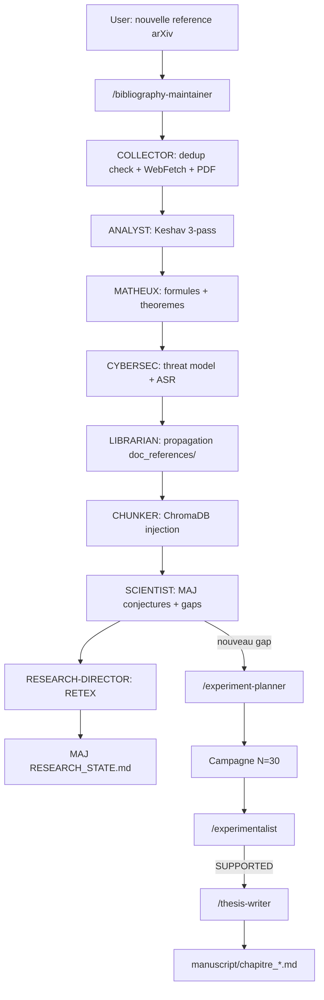

# Ecosysteme des 24 skills Claude Code

!!! abstract "En une phrase"
    Les **skills** sont des **slash-commands Claude Code** (`/research-director`,
    `/bibliography-maintainer`, `/fiche-attaque`...) qui encapsulent des **pipelines multi-agents**
    autonomes pour orchestrer la recherche doctorale AEGIS.

    AEGIS compte **24 skills** dans `.claude/skills/`, dont **14 specifiques au projet** et
    **10 generiques** (docx, pptx, algorithmic-art...).

## 1. A quoi ca sert

Chaque skill automatise une tache recurrente du projet de these qui serait :

- **Trop complexe** pour un seul prompt (fiche-attaque = 11 sections + 2 annexes)
- **Trop repetitive** pour etre manuelle (integration bibliographique P001 → P130)
- **Trop critique** pour laisser la main au LLM sans garde-fous (audit-these, cross-validation)

## 2. Les 14 skills AEGIS-specifiques

<div class="grid cards" markdown>

-   :material-account-tie: **`/research-director`**

    ---

    **Role** : **orchestrateur PDCA** (Plan-Do-Check-Act) — directeur de laboratoire autonome.

    **Boucle** : OBJECTIVE → DECOMPOSE → PLAN → ACT → OBSERVE → EVALUATE → (REPLAN) → COMPLETE

    **Orchestre** : `bibliography-maintainer`, `aegis-prompt-forge`, `fiche-attaque`,
    `experimentalist`, `thesis-writer`.

    **Trigger** : `/research-director cycle`

-   :material-book-search: **`/bibliography-maintainer`**

    ---

    **9 agents** : COLLECTOR, ANALYST, MATHEUX, CYBERSEC, WHITEHACKER, LIBRARIAN, MATHTEACHER,
    SCIENTIST, CHUNKER.

    **Modes** : `full_search`, `incremental`, `scoped`

    **Pipeline** : WebFetch → check_corpus_dedup → Keshav 3-pass analyse → propagation doc_references/
    → injection ChromaDB → verification >= 5 chunks.

    **Trigger** : `/bibliography-maintainer incremental`

-   :material-file-document-edit: **`/fiche-attaque [num]`**

    ---

    **3 agents** : SCIENTIST + MATH + CYBER-LIBRARIAN (tous Sonnet, TEXT-ONLY).

    **Genere** une fiche d'attaque `.docx` de **11 sections + 2 annexes** pour un template AEGIS.

    **Statut** : 23/97 fiches generees, seedees dans ChromaDB apres generation.

-   :material-forge: **`/aegis-prompt-forge`**

    ---

    **4 modes** : `FORGE` (genere prompt), `AUDIT` (score), `RETEX`, `CALIBRATE`.

    **Usage** : creer un nouveau prompt d'attaque pour un scenario donne, ou auditer un prompt
    existant contre le SVC 6D.

-   :material-plus-box: **`/add-scenario`**

    ---

    **6 agents** : Orchestrator, Scientist, Backend Dev, Frontend Dev, QA, DOC.

    **Pipeline end-to-end** : nouveau scenario → scenarios.py → frontend component → tests →
    documentation (gates G-A a G-D).

-   :material-beaker: **`/experiment-planner [gap_id]`**

    ---

    Convertit un **gap ACTIONNABLE** (G-001 a G-027) en **protocole JSON executable** :

    - Pre-check 5 runs baseline
    - Parametres N=30, Wilson CI
    - Metriques cibles
    - Auto-rerun si INCONCLUSIVE

-   :material-chart-bell-curve: **`/experimentalist [experiment_id]`**

    ---

    **Analyse automatique** des resultats d'une campagne :

    - Verdict SUPPORTED / REFUTED / INCONCLUSIVE
    - Met a jour les conjectures C1-C8
    - Reboucle si necessaire (max 3 iterations)
    - **Auto-declenche** sur nouveau fichier dans `experiments/`

-   :material-file-document-plus: **`/thesis-writer [conjecture_id]`**

    ---

    Integre automatiquement les resultats valides dans le manuscrit.

    **Regle** : ne cite QUE des resultats avec `p < 0.05` et `N >= 30`.

    **Auto-declenche** quand une conjecture est VALIDATED EXPERIMENTALLY.

-   :material-shield-search: **`/audit-these [mode]`**

    ---

    **Systeme anti-hallucination** pour la these : 6 verificateurs en sequence.

    **Modes** : `full`, `claims`, `citations`, `fidelity`, `contradictions`, `volume`.

    **Regle** : chaque session COMMENCE et TERMINE par `/audit-these full`.

-   :material-book: **`/audit-pdca`**

    ---

    Audit **PDCA universel** : benchmark externe, recette securite/unitaire, scoring automatique,
    amelioration continue.

-   :material-file-word: **`/wiki-publish`**

    ---

    **Modes** : `update` (incremental), `full` (rebuild), `serve` (preview local), `check`.

    Synchronise `wiki/docs/` depuis les sources et declenche le build MkDocs.

-   :material-rocket-launch: **`/apex`**

    ---

    Methodologie **APEX** (Analyze-Plan-Execute-eXamine) en 10 etapes autonomes avec validation,
    review adversariale, tests, et creation de PR.

    **Mode `-i`** : porter du code externe avec transposition.

-   :material-target: **`/aegis-research-lab`**

    ---

    Meta-skill qui expose l'ensemble du lab comme un outil agentique.

-   :material-autorenew: **`/aegis-validation-pipeline`**

    ---

    Pipeline de validation end-to-end des decouvertes avant integration manuscrit.

</div>

## 3. Skills generiques (10)

| Skill | Usage AEGIS |
|-------|-------------|
| `/docx` | Generation fiches d'attaque `.docx` |
| `/pptx` | Slides pour PITCH_DOCTORAT_NACCACHE |
| `/xlsx` | Export tableaux de campagne pour annexes |
| `/pdf` | Lecture PDFs litterature (pypdf extraction) |
| `/brand-guidelines` | Style visuel coherent (pas utilise actuellement) |
| `/algorithmic-art` | Generation diagrammes pour la these |
| `/frontend-design` | Mockups composants React |
| `/prompt-builder` | Optimisation prompts Claude/GPT/Midjourney |
| `/mcp-builder` | Developpement de serveurs MCP |
| `/schedule` | Taches recurrentes (audit quotidien) |

## 4. File d'attente partagee

Toutes les skills lisent/ecrivent dans :

```
research_archive/
├── RESEARCH_STATE.md                       ← source de verite globale
├── _staging/
│   ├── DIRECTOR_BRIEFING_RUN*.md           ← briefings par RUN
│   ├── analyst/                            ← analyses bibliographic
│   ├── scientist/                          ← axes recherche
│   └── memory/MEMORY_STATE.md              ← etat memoire inter-skills
├── doc_references/
│   ├── MANIFEST.md                         ← index papers autoritaire
│   └── prompt_analysis/research_requests.json  ← file d'attente gaps
└── experiments/
    └── campaign_manifest.json              ← manifest campagnes
```

**Regle d'automation** : apres chaque etape, la suivante se lance **sans que l'utilisateur ait a
demander**. Si l'utilisateur doit dire *"c'est indexe ?"*, *"le directeur a les elements ?"*,
*"les preuves sont propagees ?"* — **c'est que le pipeline est casse**.

## 5. Chaine d'automation typique



## 6. Statistiques des skills

| Skill | Agents internes | Frequence usage | Auto-trigger |
|-------|:---------------:|-----------------|:------------:|
| `/bibliography-maintainer` | 9 | Quasi quotidienne | — |
| `/fiche-attaque` | 3 | Par template | — |
| `/research-director` | — (meta) | Debut + fin session | — |
| `/experiment-planner` | 1 | Par gap | gap resolu |
| `/experimentalist` | 1 | Par campagne | nouveau results.json |
| `/thesis-writer` | 1 | Par conjecture validee | VALIDATED EXPERIMENTALLY |
| `/audit-these` | 6 | Debut + fin session | — |
| `/wiki-publish` | 1 | Par mise a jour wiki | — |
| `/add-scenario` | 6 | Par nouveau scenario | — |

## 7. Limites et avantages

<div class="grid" markdown>

!!! success "Avantages"
    - **Automatisation end-to-end** : gap → manuscrit sans intervention
    - **Traçabilite** : chaque skill logue dans RESEARCH_STATE + _staging/
    - **Specialisation** : agents dedies (math, cyber, white hacker)
    - **Regles anti-hallucination** : audit-these en boucle
    - **Regles anti-doublon** : check_corpus_dedup obligatoire
    - **Mult-iteration** : max 3 iterations puis escalade humaine
    - **Pattern 3-couches** pour contenu adversarial (orchestrator + forge subagent + Python gen)

!!! failure "Limites"
    - **Complexite** : 14 skills a maintenir, regles entrelacees
    - **Coût LLM** : 9 agents bibliography = 9 appels Sonnet par paper
    - **Filtrage Claude** : contenu sensible (templates `.json`) bloque les subagents
      → necessite pattern safe-pipeline
    - **Pas de ground-truth** : les skills s'autovalidant peuvent hallucinations
    - **Gestion d'erreur** : un agent qui crash bloque la chaine (cf. RETEX provider bug)
    - **Maintenance docs** : les skills evoluent plus vite que leur documentation

</div>

## 8. Regles absolues (CLAUDE.md)

1. **ZERO placeholder** dans les outputs de skill
2. **ZERO emoticon** sauf demande explicite
3. **Cross-validation obligatoire** : 3 analyses aleatoires verifiees contre fulltext ChromaDB
   apres chaque batch
4. **Max 3 agents en parallele** (auditabilite)
5. **Pas de commandes directes** — toujours via `aegis.ps1` / `aegis.sh`

## 9. Ressources

- :material-folder: [.claude/skills/](https://github.com/pizzif/poc_medical/tree/main/.claude/skills)
- :material-file: [CLAUDE.md - regles projet](https://github.com/pizzif/poc_medical/blob/main/.claude/CLAUDE.md)
- :material-file-check: [doctoral-research.md - regles doctorales](https://github.com/pizzif/poc_medical/blob/main/.claude/rules/doctoral-research.md)
- :material-book: [RESEARCH_ARCHIVE_GUIDE.md](../research/index.md)
