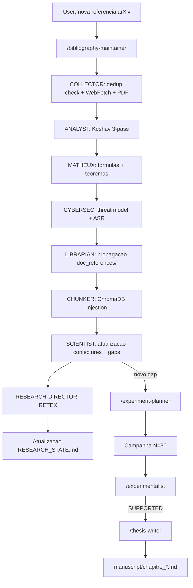

# Ecossistema das 24 skills Claude Code

!!! abstract "Em uma frase"
    As **skills** sao **slash-commands Claude Code** (`/research-director`,
    `/bibliography-maintainer`, `/fiche-attaque`...) que encapsulam **pipelines multi-agents**
    autonomos para orquestrar a pesquisa doutoral AEGIS.

    AEGIS conta com **24 skills** em `.claude/skills/`, das quais **14 especificas ao projeto** e
    **10 genericas** (docx, pptx, algorithmic-art...).

## 1. Para que serve

Cada skill automatiza uma tarefa recorrente do projeto de tese que seria :

- **Muito complexa** para um unico prompt (fiche-attaque = 11 secoes + 2 anexos)
- **Muito repetitiva** para ser manual (integracao bibliografica P001 → P130)
- **Muito critica** para deixar a mao ao LLM sem salvaguardas (audit-these, cross-validation)

## 2. As 14 skills AEGIS-especificas

<div class="grid cards" markdown>

-   :material-account-tie: **`/research-director`**

    ---

    **Papel** : **orquestrador PDCA** (Plan-Do-Check-Act) — diretor de laboratorio autonomo.

    **Loop** : OBJECTIVE → DECOMPOSE → PLAN → ACT → OBSERVE → EVALUATE → (REPLAN) → COMPLETE

    **Orquestra** : `bibliography-maintainer`, `aegis-prompt-forge`, `fiche-attaque`,
    `experimentalist`, `thesis-writer`.

    **Trigger** : `/research-director cycle`

-   :material-book-search: **`/bibliography-maintainer`**

    ---

    **9 agents** : COLLECTOR, ANALYST, MATHEUX, CYBERSEC, WHITEHACKER, LIBRARIAN, MATHTEACHER,
    SCIENTIST, CHUNKER.

    **Modos** : `full_search`, `incremental`, `scoped`

    **Pipeline** : WebFetch → check_corpus_dedup → Keshav 3-pass analise → propagacao doc_references/
    → injecao ChromaDB → verificacao >= 5 chunks.

    **Trigger** : `/bibliography-maintainer incremental`

-   :material-file-document-edit: **`/fiche-attaque [num]`**

    ---

    **3 agents** : SCIENTIST + MATH + CYBER-LIBRARIAN (todos Sonnet, TEXT-ONLY).

    **Gera** uma ficha de ataque `.docx` de **11 secoes + 2 anexos** para um template AEGIS.

    **Status** : 23/97 fichas geradas, seedadas no ChromaDB apos a geracao.

-   :material-forge: **`/aegis-prompt-forge`**

    ---

    **4 modos** : `FORGE` (gera prompt), `AUDIT` (pontuacao), `RETEX`, `CALIBRATE`.

    **Uso** : criar um novo prompt de ataque para um scenario dado, ou auditar um prompt
    existente contra o SVC 6D.

-   :material-plus-box: **`/add-scenario`**

    ---

    **6 agents** : Orchestrator, Scientist, Backend Dev, Frontend Dev, QA, DOC.

    **Pipeline end-to-end** : novo scenario → scenarios.py → frontend component → testes →
    documentacao (gates G-A a G-D).

-   :material-beaker: **`/experiment-planner [gap_id]`**

    ---

    Converte um **gap ACTIONNABLE** (G-001 a G-027) em **protocolo JSON executavel** :

    - Pre-check 5 runs baseline
    - Parametros N=30, Wilson CI
    - Metricas alvo
    - Auto-rerun se INCONCLUSIVE

-   :material-chart-bell-curve: **`/experimentalist [experiment_id]`**

    ---

    **Analise automatica** dos resultados de uma campanha :

    - Veredito SUPPORTED / REFUTED / INCONCLUSIVE
    - Atualiza as conjectures C1-C8
    - Reentra em loop se necessario (max 3 iteracoes)
    - **Auto-disparado** em novo arquivo em `experiments/`

-   :material-file-document-plus: **`/thesis-writer [conjecture_id]`**

    ---

    Integra automaticamente os resultados validos no manuscrito.

    **Regra** : so cita resultados com `p < 0.05` e `N >= 30`.

    **Auto-disparado** quando uma conjecture e VALIDATED EXPERIMENTALLY.

-   :material-shield-search: **`/audit-these [mode]`**

    ---

    **Sistema anti-halucinacao** para a tese : 6 verificadores em sequencia.

    **Modos** : `full`, `claims`, `citations`, `fidelity`, `contradictions`, `volume`.

    **Regra** : cada sessao COMECA e TERMINA por `/audit-these full`.

-   :material-book: **`/audit-pdca`**

    ---

    Audit **PDCA universal** : benchmark externo, receita seguranca/unitaria, scoring automatico,
    melhoria continua.

-   :material-file-word: **`/wiki-publish`**

    ---

    **Modos** : `update` (incremental), `full` (rebuild), `serve` (preview local), `check`.

    Sincroniza `wiki/docs/` a partir das fontes e dispara o build MkDocs.

-   :material-rocket-launch: **`/apex`**

    ---

    Metodologia **APEX** (Analyze-Plan-Execute-eXamine) em 10 etapas autonomas com validacao,
    review adversarial, testes, e criacao de PR.

    **Modo `-i`** : portar codigo externo com transposicao.

-   :material-target: **`/aegis-research-lab`**

    ---

    Meta-skill que expoe o conjunto do lab como uma ferramenta agentica.

-   :material-autorenew: **`/aegis-validation-pipeline`**

    ---

    Pipeline de validacao end-to-end das descobertas antes da integracao no manuscrito.

</div>

## 3. Skills genericas (10)

| Skill | Uso AEGIS |
|-------|-----------|
| `/docx` | Geracao fichas de ataque `.docx` |
| `/pptx` | Slides para PITCH_DOCTORAT_NACCACHE |
| `/xlsx` | Export tabelas de campanha para anexos |
| `/pdf` | Leitura PDFs literatura (pypdf extraction) |
| `/brand-guidelines` | Estilo visual coerente (nao usado atualmente) |
| `/algorithmic-art` | Geracao de diagramas para a tese |
| `/frontend-design` | Mockups de componentes React |
| `/prompt-builder` | Otimizacao de prompts Claude/GPT/Midjourney |
| `/mcp-builder` | Desenvolvimento de servidores MCP |
| `/schedule` | Tarefas recorrentes (audit diario) |

## 4. Fila compartilhada

Todas as skills leem/escrevem em :

```
research_archive/
├── RESEARCH_STATE.md                       ← fonte de verdade global
├── _staging/
│   ├── DIRECTOR_BRIEFING_RUN*.md           ← briefings por RUN
│   ├── analyst/                            ← analises bibliografic
│   ├── scientist/                          ← eixos de pesquisa
│   └── memory/MEMORY_STATE.md              ← estado memoria inter-skills
├── doc_references/
│   ├── MANIFEST.md                         ← index papers autoritativo
│   └── prompt_analysis/research_requests.json  ← fila gaps
└── experiments/
    └── campaign_manifest.json              ← manifest campanhas
```

**Regra de automacao** : apos cada etapa, a seguinte e disparada **sem que o usuario precise
pedir**. Se o usuario tiver que dizer *"esta indexado?"*, *"o diretor tem os elementos?"*,
*"as provas sao propagadas?"* — **e que o pipeline esta quebrado**.

## 5. Cadeia de automacao tipica



## 6. Estatisticas das skills

| Skill | Agents internos | Frequencia de uso | Auto-trigger |
|-------|:---------------:|-------------------|:------------:|
| `/bibliography-maintainer` | 9 | Quase diaria | — |
| `/fiche-attaque` | 3 | Por template | — |
| `/research-director` | — (meta) | Inicio + fim de sessao | — |
| `/experiment-planner` | 1 | Por gap | gap resolvido |
| `/experimentalist` | 1 | Por campanha | novo results.json |
| `/thesis-writer` | 1 | Por conjecture validada | VALIDATED EXPERIMENTALLY |
| `/audit-these` | 6 | Inicio + fim de sessao | — |
| `/wiki-publish` | 1 | Por atualizacao do wiki | — |
| `/add-scenario` | 6 | Por novo scenario | — |

## 7. Limites e vantagens

<div class="grid" markdown>

!!! success "Vantagens"
    - **Automacao end-to-end** : gap → manuscrito sem intervencao
    - **Rastreabilidade** : cada skill loga em RESEARCH_STATE + _staging/
    - **Especializacao** : agents dedicados (math, cyber, white hacker)
    - **Regras anti-halucinacao** : audit-these em loop
    - **Regras anti-duplicata** : check_corpus_dedup obrigatorio
    - **Multi-iteracao** : max 3 iteracoes depois escalacao humana
    - **Padrao 3-camadas** para conteudo adversarial (orchestrator + forge subagent + Python gen)

!!! failure "Limites"
    - **Complexidade** : 14 skills para manter, regras entrelacadas
    - **Custo LLM** : 9 agents bibliography = 9 chamadas Sonnet por paper
    - **Filtragem Claude** : conteudo sensivel (templates `.json`) bloqueia os subagents
      → requer padrao safe-pipeline
    - **Sem ground-truth** : as skills autovalidantes podem alucinar
    - **Gestao de erro** : um agent que crasha bloqueia a cadeia (cf. RETEX provider bug)
    - **Manutencao docs** : as skills evoluem mais rapido que sua documentacao

</div>

## 8. Regras absolutas (CLAUDE.md)

1. **ZERO placeholder** nos outputs de skill
2. **ZERO emoticon** exceto demanda explicita
3. **Cross-validation obrigatoria** : 3 analises aleatorias verificadas contra fulltext ChromaDB
   apos cada batch
4. **Max 3 agents em paralelo** (auditabilidade)
5. **Sem comandos diretos** — sempre via `aegis.ps1` / `aegis.sh`

## 9. Recursos

- :material-folder: [.claude/skills/](https://github.com/pizzif/poc_medical/tree/main/.claude/skills)
- :material-file: [CLAUDE.md - regras do projeto](https://github.com/pizzif/poc_medical/blob/main/.claude/CLAUDE.md)
- :material-file-check: [doctoral-research.md - regras doutorais](https://github.com/pizzif/poc_medical/blob/main/.claude/rules/doctoral-research.md)
- :material-book: [RESEARCH_ARCHIVE_GUIDE.md](../research/index.md)
