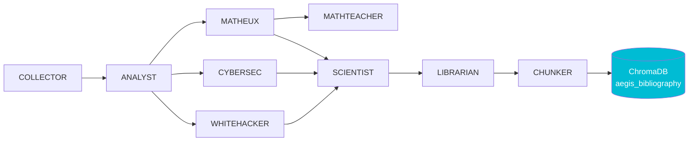

# Staging — Agents de recherche

!!! abstract "Pipeline bibliography-maintainer"
    Le dossier `research_archive/_staging/` contient **l'integralite du travail** produit par les 9 agents specialises du pipeline `/bibliography-maintainer` (COLLECTOR → ANALYST → MATHEUX → CYBERSEC → WHITEHACKER → LIBRARIAN → CHUNKER → MATHTEACHER → SCIENTIST). Ces fichiers sont normalement invisibles aux chercheurs externes car ils vivent dans le repo git. Ce wiki **les publie**.

## Agents et productions

| Agent | Description | # fichiers | # lignes | Acces |
|-------|-------------|:----------:|:--------:|:-----:|
| **analyst** | Analyses de papiers (Keshav 3-pass) | 140 | 13 701 | [→](analyst/index.md) |
| **scientist** | Synthese scientifique | 26 | 5 088 | [→](scientist/index.md) |
| **matheux** | Formules mathematiques (extraction & reviews) | 11 | 4 915 | [→](matheux/index.md) |
| **mathteacher** | Cours de mathematiques (8 modules + guide notation + self-assessment) | 15 | 7 326 | [→](mathteacher/index.md) |
| **cybersec** | Analyses menaces & defenses | 8 | 4 783 | [→](cybersec/index.md) |
| **whitehacker** | Red Team playbooks & exploitation | 8 | 7 297 | [→](whitehacker/index.md) |
| **librarian** | Rapports de propagation & validation | 10 | 1 561 | [→](librarian/index.md) |
| **chunker** | Chunking pour injection ChromaDB | 6 | 1 781 | [→](chunker/index.md) |
| **collector** | Preseed et verifications anti-doublon | 7 | 496 | [→](collector/index.md) |
| **TOTAL** | — | **231** | **46 948** | — |

## Hierarchie du pipeline

**Acces complet** : chaque agent a sa propre section navigable. Les fichiers sont disponibles en lecture web **et** telechargement markdown direct.
