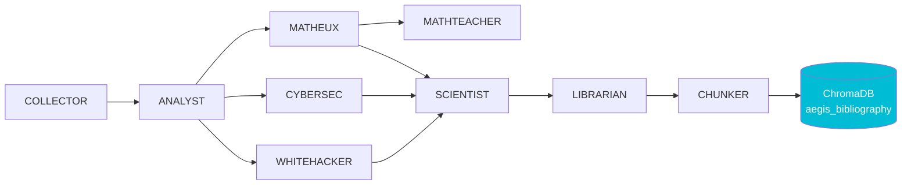

# Staging --- Agents de recherche

PIPELINE &middot; BIBLIOGRAPHY-MAINTAINER

!!! abstract "Pipeline bibliography-maintainer"
    Le dossier `research_archive/_staging/` contient **l'integralite du travail** produit par les agents specialises du pipeline `/bibliography-maintainer`. Ces fichiers vivent dans le repo git et sont normalement invisibles aux chercheurs externes. Ce wiki **les publie**.

  
13Agents publies

  
272Fichiers

  
52 913Lignes

  
9Phases pipeline

## Agents et productions

- ANALYST **Analyses de papiers (Keshav 3-pass)**

    140 fichiers &middot; 13 659 lignes.

    [:material-arrow-right: Ouvrir](analyst/index.md)

- SCIENTIST **Synthese scientifique**

    33 fichiers &middot; 6 442 lignes.

    [:material-arrow-right: Ouvrir](scientist/index.md)

- MATHEUX **Formules mathematiques (extraction & reviews)**

    14 fichiers &middot; 5 449 lignes.

    [:material-arrow-right: Ouvrir](matheux/index.md)

- MATHTEACHER **Cours de mathematiques (8 modules + guide notation + self-assessment)**

    16 fichiers &middot; 7 747 lignes.

    [:material-arrow-right: Ouvrir](mathteacher/index.md)

- CYBERSEC **Analyses menaces & defenses**

    9 fichiers &middot; 4 952 lignes.

    [:material-arrow-right: Ouvrir](cybersec/index.md)

- WHITEHACKER **Red Team playbooks & exploitation**

    8 fichiers &middot; 7 297 lignes.

    [:material-arrow-right: Ouvrir](whitehacker/index.md)

- LIBRARIAN **Rapports de propagation & validation**

    10 fichiers &middot; 1 561 lignes.

    [:material-arrow-right: Ouvrir](librarian/index.md)

- CHUNKER **Chunking pour injection ChromaDB**

    6 fichiers &middot; 1 781 lignes.

    [:material-arrow-right: Ouvrir](chunker/index.md)

- COLLECTOR **Preseed et verifications anti-doublon**

    8 fichiers &middot; 584 lignes.

    [:material-arrow-right: Ouvrir](collector/index.md)

- BRIEFINGS **Briefings directeur (livrable Phase 6)**

    8 fichiers &middot; 1 282 lignes.

    [:material-arrow-right: Ouvrir](briefings/index.md)

- AUDIT THESE **Audits scientifiques (claims, versions)**

    18 fichiers &middot; 1 688 lignes.

    [:material-arrow-right: Ouvrir](audit-these/index.md)

- AUDIT PDCA **Audits PDCA des sessions wiki**

    1 fichiers &middot; 184 lignes.

    [:material-arrow-right: Ouvrir](audit-pdca/index.md)

- MEMORY **Etat persistant inter-session**

    1 fichiers &middot; 287 lignes.

    [:material-arrow-right: Ouvrir](memory/index.md)

## Hierarchie du pipeline

```mermaid
flowchart LR
    COL["COLLECTOR"] --> ANA["ANALYST"]
    ANA --> MAT["MATHEUX"]
    ANA --> CYB["CYBERSEC"]
    ANA --> WH["WHITEHACKER"]
    MAT --> MT["MATHTEACHER"]
    MAT --> SCI["SCIENTIST"]
    CYB --> SCI
    WH --> SCI
    SCI --> LIB["LIBRARIAN"]
    LIB --> CHK["CHUNKER"]
    CHK --> DB[("ChromaDB<br/>aegis_bibliography")]
    style DB fill:#00bcd4,color:#fff
```

**Acces complet** : chaque agent a sa propre section navigable. Les fichiers sont disponibles en lecture web **et** telechargement markdown direct.
