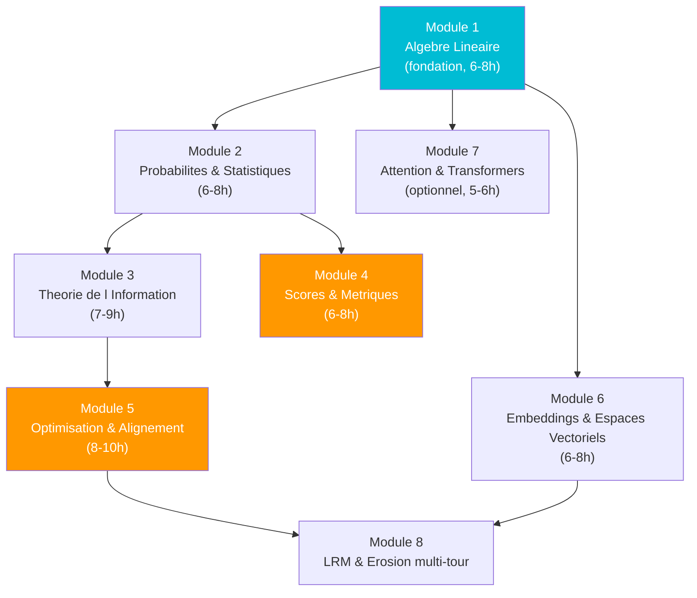

# Cours de mathematiques --- Prof de maths AEGIS

AGENT &middot; MATHTEACHER (Opus 4.6)

<strong>Phase 4</strong>16 fichiers22 formules34 articles45-55 h6-8 semaines

!!! abstract curriculum "Curriculum mathematique structure"
    Cours produit par l'agent **MATHTEACHER** (Opus 4.6) du pipeline `/bibliography-maintainer`. Public cible : doctorant(e) avec un bac+2 en biologie, statistiques ou mathematiques. Objectif : maitriser les **22 formules** utilisees dans les **34 articles** AEGIS, en autonomie.

## Comment utiliser ce cours

1. **Pre-test** ([`SELF_ASSESSMENT_QUIZ.md`](SELF_ASSESSMENT_QUIZ.md)) pour identifier forces et lacunes.
2. **Suivre l'ordre des modules** selon le DAG ci-dessous.
3. **Faire TOUS les exercices** ; solutions fournies, essayer seul(e) d'abord.
4. **Garder le glossaire ouvert** ([`GLOSSAIRE_SYMBOLES.md`](GLOSSAIRE_SYMBOLES.md)).
5. **Consulter** [`NOTATION_GUIDE.md`](NOTATION_GUIDE.md) si la notation surprend.
6. **Repasser le quiz** a la fin pour mesurer la progression.

Curriculum complet : [`APPRENTISSAGE_PROGRESSIF.md`](APPRENTISSAGE_PROGRESSIF.md) (DAG, chemins de lecture, mapping formules-modules-couches delta).

## Graphe de dependances des modules

## Trois chemins de lecture

| Chemin | Sequence | Pour qui ? |
|--------|----------|-----------|
| Complet | 1 -> 2 -> 3 -> 4 -> 5 -> 6 -> 7 -> 8 | Doctorant(e) qui prepare la lecture autonome des 34 articles AEGIS |
| Detection | 1 -> 2 -> 4 -> 6 | Focus Sep(M), ASR, F1, AUROC, embeddings de detection |
| Alignement | 1 -> 2 -> 3 -> 5 | RLHF, DPO, divergence KL, fine-tuning contraint |

## Curriculum et guides de reference

| Fichier | Role | Lignes |
|---------|------|-------:|
| [`APPRENTISSAGE_PROGRESSIF.md`](APPRENTISSAGE_PROGRESSIF.md) | Curriculum complet : DAG, chemins, mapping | 131 |
| [`GLOSSAIRE_SYMBOLES.md`](GLOSSAIRE_SYMBOLES.md) | Glossaire des symboles mathematiques | 287 |
| [`NOTATION_GUIDE.md`](NOTATION_GUIDE.md) | Guide de notation mathematique | 246 |
| [`SELF_ASSESSMENT_QUIZ.md`](SELF_ASSESSMENT_QUIZ.md) | Pre-test et post-test d'auto-evaluation | 445 |

## Modules de cours

| # | Fichier | Titre | Lignes | Prerequis |
|---|---------|-------|-------:|-----------|
| 1 | [`Module_01_Algebre_Lineaire.md`](Module_01_Algebre_Lineaire.md) | Algebre lineaire pour la securite des LLM | 372 | Bac+2 |
| 2 | [`Module_02_Probabilites_Statistiques.md`](Module_02_Probabilites_Statistiques.md) | Probabilites et statistiques | 458 | M1 |
| 3 | [`Module_03_Theorie_Information.md`](Module_03_Theorie_Information.md) | Theorie de l'information et entropie | 431 | M2 |
| 4 | [`Module_04_Scores_Metriques.md`](Module_04_Scores_Metriques.md) | Scores et metriques de detection | 1566 | M1-2 |
| 5 | [`Module_05_Optimisation_Alignement.md`](Module_05_Optimisation_Alignement.md) | Optimisation et alignement | 1106 | M3 |
| 6 | [`Module_06_Embeddings_Espaces_Vectoriels.md`](Module_06_Embeddings_Espaces_Vectoriels.md) | Embeddings et espaces vectoriels | 604 | M1-3 |
| 7 | [`Module_07_Attention_Transformers.md`](Module_07_Attention_Transformers.md) | Attention et Transformers (optionnel) | 324 | M1-2 |
| 8 | [`Module_08_LRM_Erosion_MultiTour.md`](Module_08_LRM_Erosion_MultiTour.md) | LRM et erosion multi-tour | 810 | M5-6 |

## Mapping formules vers couches delta AEGIS

| Couche | Role | Formules cles |
|--------|------|---------------|
| delta-0 alignement interne | Proteger le modele de l'interieur | RLHF (4.1), DPO (4.3), Fine-Tuning Contraint (4.4), Harm Info (4.5) |
| delta-1 detection pre-inference | Bloquer avant inference | Focus Score (3.3), DMPI-PMHFE (5.1), F1 (1.2), AUROC (7.1) |
| delta-2 validation post-inference | Verifier la reponse | SemScore (2.1), SBERT (5.2), Cosine Sim (1.1), Sep(M) (3.1-3.2) |
| delta-3 monitoring continu | Surveiller en permanence | ASR (3.4), toutes les metriques en mode monitoring |

## Ressources externes complementaires

- **3Blue1Brown** (YouTube) : Essence of Linear Algebra.
- **Khan Academy** (FR) : probabilites et statistiques.
- **StatQuest** (YouTube) : cross-entropy, ROC, gradient.
- **Jay Alammar** (blog) : The Illustrated Transformer.
- **Lilian Weng** (blog) : From RLHF to DPO.

## Conseils pratiques

1. Ne pas sauter les exercices : la lecture passive ne suffit pas.
2. Recopier les formules a la main est plus efficace que copier-coller.
3. Relier chaque formule a un article : la motivation vient du **pourquoi**.
4. Garder GLOSSAIRE_SYMBOLES.md et NOTATION_GUIDE.md ouverts.
5. Viser la comprehension, pas la memorisation.

## Rapports d'execution (tracabilite)

| Fichier | Lignes |
|---------|-------:|
| [`PHASE4_MATHTEACHER_REPORT_RUN002.md`](PHASE4_MATHTEACHER_REPORT_RUN002.md) | 158 |
| [`PHASE4_MATHTEACHER_RUN003.md`](PHASE4_MATHTEACHER_RUN003.md) | 201 |
| [`REPORT_RUN005_MATHTEACHER.md`](REPORT_RUN005_MATHTEACHER.md) | 187 |

---

*Curriculum genere par l'agent **MATHTEACHER** (Opus 4.6) du skill `/bibliography-maintainer`. Voir aussi [Matheux](../matheux/index.md).*
